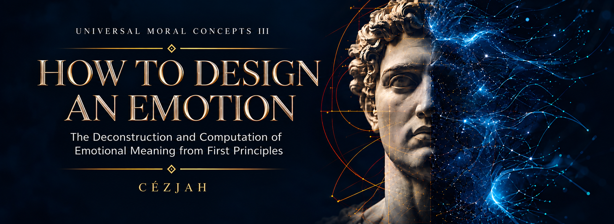

  

# How To Design an Emotion

### The Deconstruction and Computation of Emotional Meaning from First Principles

**Universal Moral Concepts III**  
**Author: Cézjah**

<table>
<tr>
<td width="36%" valign="top" align="center">
  
  &nbsp;&nbsp;
  
   Front and back covers. Click either image to view full size.
</td>
<td width="64%" valign="top">

## Overview

*How To Design an Emotion* examines how raw experience becomes emotional meaning. It distinguishes physiological affect, phenomenological feeling, and cognitive-semiotic emotion, then develops a first-principles framework for understanding how values, meaning, agency, motivation, and ethics interact.

This repository is the open, versioned, collaborative scholarly edition of the book, published through The John Charitable Trust as part of an experiment in living scholarship.

### COMING SOON

[**SUBSCRIBE TO BE NOTIFIED ↓**](https://the-john-charitable-trust.github.io/open-publishing/#newsletter)

</td>
</tr>
</table>

---

## THE BOOK IDEOLOGY

  

<a href="https://www.youtube.com/watch?v=1pjmcboMYOM&list=PLeSNXBpf5Q-Ad8Op7Yyw46_0ZAZ4j13ly"><strong>▶ WATCH THE BOOK IDEOLOGY</strong></a>

*Watch the video to explore the ideas and intellectual framework behind the book.*

---

## Open Scholarship

This repository treats the book as a living, version-controlled body of knowledge while preserving the provenance of the original work.

| | |
|---|---|
| **Read** | Begin with the [front matter](book/front-matter/) or [Chapter 1](book/part-1/chapter-01.md). |
| **Contribute** | Everyone may read. Qualified contributors may propose. Authorized editors may approve. See [CONTRIBUTING.md](CONTRIBUTING.md). |
| **Versions** | Git preserves the history of the manuscript, proposed changes, accepted revisions, and future editions. |
| **License** | Open scholarly content is licensed under [CC BY-SA 4.0](LICENSE.md), except where a file or asset is explicitly identified otherwise. |

## Repository Structure

- `book/` — canonical Markdown manuscript
- `book/front-matter/` — front matter as independently versioned documents
- `book/methodology-of-an-ontology/` — the methodology that develops across the work
- `book/part-1/` and `book/part-2/` — currently supplied manuscript chapters
- `book/part-3/` through `book/part-5/` — reserved for subsequent parts
- `assets/` — covers, figures, NFT material, and publication media
- `source/original-docx/` — archival source documents used for the initial Markdown conversion
- `docs/` — public project-site material

## Canonical Authorship

Original author: **Cézjah**. See [AUTHORS.md](AUTHORS.md) for provenance and contributor recognition.
