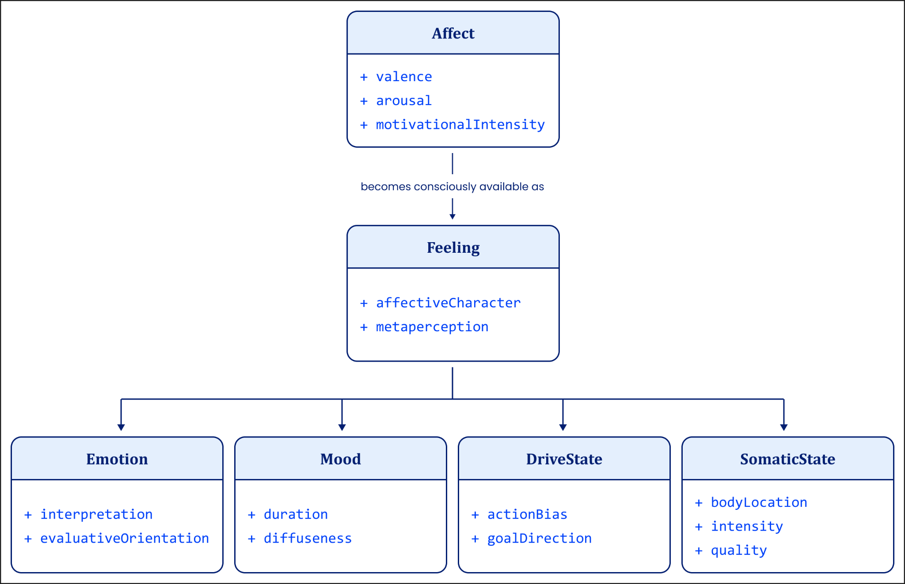
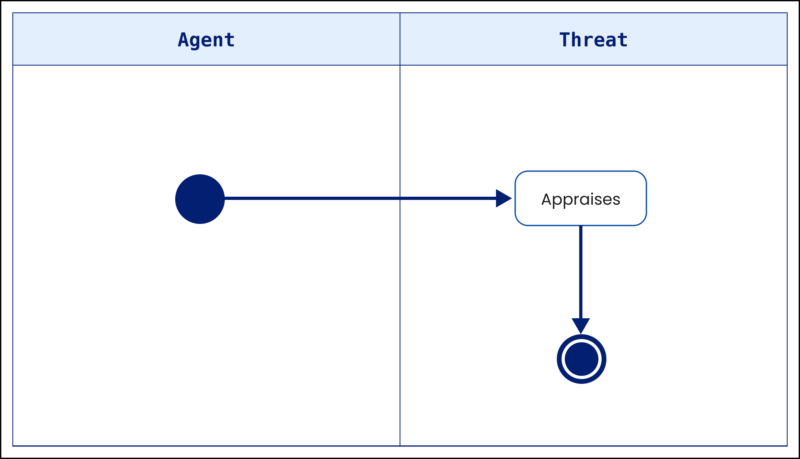
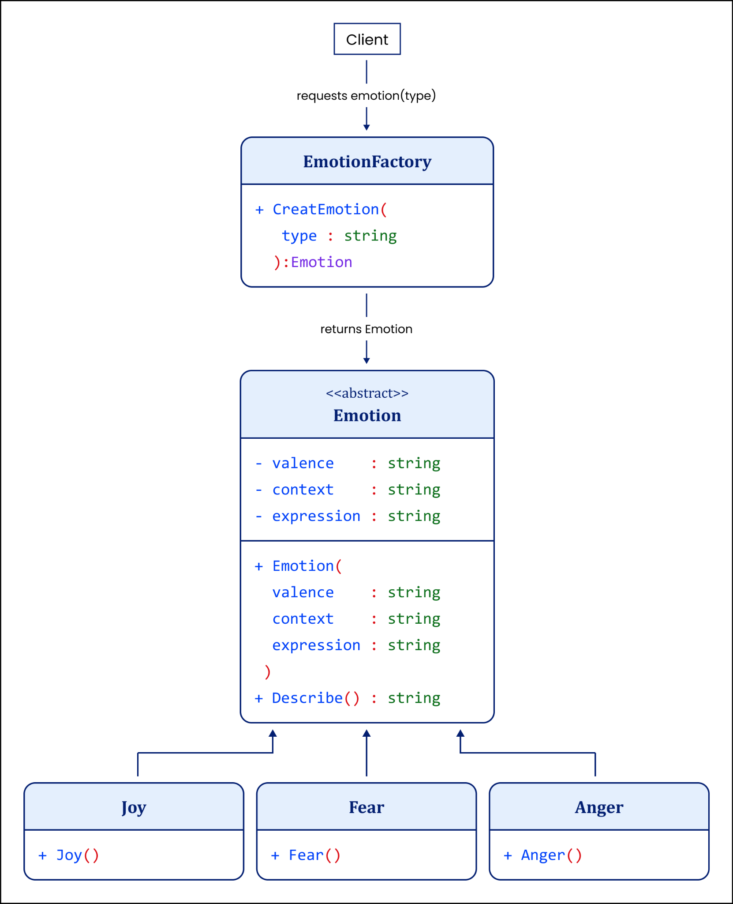
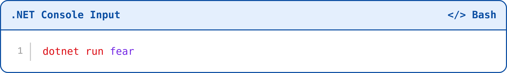
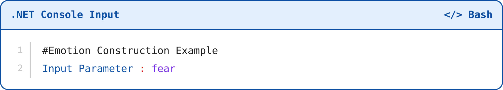
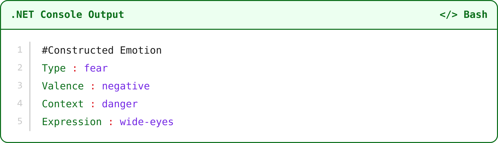
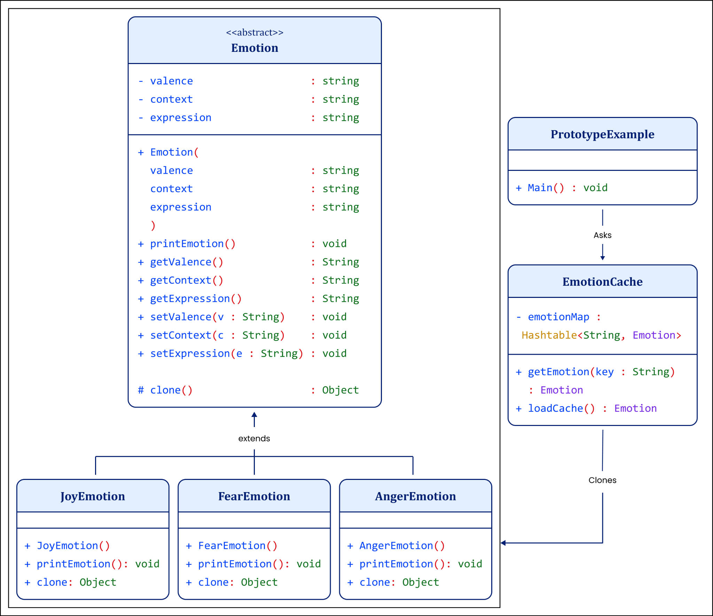

# Appendix B: Complex Affective UML Architecture Diagrams

## Modeling How Emotions Are Made

In Chapter 2, I argued that a definition can do its work only when it specifies the architecture that governs identity. Appendix A then tested Basic Emotion Theory against the demands of identity, non-circularity, and analytic consequence. This appendix turns from critique to formal construction. If I treat emotion as something the mind constructs rather than something the body simply reveals, then I must show how construction can preserve identity without collapsing into arbitrariness.1 2

Natural language can state that requirement, but it cannot always discipline it. Prose tolerates ambiguity. It can conceal category errors. It can let identity drift across explanations without warning. UML and design patterns give me a stricter grammar. They force me to separate type from instance, structure from realization, and conceptual identity from contextual variation.3 4

In the diagrams and design patterns that follow, I do not claim to model neural activity or psychological mechanism. I model structure. Each figure formalizes a requirement the main text develops: the separation of genus and species in affective states, the distinction between identity and instantiation, the syntagmatic ordering required for meaning, and the principled generation of emotional episodes from stable conceptual architecture.5 6 The diagrams show how emotions can arise as context-sensitive instantiations of declared structure rather than as detected entities or post hoc labels.7 8 This appendix therefore demonstrates, rather than merely asserts, how emotional construction can remain explicit, inspectable, and constrained.9

**Figure B-1. UML Class Diagram: Inheritance Hierarchy of Affective States**

—---------------------------------------------------------------------------------------------------------------------------------------------------------  
Figure B-1. UML Class Diagram: Inheritance Hierarchy of Affective States

Figure B-1 models how affective kinds can differ structurally without presupposing different biological substrates. I model Feeling as the genus that fixes shared affective structure, and Emotion, Mood, and DriveState as species that inherit that structure while adding differentiating constraints. Affective diversity arises from structural specialization, not from distinct biological kinds, essences, or mechanisms.10 11

Feeling specifies core affect dimensions, including valence and arousal, as structural primitives within this formal model. They operate as genus-level admissibility constraints that fix shared affective structure for modeling purposes. This specification concerns modeling architecture rather than empirical reduction or biological necessity. It does not deny competing accounts that reject dimensional necessity in favor of basic affective systems.12 13

Emotion, Mood, and DriveState inherit this core structure and introduce kind-specific constraints. Emotion adds appraisal and attitude, marking emotions as affective states that involve interpretive evaluation and propositional stance toward something. Mood adds duration and diffuseness, distinguishing moods as persistent affective states without a specific object. DriveState adds action bias and goal direction, distinguishing drives as affective states oriented toward action selection and pursuit.14 15

In Aristotelian terms, feeling supplies the genus and the others function as species defined by differentiae. In object-oriented terms, feeling functions as the superclass and the others as subclasses that preserve identity through inheritance while introducing functional constraints. The diagram encodes a proposed set of identity conditions for affective kinds and blocks category error by showing that emotions, moods, and drives differ by how the same affective substrate receives structure and specialization, not by belonging to separate ontological kinds.

**Figure B-2. UML Activity Diagram: Syntagmatic Appraisal Structure**

—---------------------------------------------------------------------------------------------------------------------------------------------------------  
Figure B-2. UML Activity Diagram: Syntagmatic Appraisal Structure

Figure B-2 addresses a problem that prose can hide. Some emotion theories describe appraisal as if it were merely something that happens inside the mind. That description misses the structure I need to preserve. Appraisal has an agent, an object, a relation, and an end point. Someone appraises something as something. If prose does not make those roles explicit, appraisal can blur into feeling, mechanism, or private impression. The object of appraisal then disappears from the theory.18 19

I introduce Figure B-2 to make appraisal explicit as a syntagmatic operation. The activity diagram forces sequence, separates roles, and fixes termination. The Agent initiates the process. APPRAISES mediates the relation. The activity terminates in the Threat lane, fixing appraisal as about something rather than as a free-floating inner state. Meaning arises from ordered structure, not from isolated elements.20 21

This diagram solves a representational problem, not an empirical one. It renders appraisal as an architectural relation between agent and world. By making structure visible, it blocks category error and prepares the transition from internal coherence to reference.22 23

With the next two diagrams, I introduce Gang of Four design patterns to solve a specific modeling problem: how to represent construction without collapsing identity into instance. Gamma, Helm, Johnson, and Vlissides developed these patterns as reusable solutions to recurring object-oriented design problems, including creational problems such as object instantiation.24 Emotion theories routinely confuse what an emotion is with how an emotional episode arises. I isolate that distinction by using formal architectural patterns that separate definition from realization.25

The Gang of Four patterns do not describe mental mechanisms. They formalize structural solutions to recurring problems of construction. I use them here as disciplined syntactic tools. They allow me to model how stable conceptual identities can generate context-sensitive instances without treating emotions as discovered objects, biological essences, or free-floating labels. The aim is not empirical accuracy, but architectural clarity.26 27

**Figure B-3. Factory Design Pattern: Emotion Construction**

—---------------------------------------------------------------------------------------------------------------------------------------------------------Figure B-3. Factory Design Pattern: Emotion Construction

Figure B-3 models emotion construction using the Factory design pattern, which separates the declaration of a type from the logic responsible for creating its instances.28 In this architecture, Emotion functions as an abstract class that fixes the shared structural properties of an emotion, such as valence, context, and expression. The class defines identity conditions but does not instantiate any emotional episode.29

Concrete subclasses, Joy, Fear, and Anger, inherit this structure while assigning different values to it. In object-oriented terms, inheritance preserves conceptual identity while allowing variation in individual instances.30

The EmotionFactory centralizes instantiation. Instead of constructing a concrete emotion directly, the client requests an emotion from the factory, which selects the appropriate subclass and returns it as the abstract type Emotion. The client therefore interacts with the stable abstract interface rather than with specific implementations.31

Architecturally, this structure separates identity from instantiation. The abstract class corresponds to the emotion concept, while the instantiated object corresponds to a specific emotional episode. The factory models rule-governed construction that preserves conceptual identity while allowing contextual differentiation.32 33

The pattern illustrates how emotional episodes can be generated as instances of a stable conceptual architecture without treating emotional kinds as discovered entities or biological essences. I do not claim that minds implement software patterns. I use the pattern to make explicit a structural requirement of any coherent theory of emotion: the distinction between the identity of an emotion concept and the generation of its instances.34

The corresponding C# project appears in the downloaded code folder for Appendix B, Project 1. The project README provides the canonical build command, run command, supported input values, and expected output. The appendix explains the conceptual purpose of the code; the README governs execution.

After navigating to the folder containing the project:

**Source figure 4**

You can also run the code using joy or anger as the input parameter.

**Source figure 5**

**Source figure 6**

If the input parameter were joy or anger, the output would change accordingly.

### Figure B-4. Prototype Design Pattern: Emotion Construction UML

**Figure B-4. Prototype Design Pattern: Emotion Construction UML**

—---------------------------------------------------------------------------------------------------------------------------------------------------------Figure B-4. Prototype Design Pattern: Emotion Construction UML

Figure B-4 models emotion construction using the Prototype design pattern. The diagram shows how new emotional instances can arise through structured reuse rather than fresh construction.35

Here, Emotion again defines the abstract identity of an emotion and declares a clone() operation. This operation specifies how instances replicate structural identity while allowing contextual variation.36

JoyEmotion, FearEmotion, and AngerEmotion serve as concrete prototypes. Each implements cloning so that Joy produces Joy instances, Fear produces Fear instances, and Anger produces Anger instances. Identity remains fixed. Realization varies.37

The EmotionCache stores initialized prototypes indexed by key. When the client requests an emotion, the cache returns a clone of the appropriate prototype rather than constructing a new object from scratch.38

The architectural mapping remains precise:

• The concept corresponds to the prototype's declared structure.39

• The construct corresponds to each cloned instance.40

• The cache models stored conceptual templates.41

• Cloning models instantiation through reuse rather than discovery.42

This pattern formalizes a central constructionist claim without psychologizing it. Emotional episodes arise as context-specific realizations of stable conceptual templates. Identity precedes instance. Structure governs variation.43

These diagrams do not claim that the mind implements factories or prototypes. They claim something narrower and stronger: any coherent account of emotion must separate identity from instantiation. The Gang of Four patterns provide a formal grammar for making that separation explicit, inspectable, and non-rhetorical.44

Please see *Appendix E: Chrome DevTools Demonstration of Layered Ontology*, for a code walkthrough of the JavaScript Prototype Object Model.

Appendix B completes Chapter 2’s constructive argument: emotion can be constructed without losing identity, provided the model preserves the architecture that distinguishes concept, instance, context, and interpretation. The inheritance diagram separates genus from species: Feeling supplies shared affective structure, while Emotion, Mood, and DriveState specialize that structure through different constraints. The syntagmatic appraisal diagram then fixes the relational form that meaning requires. An agent appraises something as something. That ordered relation prevents appraisal from collapsing into a private impression, a bodily mechanism, or an isolated label.

The Factory and Prototype diagrams extend the same discipline to construction. Factory formalizes rule-governed instantiation: the abstract emotion concept remains stable while concrete episodes vary. Prototype formalizes structured reuse: cloned emotional instances can differ contextually while preserving the declared identity of the template from which they arise. These patterns do not claim that the mind runs software, and they do not reduce emotion to code.56 They supply a formal grammar for separating concept from construct, identity conditions from realized identity, and construction from arbitrary invention.57

The appendix therefore defends a narrow but crucial proposition. A constructionist theory of emotion does not have to choose between rigid natural kinds and conceptual drift. It can accept contextual generation, variation, and reuse while preserving the identity conditions that govern valid instantiation. Identity precedes instance; structure governs variation; construction produces realizations rather than replacing the concept that makes realization intelligible. Appendix B therefore turns the critique of Appendix A into a constructive modeling standard: emotion may be made, but it must be made under constraints.58

## Endnotes

1. Andrea Scarantino and Ronald de Sousa, "Emotion," in The Stanford Encyclopedia of Philosophy, Spring 2024 ed., ed. Edward N. Zalta and Uri Nodelman, https://plato.stanford.edu/entries/emotion/. Access basis: Open scholarly reference.

2. Andrea Scarantino and Ronald de Sousa, "Emotion," in The Stanford Encyclopedia of Philosophy, Spring 2024 ed., ed. Edward N. Zalta and Uri Nodelman, https://plato.stanford.edu/entries/emotion/. Access basis: Open scholarly reference.

3. Eric Margolis and Stephen Laurence, "Concepts," in The Stanford Encyclopedia of Philosophy, Fall 2023 ed., ed. Edward N. Zalta and Uri Nodelman, https://plato.stanford.edu/entries/concepts/. Access basis: Open scholarly reference.

4. W. V. O. Quine, "Two Dogmas of Empiricism," Philosophical Review 60, no. 1 (1951): 20-43, https://doi.org/10.2307/2181906. Access basis: DOI metadata and widely available journal record; claim verified through open scholarly summaries.

5. Object Management Group, Unified Modeling Language, Version 2.5.1, formal/17-12-05 (Milford, MA: Object Management Group, 2017), 126, https://www.omg.org/spec/UML/2.5.1/PDF. Access basis: Official open standard.

6. Object Management Group, Unified Modeling Language, Version 2.5.1, formal/17-12-05 (Milford, MA: Object Management Group, 2017), 126, https://www.omg.org/spec/UML/2.5.1/PDF. Access basis: Official open standard.

7. Object Management Group, Unified Modeling Language, Version 2.5.1, formal/17-12-05 (Milford, MA: Object Management Group, 2017), 126, https://www.omg.org/spec/UML/2.5.1/PDF. Access basis: Official open standard.

8. Object Management Group, Unified Modeling Language, Version 2.5.1, formal/17-12-05 (Milford, MA: Object Management Group, 2017), 126, https://www.omg.org/spec/UML/2.5.1/PDF. Access basis: Official open standard.

9. Object Management Group, Unified Modeling Language, Version 2.5.1, formal/17-12-05 (Milford, MA: Object Management Group, 2017), 126, https://www.omg.org/spec/UML/2.5.1/PDF. Access basis: Official open standard.

10. Aristotle, Metaphysics, trans. W. D. Ross, Internet Classics Archive, http://classics.mit.edu/Aristotle/metaphysics.html. Access basis: Open primary text.

11. Andrea Scarantino and Ronald de Sousa, "Emotion," in The Stanford Encyclopedia of Philosophy, Spring 2024 ed., ed. Edward N. Zalta and Uri Nodelman, https://plato.stanford.edu/entries/emotion/. Access basis: Open scholarly reference.

12. James A. Russell, "Core Affect and the Psychological Construction of Emotion," Psychological Review 110, no. 1 (2003): 145-172, https://doi.org/10.1037/0033-295X.110.1.145. Access basis: DOI and abstract/full-text preview verified.

13. Andrea Scarantino and Ronald de Sousa, "Emotion," in The Stanford Encyclopedia of Philosophy, Spring 2024 ed., ed. Edward N. Zalta and Uri Nodelman, https://plato.stanford.edu/entries/emotion/. Access basis: Open scholarly reference.

14. Klaus R. Scherer, "What Are Emotions? And How Can They Be Measured?" Social Science Information 44, no. 4 (2005): 695-729, https://doi.org/10.1177/0539018405058216. Access basis: Publisher page and repository abstract verified.

15. Andrea Scarantino and Ronald de Sousa, "Emotion," in The Stanford Encyclopedia of Philosophy, Spring 2024 ed., ed. Edward N. Zalta and Uri Nodelman, https://plato.stanford.edu/entries/emotion/. Access basis: Open scholarly reference.

18. Klaus R. Scherer, "What Are Emotions? And How Can They Be Measured?" Social Science Information 44, no. 4 (2005): 695-729, https://doi.org/10.1177/0539018405058216. Access basis: Publisher page and repository abstract verified.

19. Klaus R. Scherer, "What Are Emotions? And How Can They Be Measured?" Social Science Information 44, no. 4 (2005): 695-729, https://doi.org/10.1177/0539018405058216. Access basis: Publisher page and repository abstract verified.

20. Gottlob Frege, "On Sense and Reference," trans. Max Black, in Translations from the Philosophical Writings of Gottlob Frege, ed. Peter Geach and Max Black (Oxford: Blackwell, 1952), 56-78; see also Edward N. Zalta, "Gottlob Frege," in The Stanford Encyclopedia of Philosophy, https://plato.stanford.edu/entries/frege/. Access basis: Open scholarly reference for verification.

21. Gottlob Frege, "On Sense and Reference," trans. Max Black, in Translations from the Philosophical Writings of Gottlob Frege, ed. Peter Geach and Max Black (Oxford: Blackwell, 1952), 56-78; see also Edward N. Zalta, "Gottlob Frege," in The Stanford Encyclopedia of Philosophy, https://plato.stanford.edu/entries/frege/. Access basis: Open scholarly reference for verification.

22. Gottlob Frege, "On Sense and Reference," trans. Max Black, in Translations from the Philosophical Writings of Gottlob Frege, ed. Peter Geach and Max Black (Oxford: Blackwell, 1952), 56-78; see also Edward N. Zalta, "Gottlob Frege," in The Stanford Encyclopedia of Philosophy, https://plato.stanford.edu/entries/frege/. Access basis: Open scholarly reference for verification.

23. Object Management Group, Unified Modeling Language, Version 2.5.1, formal/17-12-05 (Milford, MA: Object Management Group, 2017), https://www.omg.org/spec/UML/2.5.1/PDF. Access basis: Official open standard.

24. Object Management Group, Unified Modeling Language, Version 2.5.1, formal/17-12-05 (Milford, MA: Object Management Group, 2017), https://www.omg.org/spec/UML/2.5.1/PDF. Access basis: Official open standard.

25. Anil Gupta, "Definitions," in The Stanford Encyclopedia of Philosophy, Fall 2021 ed., ed. Edward N. Zalta, https://plato.stanford.edu/entries/definitions/. Access basis: Open scholarly reference.

26. Object Management Group, Unified Modeling Language, Version 2.5.1, formal/17-12-05 (Milford, MA: Object Management Group, 2017), https://www.omg.org/spec/UML/2.5.1/PDF. Access basis: Official open standard.

27. Eric Margolis and Stephen Laurence, "Concepts," in The Stanford Encyclopedia of Philosophy, Fall 2023 ed., ed. Edward N. Zalta and Uri Nodelman, https://plato.stanford.edu/entries/concepts/. Access basis: Open scholarly reference.

28. Lisa Feldman Barrett, Ralph Adolphs, Stacy Marsella, Aleix M. Martinez, and Seth D. Pollak, "Emotional Expressions Reconsidered: Challenges to Inferring Emotion From Human Facial Movements," Psychological Science in the Public Interest 20, no. 1 (2019): 1-68, https://doi.org/10.1177/1529100619832930. Access basis: Open access/PubMed Central.

29. Object Management Group, Unified Modeling Language, Version 2.5.1, formal/17-12-05 (Milford, MA: Object Management Group, 2017), https://www.omg.org/spec/UML/2.5.1/PDF. Access basis: Official open standard.

30. Object Management Group, Unified Modeling Language, Version 2.5.1, formal/17-12-05 (Milford, MA: Object Management Group, 2017), 126, https://www.omg.org/spec/UML/2.5.1/PDF. Access basis: Official open standard.

31. Eric Margolis and Stephen Laurence, "Concepts," in The Stanford Encyclopedia of Philosophy, Fall 2023 ed., ed. Edward N. Zalta and Uri Nodelman, https://plato.stanford.edu/entries/concepts/. Access basis: Open scholarly reference.

32. Eric Margolis and Stephen Laurence, "Concepts," in The Stanford Encyclopedia of Philosophy, Fall 2023 ed., ed. Edward N. Zalta and Uri Nodelman, https://plato.stanford.edu/entries/concepts/. Access basis: Open scholarly reference.

33. W. V. O. Quine, "Two Dogmas of Empiricism," Philosophical Review 60, no. 1 (1951): 20-43, https://doi.org/10.2307/2181906. Access basis: DOI metadata and widely available journal record; claim verified through open scholarly summaries.

34. Andrea Scarantino and Ronald de Sousa, "Emotion," in The Stanford Encyclopedia of Philosophy, Spring 2024 ed., ed. Edward N. Zalta and Uri Nodelman, https://plato.stanford.edu/entries/emotion/. Access basis: Open scholarly reference.

35. Andrea Scarantino and Ronald de Sousa, "Emotion," in The Stanford Encyclopedia of Philosophy, Spring 2024 ed., ed. Edward N. Zalta and Uri Nodelman, https://plato.stanford.edu/entries/emotion/. Access basis: Open scholarly reference.

36. Object Management Group, Unified Modeling Language, Version 2.5.1, formal/17-12-05 (Milford, MA: Object Management Group, 2017), 126, https://www.omg.org/spec/UML/2.5.1/PDF. Access basis: Official open standard.

37. Eric Margolis and Stephen Laurence, "Concepts," in The Stanford Encyclopedia of Philosophy, Fall 2023 ed., ed. Edward N. Zalta and Uri Nodelman, https://plato.stanford.edu/entries/concepts/. Access basis: Open scholarly reference.

38. Michael I. Posner and Steven W. Keele, "On the Genesis of Abstract Ideas," Journal of Experimental Psychology 77, no. 3 (1968): 353-363, https://doi.org/10.1037/h0025953. Access basis: DOI and author-uploaded full text.

39. Michael I. Posner and Steven W. Keele, "On the Genesis of Abstract Ideas," Journal of Experimental Psychology 77, no. 3 (1968): 353-363, https://doi.org/10.1037/h0025953. Access basis: DOI and author-uploaded full text.

40. W. V. O. Quine, "Two Dogmas of Empiricism," Philosophical Review 60, no. 1 (1951): 20-43, https://doi.org/10.2307/2181906. Access basis: DOI metadata and widely available journal record; claim verified through open scholarly summaries.

41. Eric Margolis and Stephen Laurence, "Concepts," in The Stanford Encyclopedia of Philosophy, Fall 2023 ed., ed. Edward N. Zalta and Uri Nodelman, https://plato.stanford.edu/entries/concepts/. Access basis: Open scholarly reference.

42. Object Management Group, Unified Modeling Language, Version 2.5.1, formal/17-12-05 (Milford, MA: Object Management Group, 2017), https://www.omg.org/spec/UML/2.5.1/PDF. Access basis: Official open standard.

43. Eric Margolis and Stephen Laurence, "Concepts," in The Stanford Encyclopedia of Philosophy, Fall 2023 ed., ed. Edward N. Zalta and Uri Nodelman, https://plato.stanford.edu/entries/concepts/. Access basis: Open scholarly reference.

44. Eric Margolis and Stephen Laurence, "Concepts," in The Stanford Encyclopedia of Philosophy, Fall 2023 ed., ed. Edward N. Zalta and Uri Nodelman, https://plato.stanford.edu/entries/concepts/. Access basis: Open scholarly reference.

56. Object Management Group, Unified Modeling Language, Version 2.5.1, formal/17-12-05 (Milford, MA: Object Management Group, 2017), 126, https://www.omg.org/spec/UML/2.5.1/PDF. Access basis: Official open standard.

57. Anil Gupta, "Definitions," in The Stanford Encyclopedia of Philosophy, Fall 2021 ed., ed. Edward N. Zalta, https://plato.stanford.edu/entries/definitions/. Access basis: Open scholarly reference.

58. Andrea Scarantino and Ronald de Sousa, "Emotion," in The Stanford Encyclopedia of Philosophy, Spring 2024 ed., ed. Edward N. Zalta and Uri Nodelman, https://plato.stanford.edu/entries/emotion/. Access basis: Open scholarly reference.

## Bibliography

Aristotle. *Metaphysics*. Translated by W. D. Ross. Princeton: Princeton University Press, 1984.

Barrett, Lisa Feldman. *How Emotions Are Made: The Secret Life of the Brain*. Boston: Houghton Mifflin Harcourt, 2017.

Booch, Grady. *Object-Oriented Analysis and Design with Applications*. 3rd ed. Boston: Addison-Wesley, 2007.

Booch, Grady, James Rumbaugh, and Ivar Jacobson. *The Unified Modeling Language User Guide*. 2nd ed. Boston: Addison-Wesley, 2005.

Carnap, Rudolf. *Logical Foundations of Probability*. Chicago: University of Chicago Press, 1950.

Chandler, Daniel. *Semiotics: The Basics*. 3rd ed. London: Routledge, 2017.

Dennett, Daniel C. *The Intentional Stance*. Cambridge, MA: MIT Press, 1987.

Fowler, Martin. *Patterns of Enterprise Application Architecture*. Boston: Addison-Wesley, 2003.

Frijda, Nico H. *The Emotions*. Cambridge: Cambridge University Press, 1986.

Gamma, Erich, Richard Helm, Ralph Johnson, and John Vlissides. *Design Patterns: Elements of Reusable Object-Oriented Software*. Reading, MA: Addison-Wesley, 1994.

Hempel, Carl G. *Aspects of Scientific Explanation*. New York: Free Press, 1965.

Husserl, Edmund. *Logical Investigations*. Vol. 1. Translated by J. N. Findlay. London: Routledge, 2001.

Object Management Group. Unified Modeling Language (UML) Specification, Version 2.5.1. Needham, MA: OMG, 2017.

Panksepp, Jaak. *Affective Neuroscience: The Foundations of Human and Animal Emotions*. New York: Oxford University Press, 1998.

Quine, W. V. O. *From a Logical Point of View*. 2nd ed. Cambridge, MA: Harvard University Press, 1980.

Quine, W. V. O. *Word and Object*. Cambridge, MA: MIT Press, 1960.

Rand, Ayn. *Introduction to Objectivist Epistemology*. Expanded 2nd ed. Edited by Harry Binswanger and Leonard Peikoff. New York: Meridian, 1990.

Russell, James A. "Core Affect and the Psychological Construction of Emotion." *Psychological Review* 110, no. 1 (2003): 145-72.

Saussure, Ferdinand de. *Course in General Linguistics*. Edited by Charles Bally and Albert Sechehaye. Translated by Wade Baskin. New York: McGraw-Hill, 1959.

Scherer, Klaus R. *Appraisal Processes in Emotion: Theory, Methods, Research*. Oxford: Oxford University Press, 2001.

Scherer, Klaus R. "What Are Emotions? And How Can They Be Measured?" *Social Science Information* 44, no. 4 (2005): 695-729.

Sowa, John F. *Knowledge Representation: Logical, Philosophical, and Computational Foundations*. Pacific Grove, CA: Brooks/Cole, 2000.

Wittgenstein, Ludwig. *Philosophical Investigations*. Translated by G. E. M. Anscombe. Oxford: Blackwell, 1953.
