# Appendix C: Reconstructing Goal-Based Concepts

## A Constraint Analysis of Feldman Barrett's Theory of Concepts

Barrett argues that concepts can adapt to changing purposes. She describes goal-based concepts as "super flexible and adaptable to the situation."1 She immediately ties that flexibility to goal variation, adding that concepts are malleable and context-dependent because goals can change with the situation.2 She illustrates the point with the fish example: when someone asks what kind of fish they would like, the active purpose constrains the answer. One may answer "goldfish" under one purpose and reject "poached salmon" under another.3 She then generalizes the same mechanism with an artifact example: a single car can enter different concepts depending on the active purpose. In different contexts, a car may function as transportation, a status symbol, a bed, a murder weapon, or an artificial reef.4

I agree that Barrett identifies a real phenomenon: goals regulate conceptual use. Research on ad hoc categories and situated conceptualization also supports the idea that agents form or activate categories relative to practical purposes.5 But that phenomenon does not establish that identity conditions are fluid. It supports a more precise interpretation: goal-indexed regulation can operate over a stable constraint structure.6

This appendix reconstructs Barrett's examples at the level of constraint architecture. I do not deny goal flexibility. I deny that goal flexibility dissolves identity conditions. A goal can select, filter, emphasize, rank, or construct a use-specific specification. It does not thereby rewrite the deeper conditions that make something a possible instance of the concept in the first place.7

The purpose of this appendix is therefore narrow but essential. I separate five layers that Barrett’s examples tend to compress: identity conditions, instantiation, goal selection, runtime construction, and multi-concept classification. Each layer performs a distinct function, and the argument fails when one layer substitutes for another.

The corresponding C# executables for the projects below appear in the downloaded ZIP file under the matching project folder. Each folder includes a README with the canonical run commands and expected outputs. The prose that follows explains the conceptual purpose of each project rather than duplicating the execution blocks.

Project 1 implements identity conditions as admissibility constraints that operate before instantiation, selection, or context. The goal is to show that a concept must first specify what can count as an admissible instance at all. I isolate identity conditions from downstream processes so that goal-based selection and contextual variability cannot usurp their role.8

In Project 1, I represent the concept Fish as a class with invariant admissibility conditions. A fish must be aquatic, and it must be an organism. These conditions do not vary with context. The constructor enforces them as necessary constraints. The system admits only candidates that satisfy them and rejects all others.

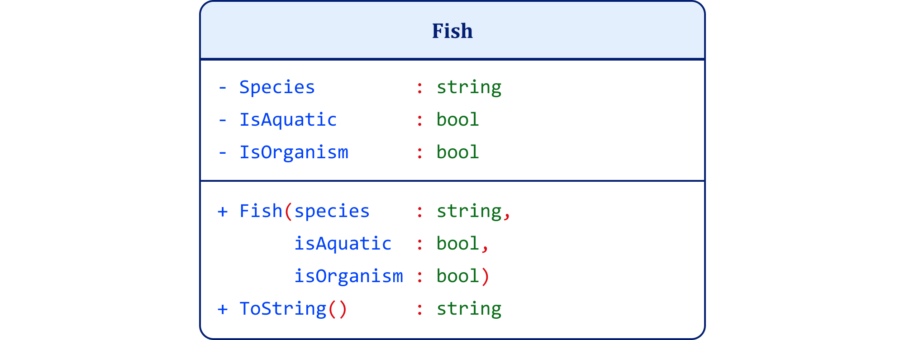

**Figure C-1. Fish UML Class Diagram**

---------------------------------------------------------------------------------------------------------------------------------------------------------------------  
**Figure C-1. Fish UML Class Diagram**

Figure C-1 defines the admissibility conditions that any instance must satisfy. No goals, parameters, or contextual modifiers appear at this level.

The valid and invalid candidates appear in separate object diagrams. Figure C-2 shows a valid Goldfish instance. Figure C-3 shows a valid Salmon instance. Figure C-4 shows an invalid Rock candidate.

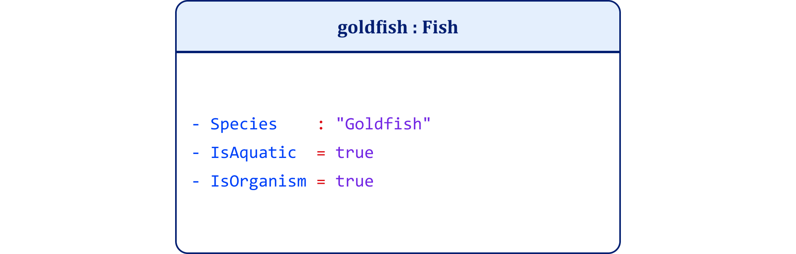

**Figure C-2. Goldfish UML Object Diagram**

------------------------------------------------------------------------------------------------------------------------------------------------------------------------  
**Figure C-2. Goldfish ****UML Object Diagram**

**Figure C-3. Salmon UML Object Diagram**

------------------------------------------------------------------------------------------------------------------------------------------------------------------------  
**Figure C-3. Salmon UML Object Diagram**

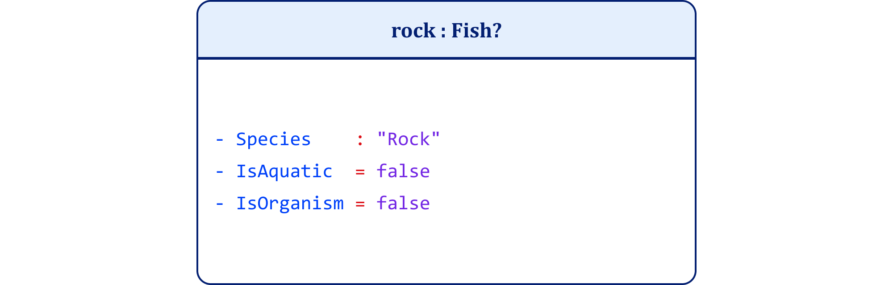

**Figure C-4. Rock UML Object Diagram (Invalid Fish)**

------------------------------------------------------------------------------------------------------------------------------------------------------------------------  
**Figure C-4. Rock UML Object Diagram (Invalid Fish)**

In Project 1, the code evaluates a specific candidate passed as a command-line argument. This makes the admissibility test explicit. The system does not switch between an abstract valid mode and invalid mode. It evaluates whether a given candidate satisfies the admissibility conditions of Fish. The README for Project 1 provides the canonical run commands and expected outputs. When you execute the C# code with the following commands:

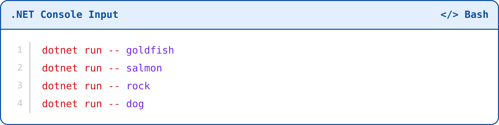

**Project 1 Run Commands**

-------------------------------------------------------------------------------------------------------------------------------------------------------------------------  
***Project ******1****** Run Commands***

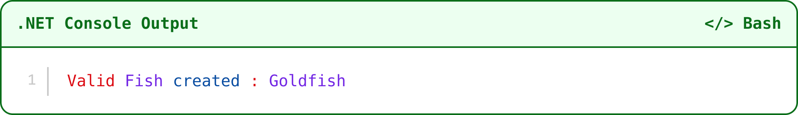

**Project 1 Valid Output**

-------------------------------------------------------------------------------------------------------------------------------------------------------------------------  
***Project ******1****** Valid Output***

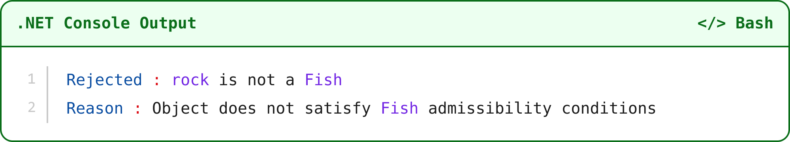

**Project 1 invalid Output**

*  
*-------------------------------------------------------------------------------------------------------------------------------------------------------------------------  
***Project ******1****** invalid Output***

You get a valid response for the first two object diagrams; for example, when you pass goldfish as an input parameter:

However, you get an  invalid response when you pass rock as the input parameter:

This behavior demonstrates that identity conditions operate upstream of all other processes. They constrain the space of possible instances before any goal-based filtering or contextual interpretation occurs. Project 1 therefore establishes the first architectural claim: identity conditions define admissibility and constrain what can count as an instance in the first place.

Project 2 isolates the instantiation layer. The goal is to show that multiple instances can satisfy the same identity conditions while differing in parametric values. Variation occurs within the boundary set by identity conditions, not by rewriting them. The rationale is to separate property assignment from the admissibility conditions Project 1 defined.9

In Project 2, the concept Fish remains unchanged. The system applies its admissibility conditions upstream. What changes at this stage is the assignment of parameter values to instances that already qualify as fish. Each instance has properties such as species and type, where type may take values such as PET or FOOD.

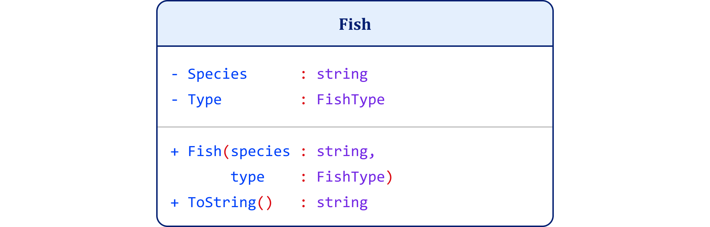

**Figure C-5. Shared Structure Fish UML Class Diagram**

-------------------------------------------------------------------------------------------------------------------------------------------------------------------------  
**Figure C-5. Shared Structure Fish UML Class Diagram**

Figure C-5 defines the shared structure that all instances must satisfy. The admissibility layer has already done its work. The focus now shifts to how admitted instances differ within that structure.

The object diagrams show distinct instantiations of the same concept. Figure C-6 represents a Goldfish instance. Figure C-7 represents a Salmon instance.

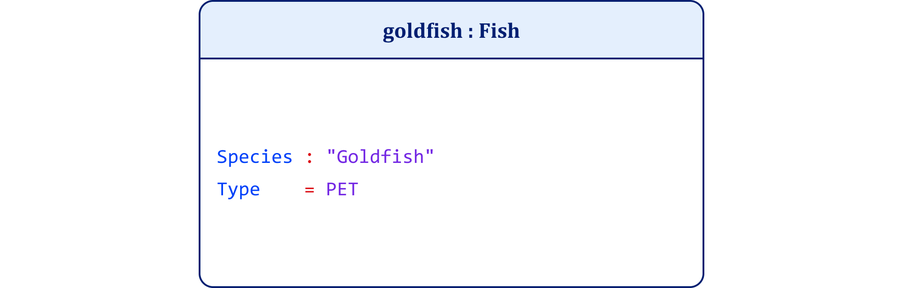

**Figure C-6. Goldfish UML Object Diagram**

-------------------------------------------------------------------------------------------------------------------------------------------------------------------------  
**Figure C-6. Goldfish UML Object Diagram**

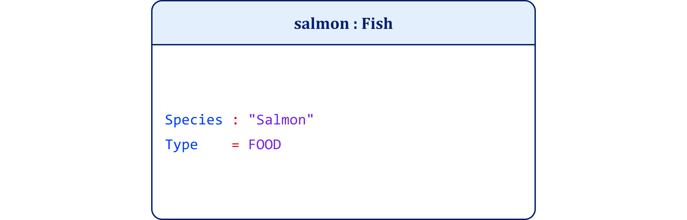

**Figure C-7. Salmon UML Object Diagram**

-------------------------------------------------------------------------------------------------------------------------------------------------------------------------  
**Figure C-7. Salmon UML Object Diagram**

Both instances satisfy the identity conditions of Fish established in Project 1. Their difference lies entirely in their parameter values. These parameters do not redefine the concept. They specify the realization of the concept in particular instances.

In Project 2, the code creates fish instances with different parameter assignments. The system does not ask whether every possible object is a fish at this stage. It works only with candidates that satisfy the admissibility layer and then assigns determinate values. The README for Project 2 provides the canonical run commands and expected outputs.

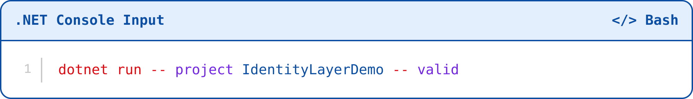

**Project 2 Valid Run Commands**

-------------------------------------------------------------------------------------------------------------------------------------------------------------------------  
***Project ******2****** Valid Run Commands***

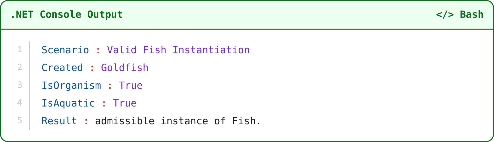

**Project 2 Valid Output**

-------------------------------------------------------------------------------------------------------------------------------------------------------------------------  
***Project ******2****** Valid Output***

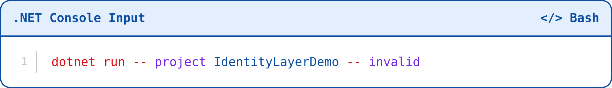

**Project 2 Invalid Run Commands**

-------------------------------------------------------------------------------------------------------------------------------------------------------------------------  
***Project ******2****** Invalid Run Commands***

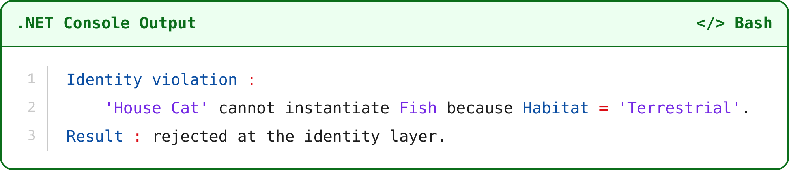

**Project 2 Invalid Output**

-------------------------------------------------------------------------------------------------------------------------------------------------------------------------  
***Project ******2****** Invalid Output***

This behavior demonstrates that instantiation assigns determinate values within a stable constraint structure. Variation occurs at the level of parameters such as species and type. It does not alter the concept.

Project 2 therefore establishes the second architectural claim: instantiation introduces variability without altering identity conditions. Identity conditions determine what can count as an instance. Instantiation assigns determinate values to the instance.

Project 3 isolates the goal layer. The goal is to show that purpose regulates selection among admissible instances without altering identity conditions or instantiation. Context enters the system as a selection mechanism. It does not determine conceptual identity.10

The concept Fish remains unchanged. The instantiated objects remain unchanged. The system now introduces a goal interface that evaluates which instances matter under a given purpose. Different goals apply different selection criteria to the same set of admitted instances.

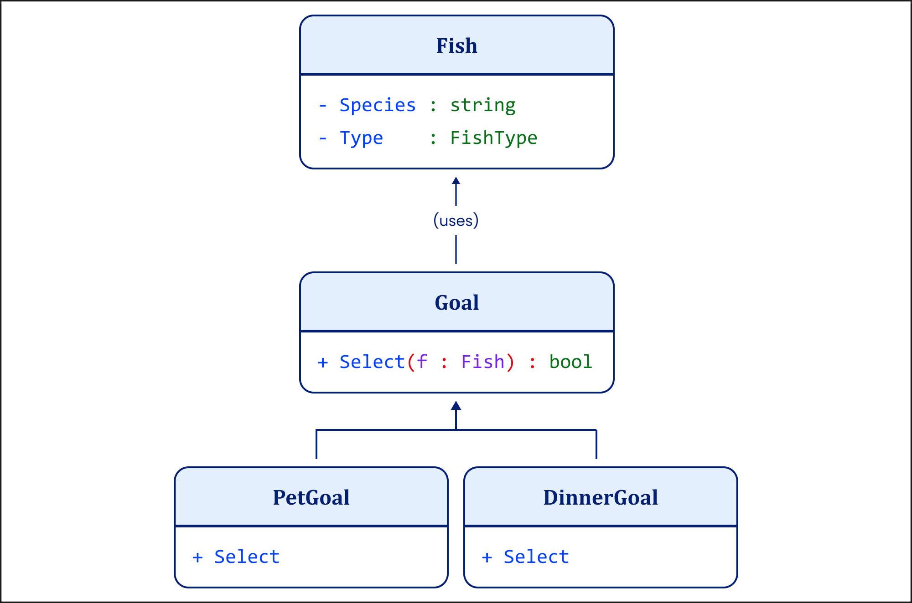

**Figure C-8. Goal Layer Selection Structure UML Class Diagram**

-------------------------------------------------------------------------------------------------------------------------------------------------------------------------  
**Figure C-8. Goal Layer Selection Structure UML Class Diagram**

Figure C-8 shows the goal layer at the class level. The interface IGoal defines a selection function over Fish instances. PetGoal selects instances where Type = PET. DinnerGoal selects instances where Type = FOOD. These goals do not modify the instances. They evaluate them.

The object diagrams show how the same set of instances receives different selection treatment under different goals.

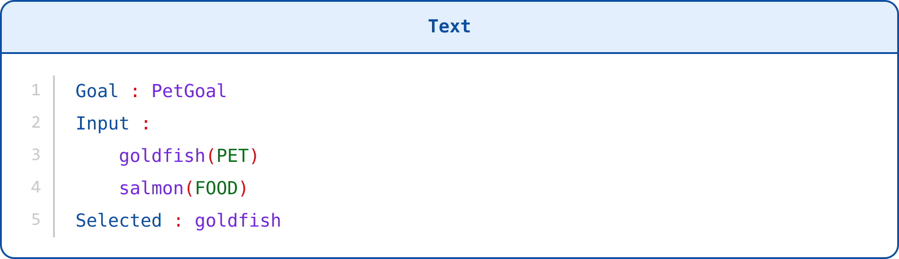

**Figure C-9. Selection Under a Pet Goal**

-------------------------------------------------------------------------------------------------------------------------------------------------------------------------  
**Figure C-9. Selection ****Under**** a Pet Goal**

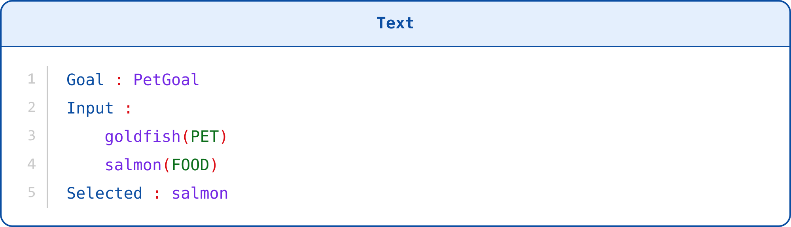

**Figure C-9. Selection Under a Dinner Goal**

-------------------------------------------------------------------------------------------------------------------------------------------------------------------------  
**Figure C-9. Selection ****Under**** a Dinner Goal**

In Project 3, the code applies a goal to a fixed set of instances. The goal determines which instances satisfy its selection constraint, but it does not alter the instances themselves or the concept they instantiate. The README for Project 3 provides the canonical run commands and expected outputs.

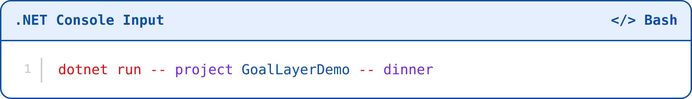

**Project 3 Dinner Run Commands**

-------------------------------------------------------------------------------------------------------------------------------------------------------------------------  
***Project ******3****** Dinner Run Commands***

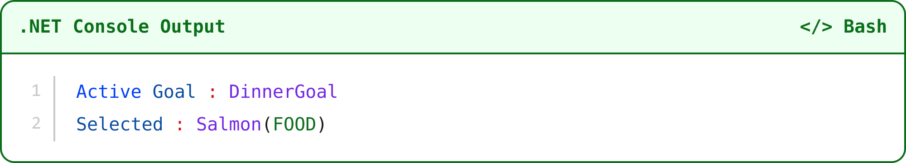

**Project 3 Dinner Output**

-------------------------------------------------------------------------------------------------------------------------------------------------------------------------  
***Project ******3****** Dinner Output***

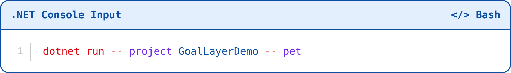

**Project 3 Pet Run Commands**

-------------------------------------------------------------------------------------------------------------------------------------------------------------------------  
***Project 3 ******Pet  Run****** Commands***

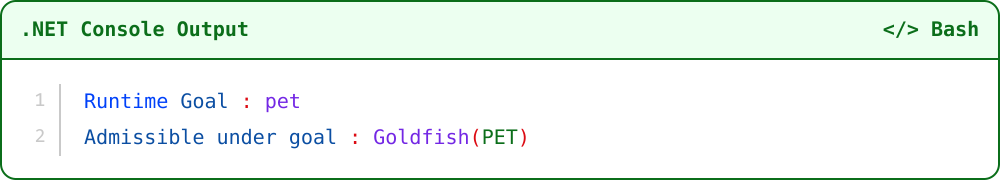

**Project 3 Pet Output**

-------------------------------------------------------------------------------------------------------------------------------------------------------------------------  
***Project 3 Pet Output***

This behavior demonstrates that goals operate downstream of identity conditions and instantiation. Goals regulate relevance by selecting among admissible instances. They do not redefine what a fish is. They do not reassign the values of the instance.

Project 3 therefore establishes the third architectural claim: goals introduce context as selection over a fixed set of valid instances. Selection varies with purpose. Identity conditions and instantiated values remain stable.

Project 4 isolates runtime construction. The goal is to show that flexibility can operate through a dynamically built constraint specification rather than through the collapse of identity conditions. This project distinguishes selection over pre-existing instances from the construction of a goal-bound constraint structure for a particular episode.11

The system no longer applies a goal directly as a filter over instances. Instead, a builder constructs a constraint specification at runtime based on the active goal. This specification determines which condition the instance must satisfy in that context. The concept does not vanish into use. The system constructs a determinate constraint structure and then evaluates instances under it.

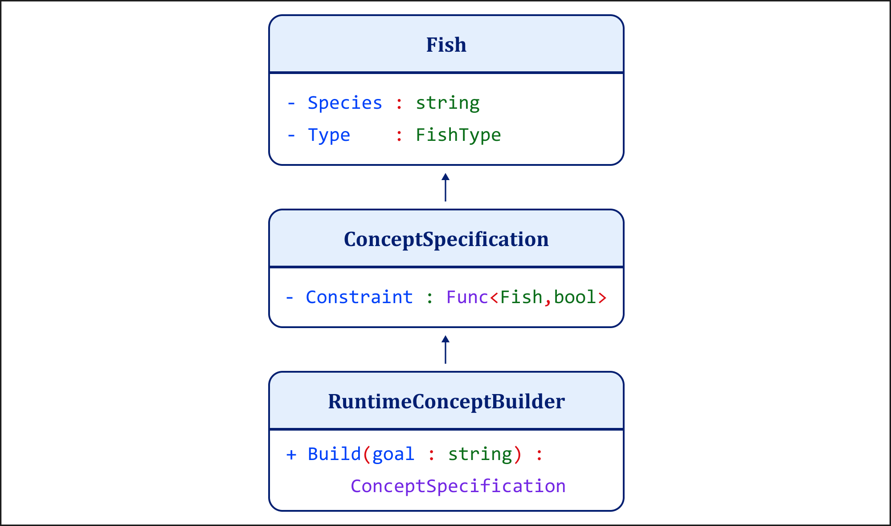

**Figure C-11. Runtime Construction Layer UML Class Diagram**

-------------------------------------------------------------------------------------------------------------------------------------------------------------------------  
**Figure C-11. Runtime Construction Layer UML Class Diagram**

The ConceptSpecification class encapsulates a constraint function. The RuntimeConceptBuilder constructs this function based on the goal. For a pet goal, the constraint evaluates whether Type == PET. For a dinner goal, the constraint evaluates whether Type == FOOD. Each invocation of the builder produces a determinate constraint structure tied to the active purpose.

The object diagrams show the constructed constraint specifications.

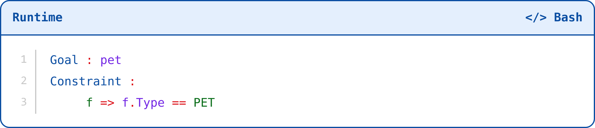

**Figure C-12. Runtime Specification for Pet Goal**

-------------------------------------------------------------------------------------------------------------------------------------------------------------------------  
**Figure C-12. Runtime Specification for Pet Goal**

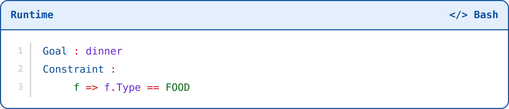

**Figure C-13. Runtime Specification for Dinner Goal**

-------------------------------------------------------------------------------------------------------------------------------------------------------------------------  
**Figure C-13. Runtime Specification for Dinner Goal**

These constraints are not predefined classes. The system constructs them at runtime and applies them to the available instances. At this layer, the constructed constraint determines whether the instance qualifies. The code builds a ConceptSpecification based on the input goal and applies its constraint to the set of Fish instances. It performs two steps: it constructs the constraint, then it evaluates instances against that constraint. The README for Project 4 provides the canonical run commands and expected outputs.

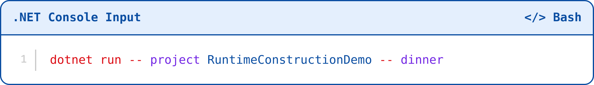

**Project 4 Dinner Run Commands**

-------------------------------------------------------------------------------------------------------------------------------------------------------------------------  
***Project 4 ******Dinner  Run****** Commands***

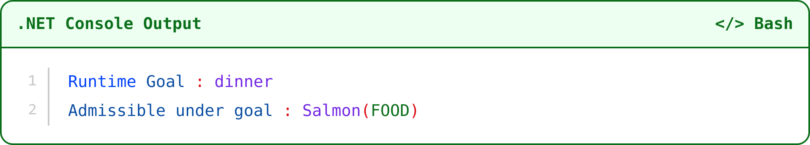

**Project 4 Dinner Output**

-------------------------------------------------------------------------------------------------------------------------------------------------------------------------  
***Project ******4****** Dinner Output***

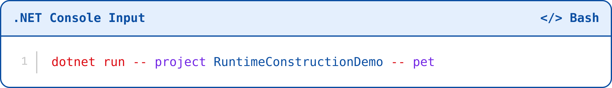

**Project 4 Pet Run Commands**

-------------------------------------------------------------------------------------------------------------------------------------------------------------------------  
***Project 4 ******Pet  Run****** Commands***

**Project 4 Pet Output**

-------------------------------------------------------------------------------------------------------------------------------------------------------------------------  
***Project 4 Pet Output***

This behavior demonstrates that runtime flexibility does not require conceptual drift. The system may construct a use-specific constraint structure, but the structure remains determinate for each execution. The active goal changes the constraint specification. It does not erase the need for constraint.

Project 4 therefore establishes the fourth architectural claim: conceptual flexibility can take the form of dynamic constraint construction. What changes is not identity itself, nor the deeper identity conditions of Fish, but the goal-bound specification that determines relevance in a given context.

Project 5 isolates multi-concept participation. The goal is to show that a single object can participate in multiple goal-bound concepts without changing its identity. Conceptual plurality arises when different constraint structures evaluate the same object under different purposes. It does not require a transformation of the object itself.12

In Project 5, the object Car remains constant across all evaluations. What varies is the goal under which the system evaluates it. Each goal defines a different constraint structure, and the same object may satisfy more than one such structure.

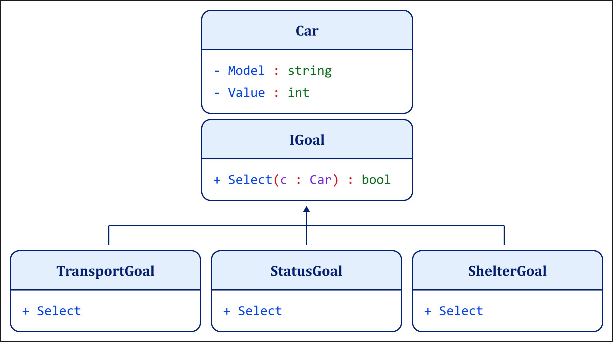

**Figure C-14. Goal Layer Selection Structure for Car UML Class Diagram**

-------------------------------------------------------------------------------------------------------------------------------------------------------------------------  
**Figure C-14. Goal Layer Selection Structure for Car UML Class Diagram**

The Car class defines the object's identity and properties. The goal interface defines a selection function. Each goal applies a different constraint. TransportGoal selects all cars. StatusGoal selects cars above a value threshold. ShelterGoal selects cars that can function as temporary shelter.

The UML object diagrams show how the same objects participate differently under each goal.

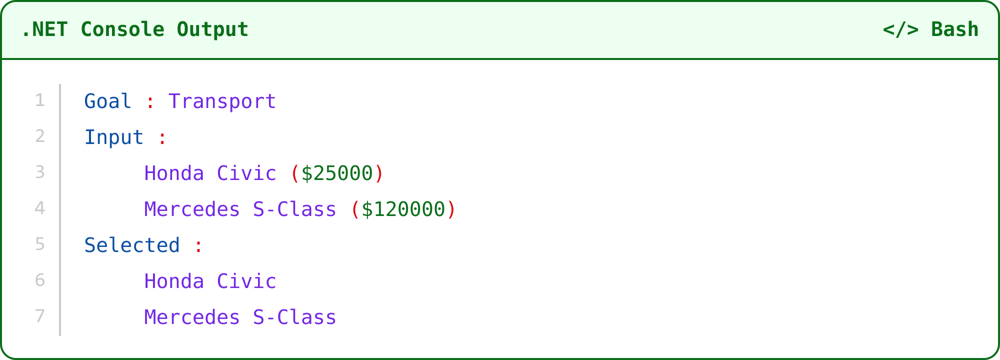

**Figure C-15. Transport Goal UML Object Diagram**

-------------------------------------------------------------------------------------------------------------------------------------------------------------------------  
**Figure C-15. Transport Goal UML Object Diagram**

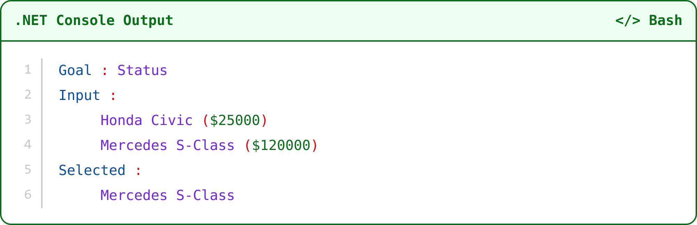

**Figure C-16. Status Goal UML Object Diagram**

-------------------------------------------------------------------------------------------------------------------------------------------------------------------------  
**Figure C-16. Status Goal UML Object Diagram**

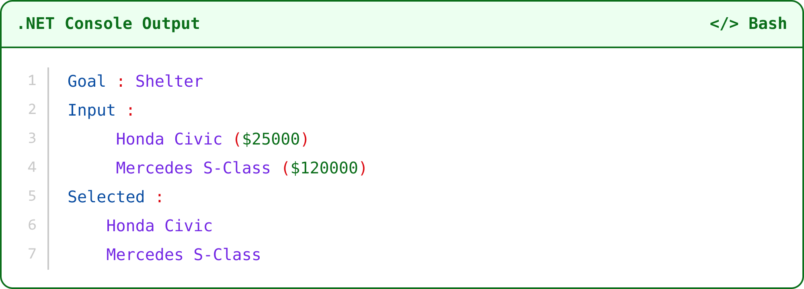

**Figure C-17. Shelter Goal UML Object Diagram**

-------------------------------------------------------------------------------------------------------------------------------------------------------------------------  
**Figure C-17. Shelter Goal UML Object Di****agram**

In Project 5, the code applies multiple goals sequentially to the same set of objects. Each goal evaluates the objects according to its own constraint. The objects do not change. Only their participation in the selected set changes. The README for Project 5 provides the canonical run command and expected output.

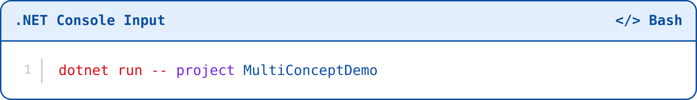

**Project 5 Run Commands**

-------------------------------------------------------------------------------------------------------------------------------------------------------------------------  
***Project ******5****** Run Comma******nds***

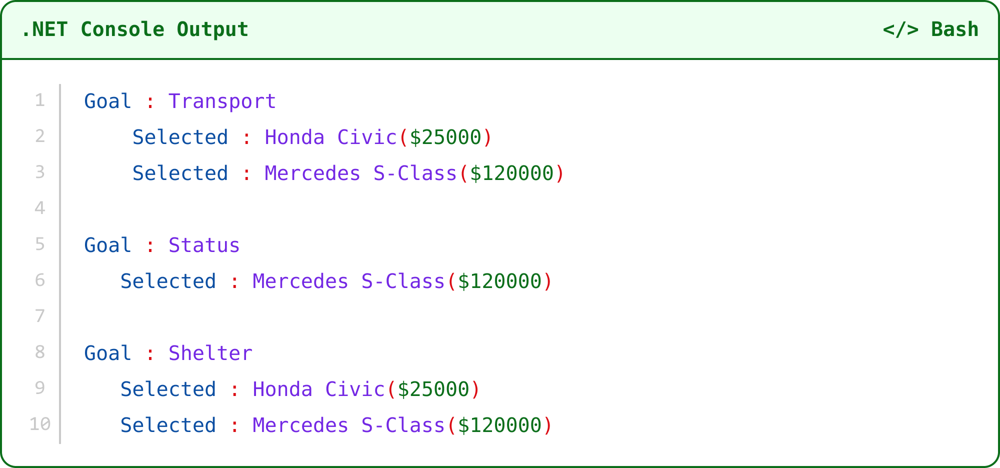

**Project 5 Run Output**

-------------------------------------------------------------------------------------------------------------------------------------------------------------------------  
***Project ******5****** Run Output***

This behavior demonstrates that a single object can satisfy multiple goal-bound constraint structures. Its identity remains stable across all evaluations. What changes is the role the object plays under different goals.

Project 5 therefore establishes the fifth architectural claim: conceptual plurality does not imply identity change. It reflects the application of different constraint structures to the same object.

In this appendix, I have tested Barrett's goal-based account at the level of executable constraint architecture. The result is not that Barrett is wrong to emphasize goal flexibility. She is right that concepts can shift with purpose and context. The question is what must remain stable for that flexibility to count as conceptual use rather than conceptual drift. The five projects answer that question directly: flexibility requires layers, and each layer must do its own work.

Project 1 fixes identity conditions as admissibility constraints: before a candidate can be selected for dinner, pet, transport, status, or shelter, it must first be a possible instance of the relevant concept. Project 2 then shows how instantiation permits variation inside that boundary without rewriting it. Project 3 shows that goals select among admissible instances rather than create their identity. Project 4 shows that runtime construction can bind determinate goal-specific specifications without abandoning constraint. Project 5 shows that one object can participate in multiple goal-bound concepts while retaining its own identity across evaluations.

These results preserve the strongest part of Barrett's account while correcting its architectural compression. Goals can select, filter, emphasize, and construct relevance. They cannot replace the identity conditions that determine what can count as an instance in the first place. Context and purpose operate downstream from admissibility. They modify use, not the basic fact that conceptual application answers to criteria.

Appendix C therefore confirms the thesis of Chapter 3 in executable form. Goal-based concepts are flexible because constraint structures can operate at several levels, not because identity conditions must be absorbed into goal-sensitive use. Variability does not entail indeterminacy. Runtime construction does not abolish structure. Multi-concept participation does not imply identity change. Flexibility presupposes constraint.13

## Endnotes

1. Eric Margolis and Stephen Laurence, "Concepts," in The Stanford Encyclopedia of Philosophy, Fall 2023 ed., ed. Edward N. Zalta and Uri Nodelman, https://plato.stanford.edu/entries/concepts/. Access basis: Open scholarly reference.

2. Eric Margolis and Stephen Laurence, "Concepts," in The Stanford Encyclopedia of Philosophy, Fall 2023 ed., ed. Edward N. Zalta and Uri Nodelman, https://plato.stanford.edu/entries/concepts/. Access basis: Open scholarly reference.

3. Eric Margolis and Stephen Laurence, "Concepts," in The Stanford Encyclopedia of Philosophy, Fall 2023 ed., ed. Edward N. Zalta and Uri Nodelman, https://plato.stanford.edu/entries/concepts/. Access basis: Open scholarly reference.

4. Eric Margolis and Stephen Laurence, "Concepts," in The Stanford Encyclopedia of Philosophy, Fall 2023 ed., ed. Edward N. Zalta and Uri Nodelman, https://plato.stanford.edu/entries/concepts/. Access basis: Open scholarly reference.

5. Lawrence W. Barsalou, "Ad Hoc Categories," Memory & Cognition 11, no. 3 (1983): 211-227, https://doi.org/10.3758/BF03196968. Access basis: DOI and publisher metadata verified.

6. Object Management Group, Unified Modeling Language, Version 2.5.1, formal/17-12-05 (Milford, MA: Object Management Group, 2017), https://www.omg.org/spec/UML/2.5.1/PDF. Access basis: Official open standard.

7. Object Management Group, Unified Modeling Language, Version 2.5.1, formal/17-12-05 (Milford, MA: Object Management Group, 2017), 126, https://www.omg.org/spec/UML/2.5.1/PDF. Access basis: Official open standard.

8. Object Management Group, Unified Modeling Language, Version 2.5.1, formal/17-12-05 (Milford, MA: Object Management Group, 2017), https://www.omg.org/spec/UML/2.5.1/PDF. Access basis: Official open standard.

9. Object Management Group, Unified Modeling Language, Version 2.5.1, formal/17-12-05 (Milford, MA: Object Management Group, 2017), https://www.omg.org/spec/UML/2.5.1/PDF. Access basis: Official open standard.

10. Lawrence W. Barsalou, "Ad Hoc Categories," Memory & Cognition 11, no. 3 (1983): 211-227, https://doi.org/10.3758/BF03196968. Access basis: DOI and publisher metadata verified.

11. Lawrence W. Barsalou, "Ad Hoc Categories," Memory & Cognition 11, no. 3 (1983): 211-227, https://doi.org/10.3758/BF03196968. Access basis: DOI and publisher metadata verified.

12. Object Management Group, Unified Modeling Language, Version 2.5.1, formal/17-12-05 (Milford, MA: Object Management Group, 2017), https://www.omg.org/spec/UML/2.5.1/PDF. Access basis: Official open standard.

13. Eric Margolis and Stephen Laurence, "Concepts," in The Stanford Encyclopedia of Philosophy, Fall 2023 ed., ed. Edward N. Zalta and Uri Nodelman, https://plato.stanford.edu/entries/concepts/. Access basis: Open scholarly reference.

## Bibliography

Aristotle. *Posterior Analytics*. Translated by Jonathan Barnes. Oxford: Clarendon Press, 1993.

Barrett, Lisa Feldman. *How Emotions **Are Made**: The Secret Life of the B**rain*. Boston: Houghton Mifflin Harcourt, 2017.

Barsalou, Lawrence W. "*Ad Hoc Categories*." *Memory & Cognition* 11, no. 3 (1983): 211-27.

Barsalou, Lawrence W. "*Perceptual Symbol Systems*." *Behavioral and Brain Sciences* 22, no. 4 (1999): 577-660.

Barsalou, Lawrence W. "*Situated Conceptualization*." *Cognitive Processing* 4 (2003): 61-84.

Booch, Grady, James Rumbaugh, and Ivar Jacobson. *The Unified Modeling Language User Guide*. 2nd ed. Boston: Addison-Wesley, 2005.
