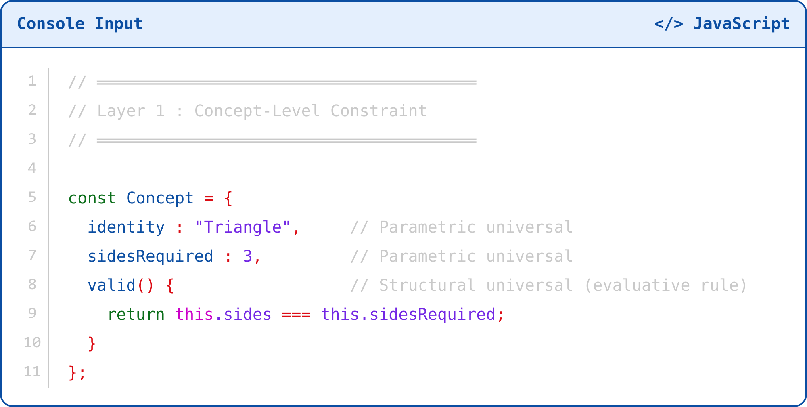
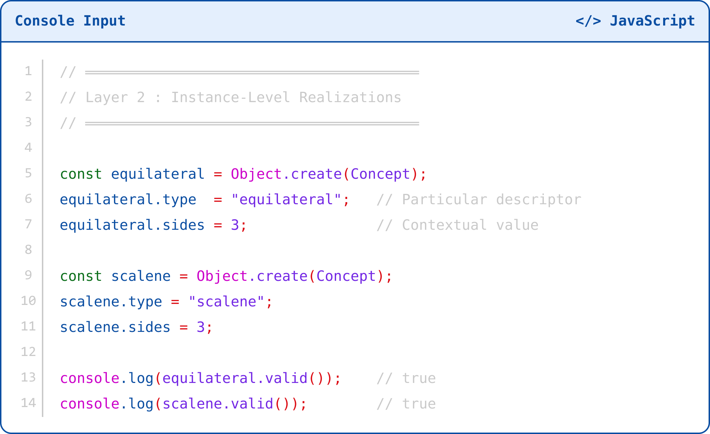
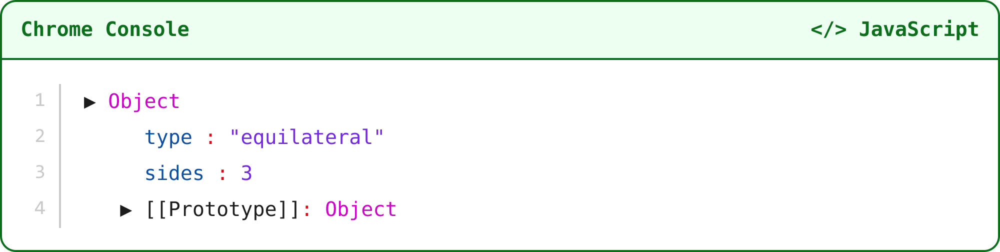
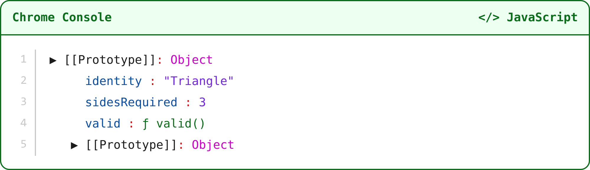
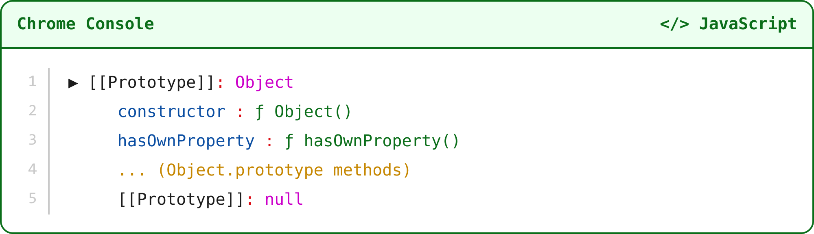
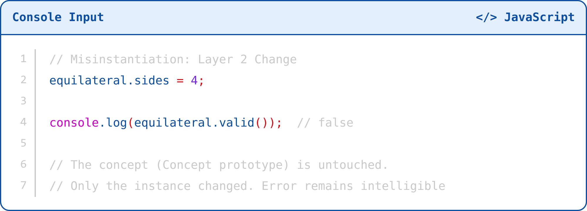
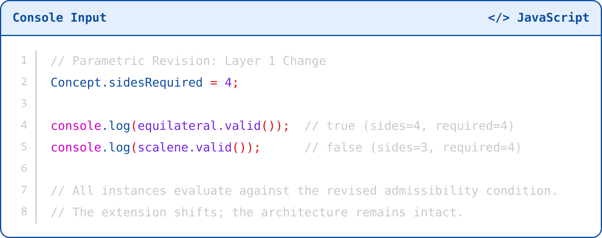
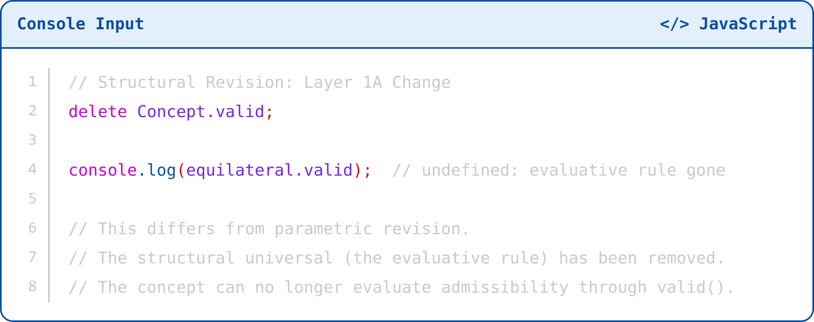

# Appendix E: Chrome DevTools

## Demonstration of Layered Ontology

# Purpose of This Demonstration

This appendix makes the central argument of Chapter 5 visible in a running JavaScript runtime. I do not use the JavaScript prototype chain as a metaphor. I use it as an inspectable structure.

The argument is this: the classical-prototype dichotomy rests on a false architectural premise. Classical theory seeks identity conditions but often hardens them into rigid classification rules. Prototype theory explains categorization behavior but often mistakes downstream similarity for the concept itself. The correct architecture separates upstream identity conditions from downstream instance behavior.

By inspecting a JavaScript object and expanding its prototype chain in DevTools, we can observe three distinct levels in runtime memory: infrastructure, concept-level constraint, and instance-level realization.

| No installation, server, package, build tool, or editor is required. This demonstration runs entirely inside Chrome's Console. |
| --- |

# Setting Up the Demo

## Step 1: Open Chrome DevTools

Open Google Chrome and navigate to any webpage, including about:blank.

Press F12 on Windows or Linux, or Cmd + Option + I on Mac.

Select the Console tab.

Click inside the Console input area at the bottom, where Chrome displays the > prompt.

## Step 2: Enter the Base Demonstration Code

Paste the following code into the Console, then press Enter. This creates the three-layer architecture in memory.

Layer 1: The Concept Object

**Source figure 1**

Layer 2: The Instance Objects

**Source figure 2**

| You can paste both code blocks together. Use Shift + Enter to add lines without running the code too early. Press Enter on a blank line to execute the full block. |
| --- |

After the code runs, the Console prints true twice. Each instance passes the valid() check inherited from Concept.

# Visual Inspection in DevTools

Now inspect the object structure directly. This is where the ontology becomes visible.

## Inspect the Instance: Layer 2

Type equilateral in the Console and press Enter.

Click the expand arrow next to the returned object.

At this level, Chrome shows the object's own properties:

**Source figure 3**

These are the instance's own properties: its particular descriptors and contextual values. This is Layer 2: Instance-Level Realization. The object has a type and a sides value, both assigned at the instance level. They do not define what a triangle is.

| Notice the collapsed [[Prototype]] entry. This is the gateway to the concept layer. Do not expand it yet. |
| --- |

## Expand [[Prototype]]: Layer 1

Click the expand arrow next to [[Prototype]], sometimes shown as __proto__.

At this level, Chrome shows the inherited structure:

**Source figure 4**

This is Layer 1: Concept-Level Constraint. Here you observe:

identity: "Triangle": the parametric universal establishing what kind of concept this is.

sidesRequired: 3: the parametric universal establishing the admissibility condition.

valid: ƒ valid(): the structural universal, the evaluative rule that determines whether an instance satisfies the concept.

These constraints do not come from the instances below them. The instances inherit from the prototype. The instances do not generate the concept. The concept governs the instances.

| This is the key observation: identity is upstream. The concept is not a summary of its instances. It is the constraint that makes those instances intelligible as instances of anything at all. |
| --- |

## Expand Further: Layer 0

Expand the second [[Prototype]] entry inside the first.

At this level, Chrome shows JavaScript's runtime infrastructure:

**Source figure 5**

This is Layer 0: Runtime Infrastructure Constraint. You have reached Object.prototype, the terminus of JavaScript's ordinary prototype chain. The final [[Prototype]] is null. Delegation has a boundary. Property lookup has an end.

This layer makes constraint inheritance possible, but it does not encode conceptual identity. It supplies the infrastructure on which the concept layer operates.

| Layer 0 is what classical essentialism can misidentify as the concept itself: identity conditions treated as infrastructural necessities. DevTools shows they are not. Layer 1 is revisable. Layer 0 is not. |
| --- |

# Demonstrating Layer-Specific Change

Each operation below targets a different ontological layer and produces a different kind of change. Run them in sequence to see what changes, what remains stable, and why the distinction matters.

## A. Misinstantiation: Layer 2 Change

Assign an invalid value to the instance's own property.

**What this shows:**

What this shows:

The particular sides changed at the instance level.

The concept, Concept, remains untouched.

valid() returns false because the instance now fails to satisfy the upstream constraint.

The error is intelligible only because identity conditions remain stable upstream.

Prototype theory can describe variation among instances, but this operation shows why variation cannot define the concept. The invalid instance does not revise the concept by existing. It fails against it.

| Typicality gradients and variability (the phenomena prototype theory correctly observes) appear here at Layer 2. But they presuppose the stability of Layer 1. |
| --- |

**Source figure 7**

## B. Parametric Revision: Layer 1 Change

Revise the governing admissibility condition on the prototype itself.

What this shows:

The parametric universal sidesRequired changed at the concept level.

equilateral.valid() returns true because equilateral.sides was changed to 4 in the previous step.

scalene.valid() returns false because scalene.sides remains 3.

All instances now evaluate against the revised admissibility condition inherited from Concept.

The extension of the concept shifts, but the architecture remains intact. Classical essentialism struggles with this distinction: identity conditions can change without structural collapse. Layer 1 is revisable. Revisability is not instability.

## C. Structural Revision: Layer 1A Change

Remove the evaluative rule from the prototype.

**Source figure 8**

What this shows:

The structural universal valid() has been removed from the concept layer.

This differs from parametric revision. The evaluative architecture changed, not merely the admissibility value.

No instance can now determine whether it satisfies the concept through valid().

The distinction between parametric revision and structural revision matters. One revises what counts as an admissible instance. The other revises the evaluative framework that makes counting intelligible at all.

| DevTools preserves this distinction in memory. A theory of concepts should preserve it in thought. |
| --- |

# The Three-Layer Ontology: Summary

The prototype chain visible in DevTools renders the layered ontology argued in Chapter 5. The three layers are not interpretive. Chrome displays them as runtime structure.

| Layer | Name | Role | Corresponds To |
| --- | --- | --- | --- |
| 0 | Runtime Infrastructure | Bounds delegation; terminates at null |  |
| 1 | Concept-Level Constraint | Encodes identity; fixes admissibility conditions and evaluative rule | Concept prototype object |
| 2 | Instance-Level Realization | Contextual values; particular assignments; graded variability | equilateral, scalene objects |

------------------------------------------------------------------------------------------------------------------------------------------------------------  
**Table E-1. Three-Layer Ontology: Runtime Infrastructure, Concept-Level Constraint, and Instance-Level Realization**

# Philosophical Implications

## Why Prototype Theory Fails at Layer 1

Prototype theory collapses Layer 1 into Layer 2. It treats the concept as a summary of its instances: a central tendency, similarity gradient, or distributional pattern. DevTools contradicts this directly. The prototype object does not derive from the instances. The instances inherit from it.

Typicality effects, graded membership, and similarity-based categorization are real phenomena, but they belong to Layer 2. They presuppose the stability of Layer 1. A system cannot exhibit graded membership unless something fixes what counts as membership in the first place.

## Why Classical Essentialism Overreaches at Layer 0

Classical theory sometimes collapses Layer 1 into Layer 0. It treats identity conditions as if they possessed the rigid, infrastructural necessity of the prototype chain's terminus. DevTools shows why this is wrong. Layer 0, Object.prototype -> null, is not revisable. Layer 1 is revisable.

## The Faux Dichotomy Loses Its Force

Once we distinguish the three layers, we no longer need the classical-prototype opposition. It becomes a division of labor.

Classical structure operates at Layer 1: it fixes identity conditions upstream.

Prototype effects operate at Layer 2: they describe instance distributions and categorization behavior downstream.

These are not competing answers to the same question. They answer different questions at different levels. The JavaScript prototype model makes this visible as runtime structure.

| Identity conditions stand upstream. Variability unfolds downstream.  Chrome DevTools makes both visible. A viable theory of concepts must preserve this distinction. It must not confuse sameness with similarity, identity conditions with frequency, or structure with execution. |
| --- |

## Conclusion

Appendix E supplies the runtime demonstration of the layered ontology. DevTools shows that instance behavior does not create the concept layer, and prototype effects do not replace inherited constraint. The appendix therefore answers its governing question: JavaScript's prototype chain does not vindicate prototype theory as concept theory. It makes visible the distinction between infrastructure, identity conditions, and instance-level variation.

Appendix E: Chrome DevTools Demonstration of Layered Ontology
