# Chapter 2: What Is an Idea, Anyway?

*Why Our Most Cherished Beliefs Rest on Shaky Ground*

*In Chapter 1, I exposed the foundational failure: we do not disagree about emotion merely because empirical evidence remains incomplete. We disagree because thinkers have not yet established what kind of entity they seek to define. In this chapter, I confront that problem directly. I examine what an idea is before I define what emotion is, because no theory of feeling, value, or agency can endure on concepts whose identity conditions remain vague.*

*This failure carries concrete danger. We invoke rights, morality, and emotion as if these abstractions carried self-evident authority. We argue from them, legislate by them, and organize our lives around them. Yet when challenged to explain what these concepts are, thinkers routinely retreat into intuitions, slogans, or inherited vocabulary. The result is not merely intellectual confusion; it is the degradation of conviction into rhetoric.*

*I offer a way out of this conceptual collapse. I define an idea as a unit of meaning composed of truth-apt propositions. I then build a framework that distinguishes the concept from the construct, and the construct from the category. A concept supplies identity conditions as binding constraints; a construct realizes those constraints under determinate values; and a category gathers valid realizations without displacing the identity of the concept itself.*

*I execute this method across three procedural tiers. First, I use linguistic definition and analytic truth to establish what must follow once an agent imposes determinate structure onto meaning. Second, I develop a layered ontology that separates concept, construct, and category. Third, I employ object-oriented grammar, UML modeling, and C# code to demonstrate that this conceptual structure survives executable execution. I do not merely argue for clarity; I computationally model clarity.*

*When an agent deploys Prototype Theory, they account for recognition, resemblance, and typicality, but recognition alone cannot establish identity. An observer may perceive a robin as more birdlike than a penguin, yet superficial resemblance cannot explain what makes either entity a bird. When a rational agent evaluates claims regarding truth, universality, and legitimacy, they require more than typical examples; they demand strict identity conditions. Classical Theory supplies the exact discipline a mind requires.*

*I then test this architecture through three decisive cases: integer, right, and core affect. Through the integer example, I demonstrate how a type constrains possible values. Through the rights example, I prove why authority cannot collapse into preference, assertion, or moral appeal. Through the core affect example, I show how an agent evaluates valence, arousal, and motivational intensity as candidate identity conditions for affective states before emotional construction begins. In each case, I enforce the same governing principle: identity must constrain variation, or meaning dissolves.*

*I turn to computation because formal modeling demands absolute explicitness. When an engineer constructs a program, a class cannot pretend to be an object; a declaration cannot silently become an instance; and a construct cannot redefine the concept that makes it possible. By executing code, I expose the ambiguity that prose routinely hides.*

*By the end of this chapter, I have built a disciplined architecture for defining ideas as structured systems. Yet this victory creates the next challenge. If identity conditions matter, what secures them after naïve essentialism collapses? In Chapter 3, I confront that question, asking whether identity must die with essence, or whether an agent can establish identity conditions without relying on naïve essentialism.*

## Why Our Most Cherished Beliefs Rest on Shaky Ground

[Notes](../references/notes/chapter-02.md) · [Bibliography](../references/bibliography/chapter-02.md)

Chapter 1 exposed the first problem: I do not believe we disagree about emotion merely because the evidence is incomplete. We disagree because we do not yet know what kind of thing we are trying to define. In this chapter, I directly address that problem. I ask what an idea is before I ask what emotion is, because no theory of feeling, value, morality, or rights can stand on concepts whose identity conditions remain vague.

The danger is not abstract. We invoke Rights, Morality, and Emotions as if these ideas possessed obvious meaning. We argue from them, suffer for them, legislate by them, and organize our lives around them. Yet when pressed to say what these ideas are, we often retreat into examples, intuitions, slogans, or inherited words. The result is not merely confusion. It is the collapse of belief into rhetoric.

I offer a way out. I define an idea as a unit of meaning composed of one or more clauses or truth-apt propositions. I then build a framework that distinguishes the word from the concept, the concept from the construct, and the construct from the category. A word labels. A concept supplies identity conditions as constraints. A construct realizes those constraints under determinate values. A category gathers valid realizations without becoming the meaning of the concept itself.

I proceed in stages. Language makes thought distinct. Definition establishes identity conditions. Analytic truth tests what must follow once meaning has determinate structure. Ontology distinguishes concept, construct, and category. Object-oriented grammar gives this distinction executable form. UML makes the structure visible. C# shows that the structure can run. I do not merely argue for clarity. I computationally model clarity.

This is why I turn to Classical Theory. Prototype Theory explains recognition, resemblance, and typicality, but recognition cannot define identity. A robin may look more birdlike than a penguin, but resemblance cannot tell us what makes either one a bird. When a theory makes claims about truth, universality, discreteness, or legitimacy, it needs more than typical examples. It needs identity conditions. Classical Theory supplies that discipline.

I then test the architecture through simple but decisive cases: integer, right, and core affect. The integer example shows how a type constrains possible values. The rights example shows why authority cannot collapse into preference, assertion, or moral appeal. The core affect example shows how valence, arousal, and motivational intensity can function as proposed identity conditions for affective state before emotion construction begins. In each case, the same principle holds: identity must govern variation, or meaning dissolves.

Computation matters here because it forces explicitness. A class cannot pretend to be an object. A declaration cannot silently become an instance. A construct cannot redefine the concept that makes it possible. The machinery exposes what prose often hides.

By the end of this chapter, I have built a disciplined architecture for defining ideas as structured systems. But this victory creates the next problem. If identity conditions matter, what secures them after naïve essentialism collapses? Chapter 3 takes up that question. It asks whether identity must die with essence, or whether a more powerful alternative remains: identity conditions without naïve essentialism.

Before I define an idea, I return to the problem Chapter 1 hands to this inquiry. I cannot define emotion until I know what kind of thing an idea is, how a definition fixes its identity, and how a concept survives variation without dissolving into rhetoric. I begin with Citizen Kain’s warning in God Father: Why Would I Get Married? by Cecil John:

“Rights. Morality. Emotions.

We treat so many ideas as if they exist in space and time: natural kinds awaiting discovery, metaphysical entities endowed with mind-independent identity and meaning.<a href="../references/notes/chapter-02.md#note-1">1</a>

We marshal arguments as if armed with facts, yet we rarely pause to test our conceptual foundations. Our propositions collapse under vague, ambiguous, and imprecise definitions.<a href="../references/notes/chapter-02.md#note-2">2</a>This collapse does not expose a failure of intelligence. It exposes a flaw in intension,<a href="../references/notes/chapter-02.md#note-3">3</a>and it exacts a moral, psychological, and intellectual cost.<a href="../references/notes/chapter-02.md#note-4">4</a>

Bear with me.”

Saussure warned that before language, nothing is distinct. Without linguistic structure, ideas do not yet exist as propositions. They remain a vague and undifferentiated mass without boundaries or meaning.<a href="../references/notes/chapter-02.md#note-5">5</a>

Ayn Rand rejected the notion that attributes exist independently of concepts.<a href="../references/notes/chapter-02.md#note-6">6</a>I extend that warning into a formal problem: when we treat ideas as loose bundles of properties rather than structures under principles of identity conditions, properties float free of constraint, instantiation becomes indeterminate, and argument collapses into rhetoric.<a href="../references/notes/chapter-02.md#note-7">7</a><a href="../references/notes/chapter-02.md#note-8">8</a>Without architecture, words can only gesture at what demands modeling.<a href="../references/notes/chapter-02.md#note-9">9</a>Where meaning remains indeterminate, conflict often stages the illusion of disagreement rather than a clash over shared identity.<a href="../references/notes/chapter-02.md#note-10">10</a>

To prevent whole doctrines from resting on concepts that no one has specified, concepts that remain incoherent, or concepts that lack structural soundness, I proceed in the order that integrity requires.<a href="../references/notes/chapter-02.md#note-11">11</a>

First, language makes ideas distinct and propositional.<a href="../references/notes/chapter-02.md#note-12">12</a>Second, analysis fixes definitions and tests them against objective principles of inference and consistency.<a href="../references/notes/chapter-02.md#note-13">13</a>Third, ontology distinguishes concept from construct and intension from extension, so identity conditions do not collapse into identity and meaning does not collapse into category.<a href="../references/notes/chapter-02.md#note-14">14</a>

Fourth, object-oriented grammar declares principles of identity by separating definition from instantiation.<a href="../references/notes/chapter-02.md#note-15">15</a>Fifth, UML renders that structure explicit and separates identity from instantiation without rhetorical drift.<a href="../references/notes/chapter-02.md#note-16">16</a>

As far as I am aware, no existing work integrates these linguistic, analytic, ontological, grammatical, and syntactic constraints into a single psychological and computational framework for classifying, constructing, and categorizing ideas as structured systems.<a href="../references/notes/chapter-02.md#note-17">17</a>This integration is the chapter’s value proposition: I do not merely argue for clearer definitions; I specify the architecture and principles a definition must obey.

Before I define an idea, I state what it is not. It is not a perceptual object, not a natural kind, and not a mind-independent theoretical entity. We perceive rocks, not rights. We weigh mercury, not morality. We detect electrons, not emotions.<a href="../references/notes/chapter-02.md#note-18">18</a>

How, then, do I distinguish the experience of an idea from its existence, and its existence from its meaning? I do not address the phenomenological status of an idea, that is, what it is like to think about an idea or the qualitative character of experience itself.<a href="../references/notes/chapter-02.md#note-19">19</a> I also do not resolve the noumenological question of whether an idea exists independently of experience. That problem belongs to the hard problem of consciousness.<a href="../references/notes/chapter-02.md#note-20">20</a>

Nowhere do these distinctions matter more than in the study of emotion. Theorists often collapse physiology, phenomenology, and conceptual meaning into one explanatory layer, and that collapse obscures the structure the distinction exists to preserve.<a href="../references/notes/chapter-02.md#note-21">21</a><a href="../references/notes/chapter-02.md#note-22">22</a>

My concern is narrower and more fundamental: I examine the status of an idea at the level of intensional conceptual structure before empirical application, interpretation, use, or theoretical dispute.<a href="../references/notes/chapter-02.md#note-23">23</a>

What then, exactly, is an idea?

An idea is a truth-apt unit of meaning composed of one or more clauses or propositions.<a href="../references/notes/chapter-02.md#note-24">24</a>Concepts come first. Meaning, categorization, inference, and valuation follow from conceptual structure.<a href="../references/notes/chapter-02.md#note-25">25</a>Most academics take concept as a settled primitive rather than a structure that requires architectural clarity.<a href="../references/notes/chapter-02.md#note-26">26</a>

When foundational concepts lack precise definition, every argument built on them inherits structural instability. Disputes that appear substantive often arise not from faulty reasoning or bad faith, but from incompatible definitions that operate beneath the surface.<a href="../references/notes/chapter-02.md#note-27">27</a>Ambiguity at the level of definition produces ontological confusion, undermines analytic integrity, and mistakes meaning for rhetoric rather than structure.<a href="../references/notes/chapter-02.md#note-28">28</a>

In ancient construction, builders set the cornerstone first. Every wall, angle, and load answered to it. When the cornerstone failed, the structure could appear upright while carrying the conditions of collapse.<a href="../references/notes/chapter-02.md#note-29">29</a>Similarly, a mission-critical ideological system can look coherent while its foundation practically guarantees contradictory interpretations.<a href="../references/notes/chapter-02.md#note-30">30</a>

Consider modern rights discourse. We treat rights as inherent and self-evident, as if their meaning required no definition. Yet neither logic nor nature validates that assumption. What passes for objectivity is belief, not evidence.<a href="../references/notes/chapter-02.md#note-31">31</a>

The Declaration of Independence collapses values, rights, and moral justification into a single rhetorical object. The Founders imported John Locke’s terminology without his structure. Locke did not claim that life, liberty, and property were rights. He claimed that one has a right to life, liberty, and property. These are claim-rights: authorities that generate correlative duties in others.<a href="../references/notes/chapter-02.md#note-32">32</a> Thomas Jefferson’s phrasing erased this structure, transforming values into rights, rights into preferences, liberties into authorities, authorities into entitlements, and entitlements into moral absolutes.<a href="../references/notes/chapter-02.md#note-33">33</a> The self-evident unalienable truths alluded to in the Declaration of Independence are not rights at all, but values.<a href="../references/notes/chapter-02.md#note-34">34</a>

The stone the builders accepted has become the weak cornerstone.

I co-opt Psalm 118:22 here, as I did in the Introduction, but I invert its meaning. The builders are the theorists and system-makers who treat inherited concepts as stable without specifying their identity conditions.

When we strip rights of their structure as authorities that generate correlative duties, moral obligation loses its footing and reduces to sentiment or consensus. Destroy one correlative concept and the other collapses with it.<a href="../references/notes/chapter-02.md#note-35">35</a>Plato’s Euthyphro dilemma frames the question: Are moral obligations binding because they are objectively right, or objectively right because they bind us? Divine command theory locates their authority in God’s will. Positive law locates it in institutional mandate. If morality is not optional, what grounds its binding force?<a href="../references/notes/chapter-02.md#note-36">36</a>

The stone the builders accepted has become the weak cornerstone.

Some theorists treat emotions as natural kinds with discoverable identity. Others treat them as constructed interpretations shaped by learning and context. The dispute persists because theorists fail to define the object of inquiry. Without fixed identity conditions for emotion at the level of conceptual intensionality, no one can adjudicate claims about its objectivity, realized identity, or meaning.<a href="../references/notes/chapter-02.md#note-37">37</a>

Lisa Feldman Barrett argues that we construct rather than detect emotions. However, her Conceptual Act Theory relies on the term concept to perform multiple incompatible roles at once: forming universals, interpreting sensations, instantiating episodes, and grouping categories.<a href="../references/notes/chapter-02.md#note-38">38</a>When a single term performs all four functions, definition collapses into application, identity conditions collapse into realized identity, and intension collapses into extension.<a href="../references/notes/chapter-02.md#note-39">39</a>

Whether emotions are constructions is not the issue. The issue is whether the theory that asserts construction possesses the conceptual architecture required to sustain that claim. The theory presupposes that the concept of a concept remains analytically stable, intensionally precise, and functionally invariant across these roles. As a result, conceptual ambiguity travels through every level of the theory. The theoretical basis does not fail because the evidence fails; it fails because the definitions of its core concepts lack structural adequacy.<a href="../references/notes/chapter-02.md#note-40">40</a>

The remedy begins with analytic truth. Before a proposition can become true by virtue of meaning, one must fix its definitions. As Ayn Rand states plainly, “To know the exact meaning of the concepts one is using, one must know their correct definitions.”<a href="../references/notes/chapter-02.md#note-41">41</a>Once definitions fix identity conditions, inference becomes mandatory. Analytic truths function as rules of inference within a conceptual system. They govern consistency, not existence.<a href="../references/notes/chapter-02.md#note-42">42</a>

This requires precising definition. A precising definition does not discover essences in the world. It fixes the principles of identity conditions for a concept that would otherwise remain vague, ambiguous, or indeterminate. Until one fixes those principles, inference has no footing. Where meaning shifts, contradiction follows without announcing itself.<a href="../references/notes/chapter-02.md#note-43">43</a>

Definition, properly understood, states the meaning of a concept, not merely the usage of a word. Rand makes the point directly: “A definition is a statement that identifies the nature of the units subsumed under a concept.”<a href="../references/notes/chapter-02.md#note-41">41</a>Words are tokens. Concepts declare identity conditions. Constructs realize identity. When definitions target words rather than concepts, meaning drifts, scope fractures, and apparent disagreement masks conceptual misalignment.<a href="../references/notes/chapter-02.md#note-44">44</a>

Definition creates analytic truth. If a right means the authority to gain or keep a value, then a claim-right necessarily generates a correlative duty. This proposition does not wait in nature for discovery. Meaning enforces it. To deny it does not challenge reality; it contradicts the framework one chooses.<a href="../references/notes/chapter-02.md#note-45">45</a>

This necessity does not arise from metaphysical objectivity. It arises from structural objectivity within a system. Analytic truth does not depend on universality, mind-independence, or necessity in reality. It depends on identity conditions, non-contradiction, determinacy, and inferential closure within a specified conceptual structure. Even a constructivist framework generates analytic truths once one fixes its concepts. Denying metaphysical realism does not abolish logic. It relocates its authority from ontology to structure.<a href="../references/notes/chapter-02.md#note-46">46</a>

Formal systems operate this way. In Euclidean geometry, parallel lines never meet. In chess, bishops move diagonally. In arithmetic, two plus two equals four. These truths do not describe metaphysical facts about the universe. They describe systemically objective constraints. Their objectivity lies in structure, not substance.<a href="../references/notes/chapter-02.md#note-47">47</a>

Let me be clear. I do not claim that the examples above fail because their definitions lack metaphysical objectivity. There are no objective definitions in that sense, and consequently no mind-independent cognitive meanings to discover.<a href="../references/notes/chapter-02.md#note-48">48</a> The examples fail only when their cornerstone concepts do not satisfy objective analytic principles.<a href="../references/notes/chapter-02.md#note-49">49</a> The issue is not realism, but architectural adequacy.

The principles that govern the definition of a concept determine whether that concept can function as a candidate for analytic truth.<a href="../references/notes/chapter-02.md#note-50">50</a> I therefore state the principles that any adequate definition must satisfy. A definition must fix identity conditions, clarify what the concept includes and excludes, achieve determinacy, eliminate vagueness and ambiguity, satisfy non-contradiction, exclude incompatible properties, remain non-arbitrary, constrain inference rather than preference, and preserve scope invariance so the concept does not shift across contexts of use.<a href="../references/notes/chapter-02.md#note-51">51</a>If any of these principles fail, the concept lacks fixed identity conditions and no proposition involving it can become truth-apt.<a href="../references/notes/chapter-02.md#note-52">52</a>

Once a concept satisfies these constraints, a distinct set of principles governs whether propositions involving that concept are analytically true.<a href="../references/notes/chapter-02.md#note-53">53</a>Analytic truth is governed by logical entailment, inferential closure, and necessity under substitution. A proposition is analytically true if it follows necessarily from the fixed definitions alone, if no counterexample can arise without contradiction, and if any term-substitution that preserves meaning also preserves truth.<a href="../references/notes/chapter-02.md#note-54">54</a>These principles govern what must follow once meaning has fixed identity conditions, not whether meaning has fixed those conditions in the first place.

Definition and analytic truth perform distinct but complementary roles. Definition establishes the identity conditions, integrity, and objectivity of meaning.<a href="../references/notes/chapter-02.md#note-55">55</a> Analytic truth determines what reason can and cannot assert once meaning satisfies those conditions. Definition fixes identity conditions. Analytic truth enforces consequence. Neither floats free of structure; neither collapses into the other.

Confusion follows when theorists fail to distinguish these levels. When definitions remain indeterminate, analytic claims masquerade as empirical generalizations. When theorists mistake analytic necessity for metaphysical necessity, they reify conceptual systems into discoveries about reality. Both errors collapse structure into substance.<a href="../references/notes/chapter-02.md#note-56">56</a>

Analytic objectivity is therefore neither mysterious nor metaphysical. It is the consequence of conceptual discipline. Where identity conditions hold, contradiction cannot enter. Where structure governs meaning, truth follows by necessity.<a href="../references/notes/chapter-02.md#note-57">57</a>

Appendix A now tests these principles of definition and analytic truth against Basic Emotion Theory. It asks whether the theory’s central concept of emotion satisfies the minimal requirements that govern concept formation and analytic explanation, including identity conditions, non-circularity, scope determinacy, and principled differentiation. Because Basic Emotion Theory treats emotions as discrete, universal, and biologically grounded kinds, those claims impose corresponding obligations of conceptual precision. Appendix A evaluates whether the theory’s definitions, explanatory structure, and evidentiary practices meet those requirements. The analysis does not challenge empirical findings; it assesses whether the theory’s conceptual architecture can sustain the analytic claims advanced on its behalf.<a href="../references/notes/chapter-02.md#note-58">58</a>

Definitions are not optional refinements. They are acts of intellectual commitment. But no definition can exceed the clarity of the concept it defines. If concepts anchor propositions, sustain analytic truths, and justify normative claims, then anyone who leaves them implicit commits epistemic negligence.<a href="../references/notes/chapter-02.md#note-59">59</a>One cannot demand logical rigor while refusing to specify the identity conditions on which logic operates. At this juncture, the inquiry must shift from the identity conditions of a concept to the identity conditions of “the” concept that constrain the identity of every concept: what is “the” concept?<a href="../references/notes/chapter-02.md#note-60">60</a>

To answer that question, I first examine the two dominant theories that claim to define “the” concept itself. Contemporary theories of concepts divide into two dominant families: classical theories and prototype theories.<a href="../references/notes/chapter-02.md#note-61">61</a>

According to Classical Theory, a concept declares identity conditions through structure rather than resemblance or typicality. To possess a concept is to grasp the necessary and sufficient conditions that determine what counts as an instance of it. A thing falls under the concept if and only if it satisfies those defining conditions.<a href="../references/notes/chapter-02.md#note-62">62</a>

Consider the concept integer. Similarity to familiar examples like 1, 2, or 7 does not identify an integer, nor does typicality. Formal constraints identify it: whole-valuedness, discreteness, and closure under specific operations. Any value that satisfies those conditions counts as an integer; any value that fails them does not. The concept declares identity conditions prior to instantiation, and particular numbers realize what the definition already declares.<a href="../references/notes/chapter-02.md#note-63">63</a>

On this view, conceptual meaning begins intensionally before it extends categorically. Definition establishes identity conditions. It does not derive them by aggregating instances or generalizing over collections of particular cases. This is why examples alone cannot determine the meaning of concepts such as truth, freedom, justice, or right. Without fixed defining structure, no amount of usage can determine what they are.<a href="../references/notes/chapter-02.md#note-64">64</a>Classically, this structure draws from Aristotle’s distinction between universals and particulars. Particulars are concrete instances encountered in experience. Universals supply the identity conditions that unify them. Definition proceeds by identifying the universal that explains what the particulars are.<a href="../references/notes/chapter-02.md#note-65">65</a>

Prototype Theory rejects definitional structure in favor of probabilistic structure. On this view, a concept does not specify necessary and sufficient conditions. Instead, something falls under a concept insofar as it satisfies enough characteristic properties associated with that concept. As the Stanford Encyclopedia of Philosophy puts it, “a lexical concept C doesn’t have definitional structure but has probabilistic structure in that something falls under C just in case it satisfies a sufficient number of properties encoded by C’s constituents.”<a href="../references/notes/chapter-02.md#note-66">66</a>

Consider the concept bird. Under a prototype model, a robin or sparrow counts as a more typical instance than a penguin or ostrich because it satisfies more characteristic properties, such as flying, singing, and perching. Classification proceeds by similarity to prototypical features rather than by satisfaction of fixed necessary and sufficient conditions. But this approach cannot determine what makes something a bird in the first place. It ranks instances by resemblance, but it does not declare identity conditions. As a result, Prototype Theory treats category membership as a matter of degree rather than a determinate judgment, and leaves the boundary between inclusion and exclusion indeterminate.

Philosophically, this view traces back to Wittgenstein’s notion of family resemblance, according to which category membership depends on overlapping similarities rather than shared essences.<a href="../references/notes/chapter-02.md#note-67">67</a>Psychologically, Eleanor Rosch’s experimental work on typicality effects grounds it by explaining why people judge apples as more typical examples of fruit than plums.<a href="../references/notes/chapter-02.md#note-68">68</a>Categorization, on this account, operates through similarity judgments rather than the rule-governed application of definitions.

Prototype-like generalization may drive successful categorization and recognition, but it cannot ground a formal theory of concepts. Prototype and similarity-based models explain typicality effects without fixing identity conditions.<a href="../references/notes/chapter-02.md#note-69">69</a>When a theory makes claims about identity, discreteness, or universality, it incurs an additional obligation. It must supply explicit identity conditions that govern what counts as an instance and what does not. Recognition performance cannot satisfy this requirement because classification presupposes rather than establishes the identity conditions of what it classifies. I therefore reject recognition accuracy as a substitute for definition and insist on architectural commitments that specify what a thing is and why each realization remains itself across instances.<a href="../references/notes/chapter-02.md#note-70">70</a>

Classical Theory and Prototype Theory address different explanatory targets. Classical Theory accounts for identity conditions, definition, and rule-governed application. Prototype Theory accounts for cognitive flexibility, typicality effects, and graded judgments. Prototype structure presupposes conceptual structure rather than replacing it. Similarity presupposes that one first defines what counts as an instance.<a href="../references/notes/chapter-02.md#note-71">71</a>

Classical Theory aligns with the computational aim of this chapter because it treats concepts as structured declarations rather than probabilistic impressions. I adopt a computational approach because this project requires a formal system that can declare identity conditions, constrain admissible instances, and support evaluation under explicit rules. Such a system requires identity conditions before similarity and structure before statistics. Only Classical Theory supplies the architectural discipline necessary to define, instantiate, and evaluate abstract ideas as intelligible structures rather than diffuse clusters.<a href="../references/notes/chapter-02.md#note-72">72</a>

I can now assert the definition of a concept.

A universal, in the present framework, is not a Platonic form, not a linguistic token, and not a mental image. It is an abstract identity-condition: a repeatable structural constraint that can be instantiated in multiple particulars without losing conceptual stability. Universals do not exist as separate substances; they function as type-level admissibility conditions governing what counts as an instance of a kind. As such, a universal does not possess state, measurements, or values. It defines only the structure that any admissible instance must satisfy. A concept, by contrast, is the cognitive representation of such a universal within a rational system. The universal specifies identity conditions at the level of structure; the concept grasps and declaratively fixes that structure.<a href="../references/notes/chapter-02.md#note-73">73</a>

A concept integrates one or more essential universals into a single definitional structure that declares identity conditions. These essential universals function as identity-defining attributes, while the concept unifies them at the level of type. The concept does not name a thing encountered in perception. It specifies what must hold for something to count as what it is. The next question in the chronology of this inquiry is this: by what process does the mind form such universals in the absence of direct perceptual input?<a href="../references/notes/chapter-02.md#note-74">74</a>

Concept formation is a process of cognitive integration, not discovery. The mind does not find abstract concepts in experience, nor do concepts name entities encountered in the world. The mind forms them by abstraction.<a href="../references/notes/chapter-02.md#note-75">75</a>

Abstraction integrates multiple instances under a universal by omitting their specific quantitative measurements while retaining their qualitative structure. As Ayn Rand explains, “The process of concept-formation consists of mentally isolating two or more existents according to a specific characteristic and integrating them into a single mental unit by means of a definition, while omitting their particular measurements.” By “measurements,” Rand refers to the particular values that vary from case to case, such as height, weight, color, duration, and magnitude.

Consider the concept table. One table may stand three feet high and consist of wood; another may stand six feet high and consist of metal. These instances differ in their measurements. The mind does not treat these differences as identity-defining. Instead, it identifies the structure that makes each instance a table: a horizontal surface supported by legs. In forming the concept, the mind abstracts away variation in magnitude and retains the structure that explains sameness in kind. The omitted measurements must exist in some quantity, but they may take any value consistent with the structure. Abstraction therefore eliminates variation in degree while preserving identity conditions at the level of form.<a href="../references/notes/chapter-02.md#note-76">76</a>

The result is not a statistical generalization or a perceptual average. It is a declaration of identity conditions. A concept fixes what must hold for something to count as that kind of thing. It does not describe how things usually appear. It specifies what they must satisfy.<a href="../references/notes/chapter-02.md#note-77">77</a>

This process follows a non-arbitrary constraint. Rand calls it the rule of fundamentality: “The essential characteristic of a concept is that characteristic which explains the greatest number of its other characteristics.” Fundamentality anchors a concept to the most explanatorily basic universal. It prevents floating definitions, context-shifting meanings, and example-driven concepts masquerading as principles.<a href="../references/notes/chapter-02.md#note-78">78</a> A definition alone does not yield existence. It does not produce an instance, an occurrence, or an object of evaluation. Definition establishes identity conditions. It does not yet actualize identity.<a href="../references/notes/chapter-02.md#note-79">79</a>

Once a universal fixes identity conditions, by what operation do those conditions become realized as a particular?

A construct is the extensional realization of a concept. It results when a rational system applies the universal declared by a concept under specific conditions, with omitted measurements assigned determinate values. The universal remains unchanged. Identity conditions stay fixed. Only realization varies.<a href="../references/notes/chapter-02.md#note-80">80</a>

Nothing about the concept comes from the instance. The mind does not derive the universal from the particular. It applies the universal to generate a particular. This is the movement from definition to realization, from what something must satisfy to what something is in a given case.<a href="../references/notes/chapter-02.md#note-81">81</a>

Only at this stage does existence enter the picture.

Human cognition fixes identity conditions before it evaluates instances. It permits variation only in how instances realize those conditions. Particulars do not revise the definition. They instantiate it. This separation between identity conditions and instantiation makes comparison, reuse, and conceptual stability possible.<a href="../references/notes/chapter-02.md#note-82">82</a>

Any system capable of defining abstract ideas must respect this distinction. It must separate identity conditions from instantiation. It must state what an idea is independently of how it appears in a given case. It must preserve identity conditions across instances while allowing constructs to vary without redefining meaning. My purpose here is not to explain consciousness, but to make the structure of conceptual cognition explicit and governable by reason.<a href="../references/notes/chapter-02.md#note-83">83</a>

This requires a system whose native architecture mirrors the dual role of abstraction and realization. Concepts must function as declarations of identity conditions. Constructs must function as determinate realizations of those identity conditions under specific constraints. Without this distinction, ideas collapse into descriptions, and meaning dissolves into rhetoric.<a href="../references/notes/chapter-02.md#note-84">84</a>

Object-oriented programming is one formal system that models this structure explicitly. It separates definition from instantiation, declares identity conditions at the level of class, and permits realization at the level of object. Other formal systems, such as type theory, category theory, and formal ontology languages, also distinguish type from token. I do not claim that OOP uniquely captures conceptual structure. I claim that it provides a clear and executable grammar for modeling the distinction I have drawn between concept and construct.<a href="../references/notes/chapter-02.md#note-85">85</a>

In OOP, a class declares identity conditions without asserting existence. An object instantiates that declared structure under determinate constraints. Instantiation does not modify the class definition, and realized identity remains invariant across valid realizations. I advance a structural rather than psychological claim. OOP does not describe neural implementation. It provides a formal modeling framework that renders explicit the logical distinction between identity conditions and instantiation required for abstraction.<a href="../references/notes/chapter-02.md#note-86">86</a>

Object-oriented programming makes explicit the universal-particular structure this framework requires.<a href="../references/notes/chapter-02.md#note-87">87</a>

An OOP class is a declarative structure that fixes identity conditions without asserting existence. In this framework, a class is formally equivalent to a concept. Both declare identity conditions intensionally. Neither names a particular. Neither guarantees instantiation.<a href="../references/notes/chapter-02.md#note-88">88</a>

An OOP object instantiates a class under determinate conditions and assigns specific values to its declared structure. In this framework, an object corresponds to a construct. Both realize a fixed set of identity conditions. These conditions do not change. Only their realization varies.<a href="../references/notes/chapter-02.md#note-89">89</a>

In object-oriented programming, a category is the set of all objects that instantiate a class. In this framework, a category is the set of all constructs that realize a concept. It corresponds to extension, not meaning, and collects particulars without redefining identity conditions.<a href="../references/notes/chapter-02.md#note-90">90</a>

Abstraction forms concepts by identifying shared structure across particulars while omitting their specific measurements. It produces a universal, not an instance or a group. Classification applies a concept to a particular to determine whether it satisfies the concept’s defining conditions. Instantiation realizes a concept by assigning concrete values to its declared structure. It produces a construct. Categorization groups constructs that instantiate a shared concept. It concerns a concept’s extension, not its meaning.<a href="../references/notes/chapter-02.md#note-91">91</a>

The argument has now distinguished the intensional and extensional structure of ideas. The remaining problem concerns representation. Natural language can obscure identity conditions and collapse structure into rhetoric.<a href="../references/notes/chapter-02.md#note-92">92</a>

This problem motivates the use of the Unified Modeling Language (UML).

UML expresses structure independently of implementation or interpretation. It distinguishes declaration from realization with precision. Class diagrams specify identity conditions and necessary structure. Object diagrams show how particular constructs realize that structure. This maps directly onto the distinction between concept and construct that governs this chapter.<a href="../references/notes/chapter-02.md#note-93">93</a>

Applied to ideas, UML functions as formal syntax. It represents meaning as architecture rather than prose. It prevents the conflation of definition with instance and exposes structural assumptions that natural language often conceals. UML does not interpret or evaluate ideas. It makes their structure visible so interpretation and evaluation can proceed on stable ground.<a href="../references/notes/chapter-02.md#note-94">94</a>

By adopting UML, I make it possible to diagram, compare, and analyze the structure of meaning without reducing philosophy to engineering or collapsing meaning into computation.<a href="../references/notes/chapter-02.md#note-95">95</a>

The corresponding C# executables for the projects below appear in the downloaded ZIP file under the matching project folder. Each folder includes a README with instructions for building, running, and reproducing the sample outputs.

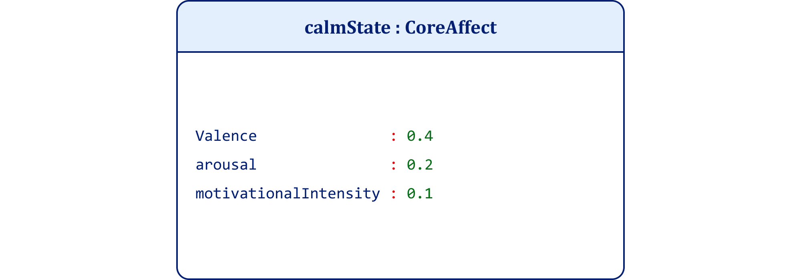

------------------------------------------------------------------------------------------------------------------------------------------------
Figure 2-1. Integer Concept UML Class Diagram

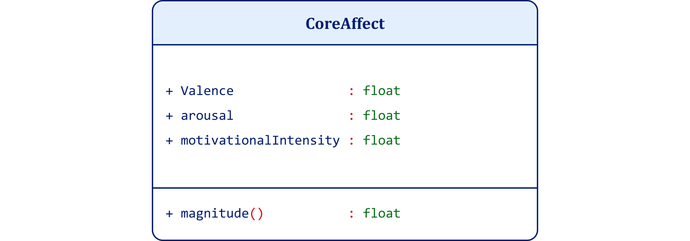

------------------------------------------------------------------------------------------------------------------------------------------------
Figure 2-2. Integer Construct UML Object Diagram

To illustrate my use of object-oriented architecture and UML to model the ontology of an idea, consider the simple case of an integer. The UML class diagram in figure 2-1 declares the concept by fixing its identity conditions independently of any particular instance. In C#, this corresponds to a declaration of type without determinate assignment.

The numeral “7” or the word “Seven” functions only as an identifier. The label does not supply meaning. The concept int supplies identity conditions as constraints because it declares what counts as an integer. The instantiation of that concept into a construct supplies determinate meaning by assigning values within those constraints. The object diagram in figure 2-2 then shows how declared structure becomes a construct when omitted measurements receive determinate values. In C#, this corresponds to initialization.

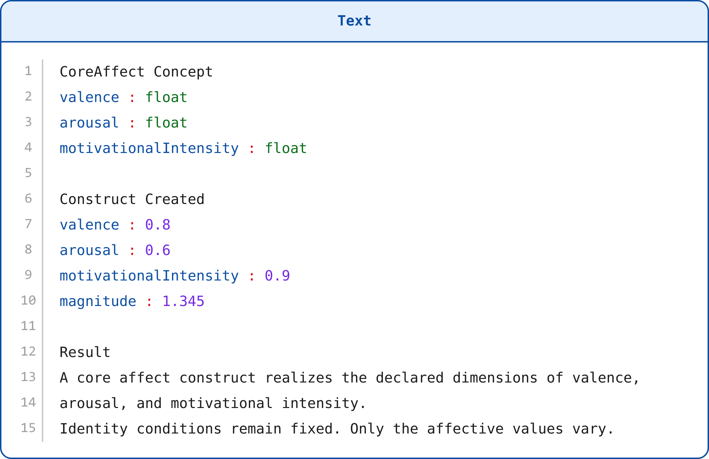

Or, in a single unified form:

The universal continues to govern the realization. Identity conditions do not change. Only realization varies.

Project 1 uses runtime parameters documented in its README. The project passes the identifier and the determinate integer value to the program so the reader can see the difference between the label and the instantiated value. The example shows that the concept fixes the type-level structure, while runtime input realizes one admissible construct.

This is the corresponding output:

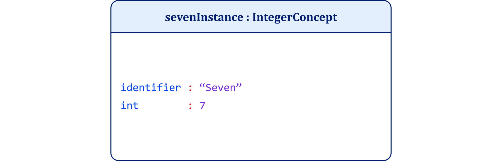

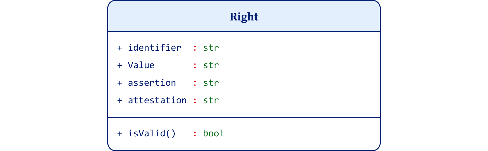

-------------------------------------------------------------------------------------------------------------------------------------------------------------
Figure 2-3. Right Concept UML Class Diagram

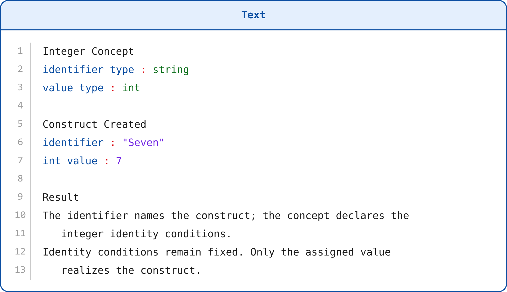

-------------------------------------------------------------------------------------------------------------------------------------------------------------
Figure 2-4. Driving Right UML Object Diagram

Figure 2-3 presents the concept Right as a UML class. It fixes the intensional structure of a right by declaring its essential components: an identifier, the value at stake, an assertion of authority over that value, and an attestation that validates the claim. In line with the analytic definition advanced here, a right is the authority to gain or keep a value. The class declares identity conditions without asserting that any particular right exists.

Figure 2-4 shows the extensional realization of this structure as a drivingRight:Right object. The identifier names the driving privilege. The value specifies the operation of a motor vehicle on public roads. The assertion expresses the bearer’s claim to that authority. The attestation records the state-issued license that substantiates it. The right becomes operative only through attested authority, not through preference, entitlement, or moral appeal.

Together, the diagrams show how one can model rights with constrained identity conditions, how claims differ from authority, and how attestation grounds legitimacy without collapsing values, permissions, or assertions into the concept of a right itself.

Project 2 uses runtime parameters documented in its README. The project passes the defining parts of the right as input parameters: the identifier, the value at stake, the assertion, and the attestation. The example shows that a right is not mere preference or rhetoric, but a constrained structure whose legitimacy depends on attested authority.

This is the corresponding output:

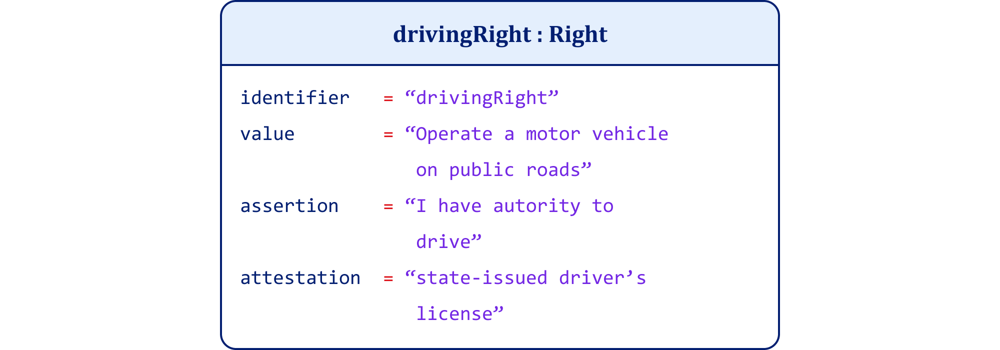

Figures 2-5 through 2-8 model core affect as the physiological substrate of feeling prior to emotion construction. In this framework, I define CoreAffect as a concept and implement it as a UML class. It declares the essential dimensions that constitute affective state as such: valence, arousal, and motivational intensity. These are not emotions, meanings, or attitudes. They fix only the identity conditions of affect at the most fundamental level.

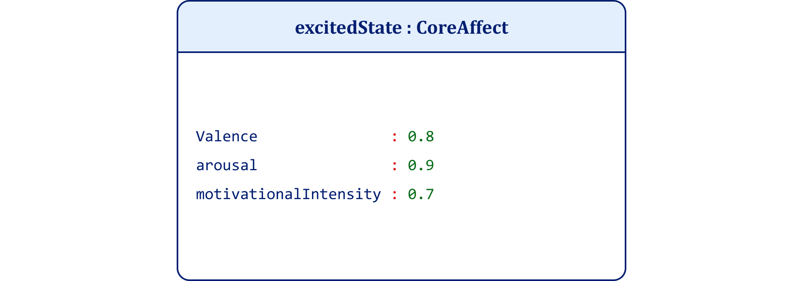

--------------------------------------------------------------------------------------------------------------------------------------------------
Figure 2-5. Core Affect Concept UML Class Diagram

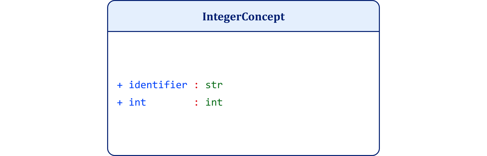

--------------------------------------------------------------------------------------------------------------------------------------------------
Figure 2-6. Calm State UML Object Diagram

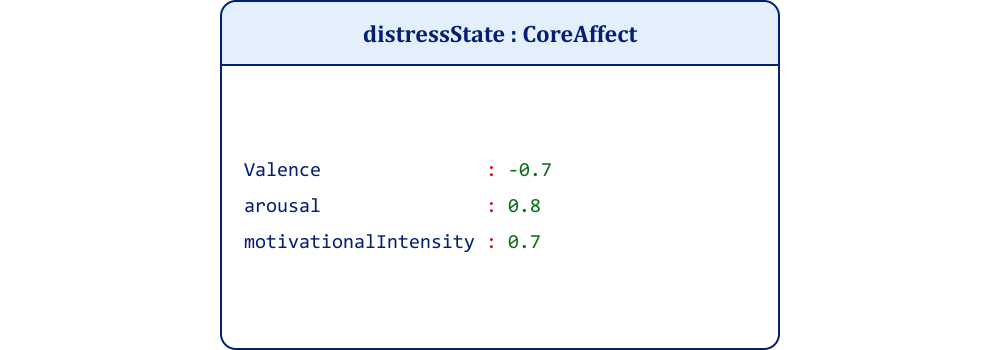

--------------------------------------------------------------------------------------------------------------------------------------------------
Figure 2-7. Excited State UML Object Diagram

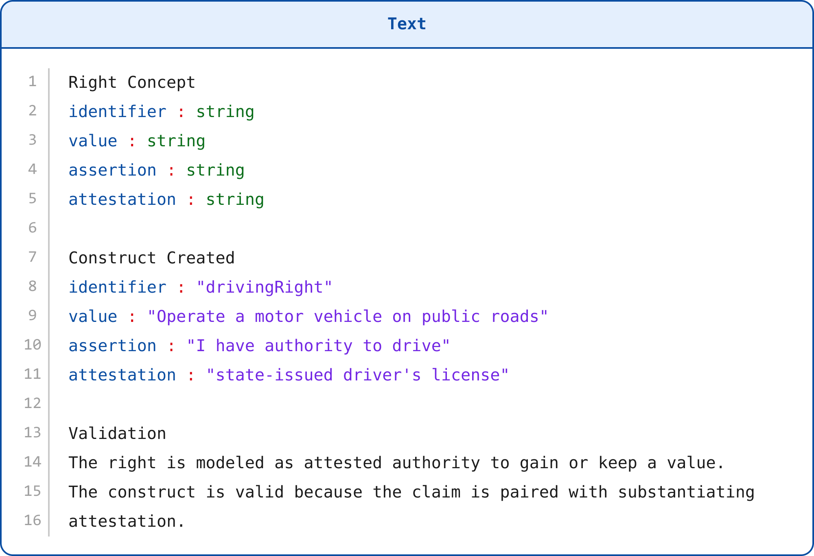

-----------------------------------------------------------------------------------------------------------------------------------------------------
Figure 2-8. Distress State UML Object Diagram

The corresponding object diagrams in figures 2-6 through 2-8 show multiple instantiated core affect states. Each object assigns determinate values to the same declared structure, demonstrating how a single concept admits diverse realizations without altering its identity conditions. The concept continues to govern each realization. Identity conditions do not change. Only instantiation varies.<a href="../references/notes/chapter-02.md#note-96">96</a>

I do not claim that these diagrams literally represent physiological affect. They show how principled criteria can define proposed identity conditions of core affect. The method is not empirical discovery but architectural clarification. Objective principles govern the declaration of the concept. UML makes that structure explicit.<a href="../references/notes/chapter-02.md#note-97">97</a>

Taken together, the instances form a category: the set of all realized core affect states. This illustrates how categorization emerges from instantiation without redefining the concept itself. Meaning remains fixed at the level of definition. Diversity appears only at the level of realization.<a href="../references/notes/chapter-02.md#note-98">98</a>

Project 3 uses runtime parameters documented in its README. The project passes determinate values for valence, arousal, and motivational intensity. The example shows that a stable conceptual structure defines core affect, while different affective states realize that same structure in different ways.

This is the corresponding output:

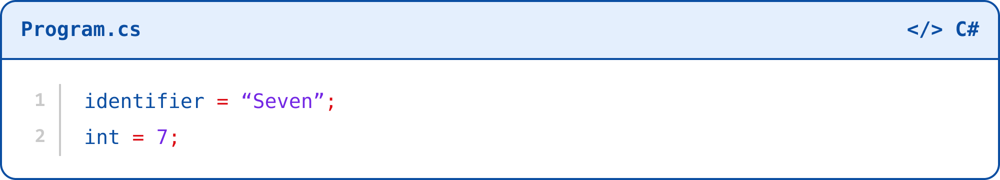

Appendix B extends the framework through more complex UML diagrams. It uses associations such as inheritance and composition to model how affective states such as emotions, moods, and drives derive from feeling as a common structural base. It also applies structuralist syntagmatic relations to show how ordered association, not isolated elements, produces meaning. Finally, it introduces GoF creational patterns, including Factory and Prototype, to model the construction of emotional instances from stable conceptual structure rather than their discovery as natural kinds.<a href="../references/notes/chapter-02.md#note-99">99</a>

The following propositions summarize the architectural commitments required to define, instantiate, and evaluate ideas as structured systems.

An idea is a unit of meaning that consists of one or more clauses or propositions that one can assert, deny, evaluate, and share.<a href="../references/notes/chapter-02.md#note-100">100</a>Analytic propositions are true by virtue of meaning alone, and objective rational principles fix their truth.<a href="../references/notes/chapter-02.md#note-101">101</a>Definition principles establish the identity conditions, integrity, and objectivity of meaning,<a href="../references/notes/chapter-02.md#note-102">102</a>while analytic truth principles determine what reason can and cannot assert once definitions establish meaning.<a href="../references/notes/chapter-02.md#note-103">103</a>Definitions state the meaning of concepts, not words; words merely label concepts whose identity conditions definition fixes.<a href="../references/notes/chapter-02.md#note-104">104</a>

In object-oriented terms, a concept corresponds to a class: a declarative structure that fixes identity conditions and specifies what must be true for any instance to count as what it is.<a href="../references/notes/chapter-02.md#note-105">105</a> A construct corresponds to an object: an extensional realization of a concept in which determinate conditions assign specific values to the declared structure.<a href="../references/notes/chapter-02.md#note-106">106</a> A category corresponds to the set of all constructs that instantiate a concept, that is, the concept’s extension across actual or possible cases.<a href="../references/notes/chapter-02.md#note-107">107</a>UML functions syntactically as a formal notation system that makes conceptual structure explicit, inspectable, and shareable by diagramming declarations, instantiations, and relations without relying on rhetorical description.<a href="../references/notes/chapter-02.md#note-108">108</a>

Chapter 2 has established the architecture that Chapter 1 required. If emotion cannot be defined by pleasure, outward evidence, or inherited names, then I must first define the kind of unit through which emotional meaning becomes intelligible. The answer developed here is that an idea is a truth-apt unit of meaning whose identity depends on structure. A word labels; a concept fixes identity conditions; a construct realizes those conditions under determinate values; a category gathers valid constructs without replacing the concept that governs them.

The chapter also established why definition and analytic truth must remain distinct. Definition fixes the identity conditions that make a concept determinate, non-circular, scope-governed, and inferentially constrained. Analytic truth then states what must follow once those identity conditions hold. This distinction preserves the force of reasoning without converting concepts into mind-independent substances. It also explains why examples, slogans, usages, and prototypes cannot bear the burden of meaning. They may guide recognition, but they cannot supply the architecture that makes recognition accountable.

The computational and diagrammatic work tests the same architecture under stricter conditions. Classical Theory preserves the need for identity conditions, while Prototype Theory explains typicality only after some concept already governs admissibility. Object-oriented grammar, UML, and C# sharpen the distinction: a class declares; an object instantiates; a category collects. The examples of integer, right, and core affect show the same principle across domains. Identity must govern variation, or meaning dissolves into rhetoric, preference, or resemblance. With that architecture in place, the inquiry can now ask whether contemporary theory preserves identity conditions after it rejects naive essence.

I have now established the structural conditions for defining, instantiating, and evaluating ideas. The inquiry must confront a deeper question. Structure fixes identity at the level of declaration and realization. It distinguishes concept from construct, intension from extension, and constraint from instantiation. But this clarification exposes a fault line in contemporary theory. What secures identity conditions once essentialist metaphysics collapses?<a href="../references/notes/chapter-02.md#note-109">109</a>

In this chapter, I have demonstrated how a concept can function as a declarative constraint structure and how instantiation realizes that structure under determinate values. The architecture preserves identity without appealing to hidden substances, invariant neural signatures, or metaphysical essences. The question now shifts from how identity operates to whether contemporary concept theory still preserves it at all.<a href="../references/notes/chapter-02.md#note-110">110</a>

In rejecting naive essentialism, much of the field has not merely abandoned fixed essences. It has abandoned identity conditions themselves. The next chapter examines this displacement. It asks whether identity must disappear once essence disappears, or whether a third architecture remains possible: constraint without universality, admissibility without substance, identity without essence.<a href="../references/notes/chapter-02.md#note-111">111</a>

The inquiry therefore turns to the status of identity conditions in contemporary concept theory.

Chapter 3: Identity Is Dead. Long Live Identity:
Why Our Concepts Collapse and How to Repair Them
