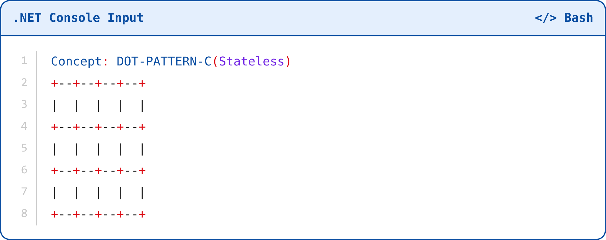
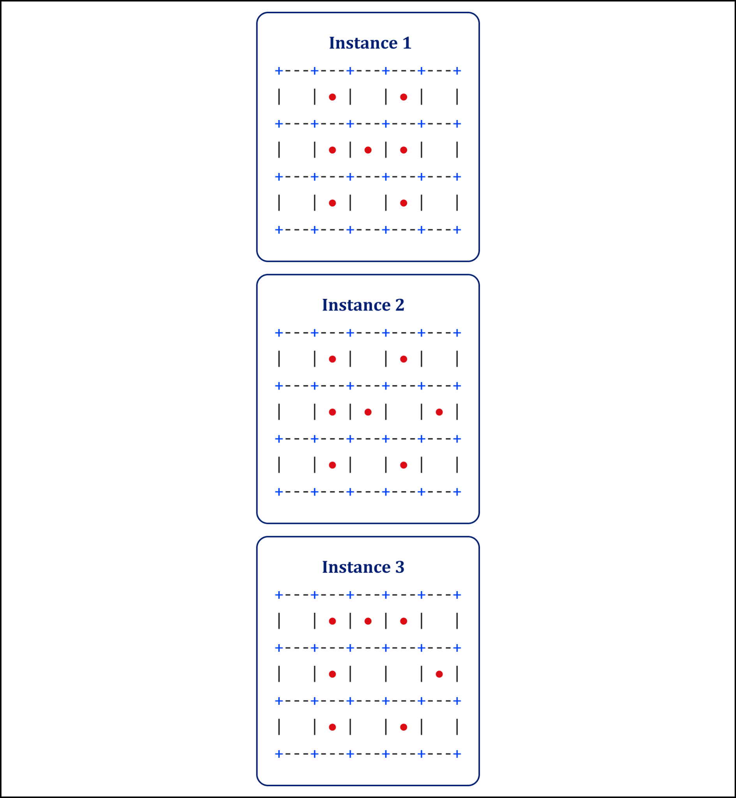
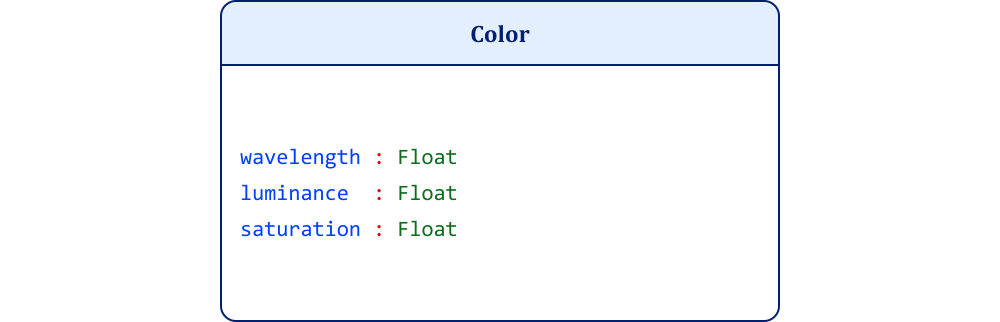
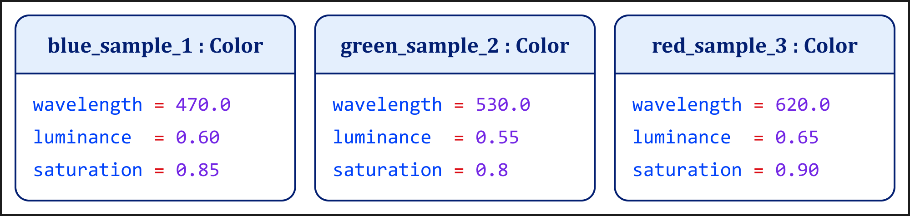
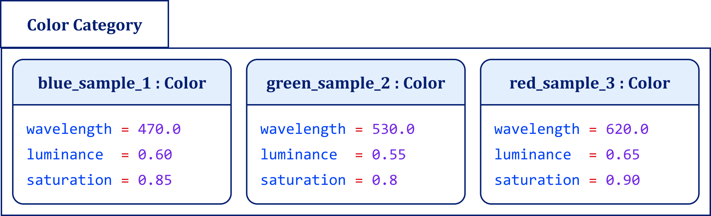
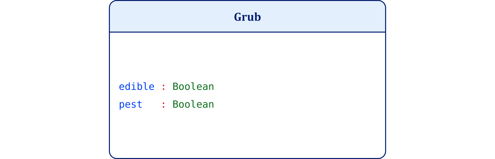
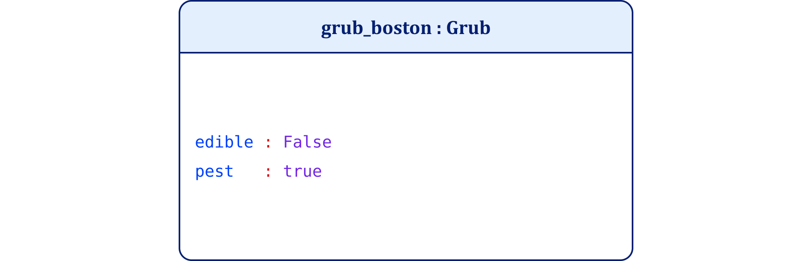

# Chapter 4: The Misappropriation of the Concept

*The Orphaning of Identity Conditions*

*Chapter 3 argued that identity conditions ought to survive the rejection of fixed essences. Chapter 4 examines what follows when theories fail to preserve that distinction.*

*Modern theories rightly reject the classical assumption that concepts derive their identity from fixed essences. Emotion does not come stamped with one neural signature, one bodily pattern, or one universal expression. Concepts do not exist as fixed inner essences awaiting application. Lisa Feldman Barrett, Eleanor Rosch, George Lakoff, Lawrence Barsalou, Andy Clark, and Karl Friston all contribute to dismantling that assumption.*

*Rejecting fixed essences, however, does not by itself explain what secures identity conditions.*

*When theorists reject essences without reconstructing identity conditions, they relocate explanatory work to the wrong level. They ask categorization, prediction, similarity, learning, culture, and task success to perform work that belongs to identity conditions. They mistake partitioning for concept formation. They treat the classification of observed instances as if it could explain the conditions that make an instance admissible in the first place.*

*A color boundary can separate blue from green. It cannot define what color is. A culture can treat a grub as food or as a pest. It cannot change what makes the organism a grub. An agent can classify a bodily state as anger or fear. That classification still presupposes conditions that distinguish anger from fear.*

*This chapter exposes that architectural error: downstream operations assume upstream authority. They borrow the explanatory work of identity conditions while denying the need for them.*

*The repair is simple but fundamental: restore each explanatory level to its proper place.*

*Concept constrains. Instance realizes. Category groups.*

*A concept specifies admissibility conditions. An instance either satisfies or violates those conditions. A category organizes admissible instances relative to a goal. Prediction, simulation, learning, culture, and embodiment all contribute to conceptual performance, but they operate within a constraint space. They do not create that space.*

*This distinction allows me to preserve the major achievements of contemporary concept theory without surrendering meaning to conceptual drift. Concepts may adapt without becoming arbitrary. Categories may vary without redefining the concepts they organize. Agents may construct meaning without abandoning conceptual constraint.*

*Chapter 5 examines the false dichotomy that made this architectural error appear inevitable: the supposed opposition between classical definitions and prototype theories. I argue that this choice is mistaken. The deeper question does not concern whether concepts possess rigid essences or flexible prototypes. It concerns where a theory locates identity conditions. Do they reside upstream in the concept that constrains admissible instances, or downstream in the operations that sort those instances? That question frames the next stage of the argument.*

[Notes](../references/notes/chapter-04.md) · [Bibliography](../references/bibliography/chapter-04.md)

Chapter 3 argued that identity conditions ought to survive the rejection of fixed essences. Chapter 4 examines what follows when theories fail to preserve that distinction.

Modern theories rightly reject the classical assumption that concepts derive their identity from fixed essences. Emotion does not come stamped with one neural signature, one bodily pattern, or one universal expression. Concepts do not exist as fixed inner essences awaiting application. Lisa Feldman Barrett, Eleanor Rosch, George Lakoff, Lawrence Barsalou, Andy Clark, and Karl Friston all contribute to dismantling that assumption.

Rejecting fixed essences, however, does not by itself explain what secures identity conditions.

When theorists reject essences without reconstructing identity conditions, they relocate explanatory work to the wrong level. They ask categorization, prediction, similarity, learning, culture, and task success to perform work that belongs to identity conditions. They mistake partitioning for concept formation. They treat the classification of observed instances as if it could explain the conditions that make an instance admissible in the first place.

A color boundary can separate blue from green. It cannot define what color is. A culture can treat a grub as food or as a pest. It cannot change what makes the organism a grub. An agent can classify a bodily state as anger or fear. That classification still presupposes conditions that distinguish anger from fear.

This chapter exposes that architectural error: downstream operations assume upstream authority. They borrow the explanatory work of identity conditions while denying the need for them.

The repair is simple but fundamental: restore each explanatory level to its proper place.

Concept constrains. Instance realizes. Category groups.

A concept specifies admissibility conditions. An instance either satisfies or violates those conditions. A category organizes admissible instances relative to a goal. Prediction, simulation, learning, culture, and embodiment all contribute to conceptual performance, but they operate within a constraint space. They do not create that space.

This distinction allows me to preserve the major achievements of contemporary concept theory without surrendering meaning to conceptual drift. Concepts may adapt without becoming arbitrary. Categories may vary without redefining the concepts they organize. Agents may construct meaning without abandoning conceptual constraint.

Chapter 5 examines the false dichotomy that made this architectural error appear inevitable: the supposed opposition between classical definitions and prototype theories. I argue that this choice is mistaken. The deeper question does not concern whether concepts possess rigid essences or flexible prototypes. It concerns where a theory locates identity conditions. Do they reside upstream in the concept that constrains admissible instances, or downstream in the operations that sort those instances? That question frames the next stage of the argument.

CHAPTER V

Rules vs. Prototypes

Why the Great Debate Over Concepts Is a Faux Dichotomy

In the previous chapter, I established a critical distinction: identity condition does not naively mean essence.<a href="../references/notes/chapter-04.md#note-1">1</a> Identity conditions function as architectural constraints.<a href="../references/notes/chapter-04.md#note-2">2</a> They specify the admissibility conditions under which something can count as an instance.<a href="../references/notes/chapter-04.md#note-3">3</a> I agreed with Lisa Feldman Barrett that emotion theory should reject naive essentialism.<a href="../references/notes/chapter-04.md#note-4">4</a> Emotions do not possess invariant neural signatures, universal biological fingerprints, or necessary and sufficient features.<a href="../references/notes/chapter-04.md#note-5">5</a> The empirical evidence no longer supports the classical view.<a href="../references/notes/chapter-04.md#note-6">6</a>

Rejecting naive essentialism, however, does not eliminate the need for identity conditions.<a href="../references/notes/chapter-04.md#note-7">7</a> It relocates the problem.<a href="../references/notes/chapter-04.md#note-8">8</a> When some contemporary constructivist theories reject essences without reconstructing identity conditions, they relocate explanatory work toward categorization, prediction, and regulatory success.<a href="../references/notes/chapter-04.md#note-9">9</a> Barrett's Theory of Constructed Emotion illustrates this strategy.<a href="../references/notes/chapter-04.md#note-10">10</a> On this reading, identity conditions no longer stand upstream as admissibility constraints for instantiation. They instead depend upon whatever stabilizes through successful prediction, categorization, or use.<a href="../references/notes/chapter-04.md#note-11">11</a>

The failure occurs at a precise architectural point. Theorists mistake partitioning for definition.<a href="../references/notes/chapter-04.md#note-12">12</a> They treat grouping and discrimination among instances as if those operations constitute concepts, even though those operations presuppose a concept already in place.<a href="../references/notes/chapter-04.md#note-13">13</a> A color boundary can divide samples into blue and green, but the boundary does not define what color is.<a href="../references/notes/chapter-04.md#note-14">14</a> A psychological taxonomy can group episodes under anger, fear, or grief, but the grouping does not define what an emotion is or what makes anger anger.<a href="../references/notes/chapter-04.md#note-15">15</a> A legal system can classify claims as rights, privileges, powers, or immunities, but the classification does not define the authority structure that makes a right a right.<a href="../references/notes/chapter-04.md#note-16">16</a> Once partitioning substitutes for definition, explanatory order inverts.<a href="../references/notes/chapter-04.md#note-17">17</a> Downstream operations begin to perform explanatory work that belongs upstream.<a href="../references/notes/chapter-04.md#note-18">18</a> Stability then reduces to task-relative success.<a href="../references/notes/chapter-04.md#note-19">19</a>

I call this an architectural error because it concerns explanatory priority.<a href="../references/notes/chapter-04.md#note-20">20</a> Some conditions must stand first before later operations can make sense.<a href="../references/notes/chapter-04.md#note-21">21</a> Identity conditions determine what counts as a possible instance of a concept before any act of grouping, prediction, or categorization.<a href="../references/notes/chapter-04.md#note-22">22</a> Categorization presupposes a domain of admissible instances.<a href="../references/notes/chapter-04.md#note-23">23</a> Prediction presupposes determinate kinds.<a href="../references/notes/chapter-04.md#note-24">24</a> Learning presupposes stability across cases.<a href="../references/notes/chapter-04.md#note-25">25</a> When theorists treat operations that depend upon identity conditions as the source of identity conditions, they reverse the order of explanation.<a href="../references/notes/chapter-04.md#note-26">26</a>

The question, then, does not concern whether categorization and prediction occur. They do.<a href="../references/notes/chapter-04.md#note-27">27</a> The question concerns where a theory locates identity conditions.<a href="../references/notes/chapter-04.md#note-28">28</a> Partitioning answers which instances belong together.<a href="../references/notes/chapter-04.md#note-29">29</a> A concept answers the prior question: what kind of thing exists such that partitioning can occur at all?<a href="../references/notes/chapter-04.md#note-30">30</a> When theorists collapse that priority, concepts become momentary products of learning, prediction, or cultural grouping.<a href="../references/notes/chapter-04.md#note-31">31</a> The resources required to explain error, disagreement, and sameness across contexts disappear.<a href="../references/notes/chapter-04.md#note-32">32</a>

I resolve this failure by diagnosis rather than rebuttal. I preserve the empirical phenomena that constructionist, prototype, embodied, and predictive accounts rightly emphasize.<a href="../references/notes/chapter-04.md#note-33">33</a> I restore the constraint architecture those phenomena presuppose. I isolate a shared structural misplacement: theorists orphan identity conditions when they push conceptual structure downstream into clustering, categorization, prediction, and learning.

On my account, concepts function as constraint structures that fix identity conditions prior to execution. Categorization, prediction, learning, and simulation occur within those constraints. They presuppose identity conditions. They do not generate them.

To maintain this distinction, I use UML and object-oriented formalisms to enforce type-instance discipline and expose illicit explanatory shifts.<a href="../references/notes/chapter-04.md#note-34">34</a> These tools do not serve as metaphors for cognition. I use them as formal instruments to prevent equivocation between definition, realization, and grouping.

Accordingly, I introduce the repair at a single level: the point at which a theory fixes identity conditions. I do not attempt to correct downstream errors one by one. Once I restore explanatory order, those errors begin to lose their force.

I begin with a simple experimental pattern that Barrett references in How Emotions Are Made.<a href="../references/notes/chapter-04.md#note-35">35</a> Researchers show subjects several distorted versions of a visual pattern. The subjects never see the original pattern itself. Later, however, they often recognize or classify the unseen original as if they had inferred it from the distorted examples. This is the dot-pattern paradigm associated with Michael Posner and Steven Keele.<a href="../references/notes/chapter-04.md#note-36">36</a>

The case matters because it seems to show that the mind can derive a central pattern from examples without retrieving a fixed intensional definition. I accept that lesson. But the experiment also hides a deeper constraint. Subjects can infer a central pattern only because the experiment already supplies a structured representational space within which the examples can vary.<a href="../references/notes/chapter-04.md#note-37">37</a> The dots can move, but they do not cease to belong to the same task. The mind can infer a central tendency because the experiment has already fixed the underlying space within which variation occurs.

Figure 4-1. Dot-Pattern Distortions and Prototype Abstraction

Figure 4-2. Dot-Pattern Central Tendency and Inferred Prototype

The color-boundary and grub examples I analyze in this chapter come from Lisa Feldman Barrett's public lecture on concepts accompanying How Emotions Are Made.<a href="../references/notes/chapter-04.md#note-38">38</a> In that lecture, she uses color continua and cross-cultural categorization, such as grubs as food in one culture and pests in another, to argue that conceptual boundaries arise through construction rather than discovery.<a href="../references/notes/chapter-04.md#note-39">39</a> She argues that the brain constructs concepts and uses them to categorize sensory input rather than discovering ready-made categories in the world, and she treats color boundaries as boundaries imposed by a perceiver rather than dictated by nature.<a href="../references/notes/chapter-04.md#note-40">40</a> She also invokes the dot-diagram study to challenge the assumption that concepts must exist as fixed templates, definitions, or prototypes.<a href="../references/notes/chapter-04.md#note-41">41</a> Referring to the classic Posner and Keele paradigm, she explains that participants can abstract a central tendency from exemplars even though they never saw the prototype itself.<a href="../references/notes/chapter-04.md#note-42">42</a>

Subjects can categorize novel stimuli and infer a central tendency without retrieving a canonical mental object. But my diagnostic question cuts deeper: does the inferred region reveal categorization behavior, or does it become the concept itself?

For a formal constraint reconstruction of Barrett's goal-based concept examples, including fish and car, see Appendix C: Reconstructing Goal-Based Concepts. That appendix shows how a goal can change which instances matter in a particular context without changing the deeper conditions that make those instances belong to the concept in the first place.

I begin with the dot-diagram case because it exposes the architectural temptation. Posner and Keele report that subjects abstracted a prototype from distorted patterns even when the prototype never appeared during training.<a href="../references/notes/chapter-04.md#note-43">43</a> They also report that participants later classified novel patterns in terms of their distance from the prototype.<a href="../references/notes/chapter-04.md#note-44">44</a> More broadly, the dot-diagram case supports the constructivist claim that successful categorization can arise from comparing instances rather than retrieving a fixed mental template.<a href="../references/notes/chapter-04.md#note-45">45</a>

That claim can stand. The error begins only when theorists promote evidence about categorization into a theory of concept identity.

Appendix D isolates this same ordering error in Barrett's goal-based examples and provides a formal reconstruction of the Posner-Keele paradigm, including its vector-space specification and distance metrics. I introduce that reconstruction not to mathematize cognition, but to make explicit the constraint structure the experiment presupposes.

The statistical operations that support prototype abstraction remain intelligible only within a fixed constraint space. The experiment must first determine the admissibility conditions of that space before inference can occur.<a href="../references/notes/chapter-04.md#note-46">46</a> Subjects may infer a prototype, but the structural constraints of the grid and the dimensionality of the vector space fix the identity conditions of the task. The inference occurs downstream. The constraints stand upstream.

I therefore begin the diagnostic sequence with the foundational error: treating partitioning as concept formation. Clustering, categorization, and similarity judgment do not constitute concepts. They presuppose a constraint structure already in place.

Distinct instances can arise under different physical, perceptual, or contextual conditions while remaining governed by the same identity conditions. That fact makes sense only if conceptual identity does not reside in similarity among instances.

The corresponding C# executables for the projects below appear in the downloaded ZIP file under the matching project folder. Each folder includes a README with instructions for building, running, and reproducing the sample outputs.

Project 1 establishes the core thesis of the chapter by formalizing the distinction between concept, instance, and category. The concept specifies an upstream constraint structure that fixes admissibility conditions before any instance can exist. The instance realizes those conditions by supplying determinate values that either satisfy or violate them. The category organizes valid instances only after the system admits them.<a href="../references/notes/chapter-04.md#note-47">47</a> In this way, the program enforces type-instance discipline and prevents the central architectural error the chapter diagnoses: confusing grouping behavior with conceptual identity. The example maps directly to the Color Concept UML Class Diagram and the Color Constructs UML Object Diagrams by showing that identity conditions reside in the class-level constraint structure rather than in the later act of classification.

The color-boundary example clarifies the distinction. Viewed rhetorically, the example critiques naive essentialism. Viewed architecturally, it reveals a more specific confusion: treating partitioning behavior as conceptual identity. I introduce the color case not as an independent case study but as part of Barrett's own exposition of her theory of concepts.<a href="../references/notes/chapter-04.md#note-48">48</a>

Figure 4-3. Color Concept UML Class Diagram

Figure 4-4. Color Constructs UML Object Diagrams

Figure 4-5. Color Category UML Object Diagram

Barrett uses the color-boundary example to argue that color categories do not reflect fixed divisions in the world. In How Emotions Are Made, she writes that the physical world does not dictate objective boundaries between one color and another.<a href="../references/notes/chapter-04.md#note-49">49</a> In her public lecture, she similarly argues that conceptual activity constructs color categories rather than discovers them.<a href="../references/notes/chapter-04.md#note-50">50</a>

Viewed architecturally, however, the example reveals what must already exist before any partitioning can occur. A color concept specifies admissible dimensions such as wavelength, luminance, and saturation without fixing particular values. Individual color samples assign determinate values within that constraint space. Categories then group those samples relative to a task or goal. None of these downstream operations defines what color is. They presuppose the conceptual structure that makes grouping intelligible in the first place. Partitioning determines which samples cluster together. A concept determines what kind of entity color is such that clustering can occur at all. When boundary construction becomes concept formation, explanatory order inverts and conceptual identity collapses into task-relative success.<a href="../references/notes/chapter-04.md#note-51">51</a>

Once partitioning substitutes for definition, a further collapse follows. Concepts, instances, and categories merge into a single explanatory level. I resist that collapse through strict type-instance discipline. A concept specifies a class-level constraint structure that fixes identity conditions. An instance realizes those conditions under determinate values. A category groups instances relative to a goal. The color case makes the point concrete: grouping samples into categories does not alter the conceptual structure that determines what counts as a valid color instance in the first place.<a href="../references/notes/chapter-04.md#note-52">52</a>

Project 1 operationalizes the distinction between concept, instance, and category. The goal is to show that identity conditions stand upstream as constraint structure. The system never infers identity conditions from downstream grouping.

Figure 4-3 shows the ColorConcept as a class-level structure. It defines admissibility conditions for wavelength, luminance, and saturation. This is the concept: it does not describe any particular color, but specifies what can count as a color at all. Figure 4-4 then shows three valid color constructs, each of which instantiates the concept by supplying determinate values for those dimensions. Figure 4-5 shows the later category-level grouping: blue, green, and red samples can be organized together as a color category only after the concept has already fixed the admissible structure and the instances have supplied valid particulars.

The ColorInstance assigns determinate values. This is the instance. It either satisfies the concept or the system rejects it. The IsAdmissible check enforces this boundary and prevents invalid instantiation.

Only after a valid instance exists does classification occur. The category is a downstream grouping of valid instances. It does not define what a color is.

The sequence matters. Figure 4-6 presents the Grub concept as the class-level structure that fixes the relevant admissibility conditions: whether the organism can function as edible and whether it can function as a pest. Figure 4-7 presents a concrete grub instance, grub_boston, with determinate values for those conditions. The instance realizes the concept before any downstream category applies. Concept constrains. Instance realizes. Category groups.

Figure 4-6. Grub Concept UML Class Diagram

Figure 4-7. Grub Constructs UML Object Diagrams

The distinction sharpens in discrete cases. Figures 4-6 and 4-7 show why the grub remains the same kind of organism even when later classifications differ. Barrett uses the grub example to show that one culture may classify a grub as food while another may classify it as a pest.<a href="../references/notes/chapter-04.md#note-53">53</a> She presents the example as evidence of cultural construction and variability in categorization. Viewed architecturally, however, the example demonstrates something narrower and more precise: classification varies, but kind does not.

A grub does not become a different kind of organism because one culture eats it and another rejects it. The cultural category changes. The purpose changes. The evaluative context changes. The organism nevertheless retains the admissibility conditions that make it a grub. Food and pest name downstream classifications relative to human goals. They do not define the biological kind itself.

Project 2 operationalizes this distinction. The program first validates whether the organism satisfies the admissibility conditions of the GrubConcept. Only after the system admits a valid grub instance does it classify that instance according to cultural context. When the context is food, the valid grub instance enters the category Food. When the context is pest, the same valid grub instance enters the category Pest. In both cases, the organism remains an admissible instance of the GrubConcept.

The architectural point now becomes clear. Category changes do not rewrite identity conditions. They apply different classificatory purposes to an already admissible instance. The concept constrains what the thing is. The instance realizes those constraints. The category organizes that instance relative to a goal.

This matters because the same confusion reappears in theories of emotion. If one agent classifies a bodily state as anger and another classifies a similar state as fear, the variation may reveal differences in context, learning, language, or purpose. It does not follow that the concept lacks governing identity conditions. It follows only that classification varies. A theory must still explain what makes anger anger, what makes fear fear, and what distinguishes reinterpretation from error.

The conflation begins when theorists treat categorization not as the application of a concept, but as its origin. Barrett argues that emotion concepts emerge from experience and that the brain uses past experience, organized as concepts, to guide action and give sensations meaning.<a href="../references/notes/chapter-04.md#note-54">54</a> She also argues that the brain constructs instances of emotion by categorizing sensory input in context.<a href="../references/notes/chapter-04.md#note-55">55</a>

Comparable moves appear elsewhere. George Lakoff rejects classical definitions and argues that categories display prototype effects and family-resemblance structure.<a href="../references/notes/chapter-04.md#note-56">56</a> He maintains that categories organize themselves around central members and extend outward to less central cases.<a href="../references/notes/chapter-04.md#note-57">57</a> Lawrence Barsalou similarly identifies concepts with simulations constructed in response to situational demands, arguing that conceptual processing uses simulations of perception, action, and introspection, and that concepts arise in response to the needs of the current situation.<a href="../references/notes/chapter-04.md#note-58">58</a>

These accounts illuminate genuine cognitive processes. They explain how agents classify, simulate, predict, and adapt. They also risk the same architectural inversion. They move from variability in categorization toward locating conceptual identity within that variability. I argue that this conclusion does not follow.

Variation requires a field in which variation can count as variation. Classification requires a kind that classification can classify. Simulation requires something to simulate.

Dot-pattern experiments make this inversion visible. Posner and Keele report that subjects abstract a central tendency from distorted exemplars and identify a prototype that the experiment never physically presents.<a href="../references/notes/chapter-04.md#note-59">59</a> This result shows that central tendencies can arise from instances. It does not establish that the inferred tendency constitutes the concept.<a href="../references/notes/chapter-04.md#note-60">60</a>

Contemporary predictive-processing accounts risk a similar inversion when explanatory priority shifts toward whatever remains stable after error minimization. Andy Clark describes the brain as a prediction machine whose central task involves minimizing the difference between expected and actual sensory input.<a href="../references/notes/chapter-04.md#note-61">61</a> Karl Friston likewise characterizes cortical function through free-energy minimization and treats perception as the reduction of prediction error.<a href="../references/notes/chapter-04.md#note-62">62</a>

The first consequence of this architectural error is the collapse of representation into operation and outcome. Successful categorization should function as evidence of performance. It should not become identity itself.<a href="../references/notes/chapter-04.md#note-63">63</a>

This collapse appears clearly in early connectionist models such as David E. Rumelhart and James L. McClelland's Parallel Distributed Processing. They argue that a concept's representation can consist in a pattern of activity distributed across units and shaped by experience with the task environment.<a href="../references/notes/chapter-04.md#note-64">64</a> Contemporary machine-learning analogies risk the same inversion when theorists treat loss minimization or task success as evidence of representational content rather than as criteria for evaluating performance.<a href="../references/notes/chapter-04.md#note-65">65</a>

In Barrett's account, concepts summarize past experience and guide prediction. She writes that concepts help the brain predict incoming sensory input and guide action.<a href="../references/notes/chapter-04.md#note-66">66</a> Barsalou's account of situated conceptualization reflects a similar emphasis: conceptual processing uses simulations of perception, action, and introspection, and concepts arise in response to the current situation.<a href="../references/notes/chapter-04.md#note-67">67</a> Predictive-processing frameworks reinforce this emphasis by treating cognition primarily in terms of prediction, error correction, and regulatory success.<a href="../references/notes/chapter-04.md#note-68">68</a>

The point is not that these accounts are false. The point is that they often explain performance while borrowing the explanatory work of identity conditions. Prediction can help an agent anticipate. Simulation can help an agent prepare. Categorization can help an agent act. None of these operations, however, determines what makes an instance an admissible instance of a concept. They operate downstream of admissibility. They cannot replace it.

This collapse also generates equivocation between physical properties, perceptual variation, and conceptual constraint. Color exposes the error with unusual clarity. Wavelength is a physical magnitude. Color experience is a perceptual phenomenon. A color concept specifies a constraint structure governing admissible relations among experiences. When theorists move from the absence of fixed physical boundaries to the claim that conceptual boundaries arise from perception or embodiment, they ask perceptual variability to perform the work of conceptual structure. Lakoff argues that color categories do not reflect objective divisions in the external world but instead arise through the interaction of bodies, brains, and world.<a href="../references/notes/chapter-04.md#note-69">69</a>

The same architectural error appears in social classification. A cultural practice may classify one entity differently across contexts, but classification does not rewrite kind. Purpose may alter category. It does not create the underlying entity.

Barrett argues that the brain constructs concepts from prior experience and then uses those concepts to categorize sensory input.<a href="../references/notes/chapter-04.md#note-70">70</a> Her account also treats concepts as dynamically reconstructed through predictive regulation. I argue that this architecture risks explanatory circularity because concepts guide categorization while their own stability remains tied to the processes they guide.

All of these consequences converge on a single failure: the theory never secures identity conditions for meaning. Similarity may explain why items cluster together, but similarity alone does not establish sameness across time, agents, or contexts. Rosch explicitly characterizes categories in terms of graded structure rather than strict definition, arguing that categories do not depend upon necessary and sufficient features but instead exhibit family resemblances.<a href="../references/notes/chapter-04.md#note-71">71</a>

Prototype and construction-based theories make the loss explicit. Rosch characterizes category membership as graded rather than all-or-none.<a href="../references/notes/chapter-04.md#note-72">72</a> Barsalou rejects static representations and treats concepts as dynamic constructions shaped by current demands.<a href="../references/notes/chapter-04.md#note-73">73</a> These accounts do not fail because they describe context sensitivity. They fail only when context sensitivity performs explanatory work that belongs to identity conditions.

Context sensitivity without identity persistence cannot sustain meaning. If a theory allows the concept itself to vary with situation, task, or neural recruitment, it loses the standard by which it distinguishes error from difference or disagreement from divergence. Meaning does not require rigid essence. It requires persistence under constraint.

Rosch's project is primarily descriptive rather than metaphysical. She does not attempt to supply identity conditions for concepts. She characterizes empirical regularities in categorization behavior. Her analysis of graded structure and family resemblance illuminates how categories function in cognition.<a href="../references/notes/chapter-04.md#note-74">74</a> It does not explain what makes a valid instance valid.

This diagnosis does not require a return to rigidity. Contemporary accounts capture indispensable truths about conceptual use. Agents deploy concepts in context. They learn through experience. They regulate action through prediction. They simulate, embody, and adapt. Barrett rightly emphasizes that concepts vary with goals and circumstances.<a href="../references/notes/chapter-04.md#note-75">75</a> Friston and Clark rightly show that organisms regulate action by refining expectations and minimizing prediction error.<a href="../references/notes/chapter-04.md#note-76">76</a> Barsalou rightly emphasizes sensorimotor simulation.<a href="../references/notes/chapter-04.md#note-77">77</a> Rosch rightly demonstrates prototype effects and graded typicality.<a href="../references/notes/chapter-04.md#note-78">78</a> Barrett rightly rejects one-to-one correspondence between mental categories and neural patterns.<a href="../references/notes/chapter-04.md#note-79">79</a>

Taken together, these insights do not undermine identity conditions. They presuppose them. The failure arises from a single architectural inversion: theorists ask execution-level phenomena such as context sensitivity, prediction, simulation, similarity, and neural dynamics to perform identity-level work.

I resolve the tension by restoring explanatory order. Here I use semiotics to mean the study of how signs carry meaning through the relation between sign, object, and interpretation.<a href="../references/notes/chapter-04.md#note-80">80</a> Within that framework, the type-token distinction must precede interpretive deployment. Without a type-level constraint, tokens cannot function as signs with stable reference.

With that relocation in place, I state the repair succinctly. A concept specifies an upstream constraint structure that fixes identity conditions without fixing particular values. An instance is a determinate realization produced under those constraints in a specific context. A category is a goal-relative grouping formed downstream over instances. Identity conditions reside at the level of constraint structure. Identity belongs to an admissible instantiation under those conditions.

This formalism provides an analytic discipline for explanatory clarity. It does not imply that cognition is literally object-oriented software. I articulate the repair through the class-object distinction. A class specifies admissible structure and identity conditions. An object instantiates that structure with determinate values. Many objects may instantiate the same class across contexts without threatening identity.<a href="../references/notes/chapter-04.md#note-81">81</a> As Booch, Rumbaugh, and Jacobson explain, a class describes a set of objects that share attributes, operations, relationships, and semantics, while an object instantiates a class.

This repair sacrifices none of the empirical gains of contemporary theory. Context sensitivity governs selection, not definition. Prediction operates within a constraint space rather than determining it. Learning refines execution policies rather than rewriting identity conditions. Embodiment supplies mechanisms of realization without defining conceptual type.

I have therefore identified the precise form of misappropriation at work in contemporary concept theory. The error does not lie in studying categorization, prediction, simulation, embodiment, culture, or neural dynamics. Those processes matter. The error begins when a theory asks them to perform identity-level work. They can explain how agents sort, anticipate, regulate, or reuse experience, but they cannot by themselves specify what makes an instance admissible under a concept.

The examples developed throughout this chapter illustrate that distinction. The Posner-Keele paradigm shows that agents can infer a central tendency from distorted examples, but the inference occurs inside an already structured stimulus space. The color-boundary example shows that categories can divide a continuum, but the division presupposes a prior domain in which wavelength, luminance, and saturation can count as color-relevant features. The grub example shows that culture can assign different roles to the same organism, but food and pest are goal-relative classifications of a stable admissible object. The executable projects formalize the same architecture: a valid color instance can be categorized under a boundary, and a grub can shift cultural category while retaining its conceptual identity.

The chapter therefore answers its governing question directly. Partitioning does not define. Similarity does not ground identity. Prediction does not create the concept it uses. A concept constrains. An instance realizes. A category groups. Once I restore that order, I can preserve the achievements of prototype, constructionist, embodied, and predictive theories without allowing their downstream operations to replace the identity conditions they presuppose.

This conclusion prepares the next step. The conflict between classical and prototype theories looks decisive only because both sides treat the wrong explanatory level as fundamental. Classical theory tries to secure identity by hardening definition into rigidity. Prototype theory explains flexible recognition but often lets typicality perform work that belongs to identity conditions. Chapter 5 takes up that false choice and shows why the real alternative is not classical essence versus prototype flexibility, but constraint architecture over both.

CHAPTER V
