[Contents](README.md) · [Notes](../references/notes/chapter-09.md) · [Bibliography](../references/bibliography/chapter-09.md)

# Chapter 9 — Emotions Are Not Triggered They Are Made

*A Constructivist Semiotic Model of Emotions* 

*In Chapter 8, I established that meaning does not exist intrinsically; an agent achieves meaning by interpreting signs under constraint. Saussure showed that signs gain stability through relations, and Peirce showed that interpretation remains indispensable, yet neither framework secured the full architecture of the Constructivist Semiotic Sign. In this chapter, I instantiate that architecture as the Constructivist Semiotic Model of Emotions (CSME). If an agent realizes emotional meaning through semiotic achievement rather than discovering an intrinsic property of bodily states, then I cannot identify emotion with physiological affect or bodily activity. I must therefore explain what an agent experiences when feeling, how feeling becomes semiotically available for interpretation, and how an agent constructs emotional meaning through an active interpretive act.*

*This chapter also marks a decisive stage in the metamorphosis of the ontology. In Part III, The Architecture of Meaning, I provisionally defined phenomenological experience as the conscious affective experience that enters the architecture of meaning through semiotic availability. I now determine that feeling replaces phenomenological experience as the proper ontological construct: the conscious metaperceptual awareness of a semiotically available affective experience with a distinctive affective character. Likewise, in Part III, I provisionally defined evaluative orientation as the cognitive disposition through which an agent subjects phenomenological experience to semiotic interpretation. I now determine that emotion replaces evaluative orientation as the proper ontological construct: the semiotic interpretive act by which an agent assigns meaning and significance to feeling. Finally, I introduce physiological affect as the bodily and regulatory substrate that causally prepares feeling without itself becoming feeling or emotion. The ontology now distinguishes three non-substitutable levels. Physiological affect is the causal bodily substrate. Feeling is the conscious metaperceptual awareness of a semiotically available affective experience. Emotion is the semiotic interpretive act by which an agent constructs emotional meaning.*

*Before I develop the Constructivist Semiotic Model of Emotions (CSME), I conduct a weighted score matrix (WSM) trade study to evaluate the principal theories, frameworks, and models of emotion against a common architectural standard. I evaluate each candidate using the dependency-ordered definitional and analytic criteria I established in Part II, The Goal-Governed Model of Conceptual Identity, together with the cognitive-semiotic and computational criteria I established in Part III, Constructivist Semiotics. I apply non-negotiable showstopper criteria at each stage of the evaluation so that failure of a prerequisite criterion eliminates a candidate from further consideration. The weighted score matrix then compares the surviving candidates to determine which theoretical contributions satisfy the architectural requirements of the model.*

*The purpose of the trade study is not to select theory of emotion I prefer, but to determine which theoretical contributions I preserve as architectural inputs to a new framework. I preserve those contributions that satisfy the governing criteria, including bodily causation, conscious feeling, appraisal, construction, regulation, and contextual sensitivity, while rejecting every ontological collapse that conflates physiological affect, feeling, appraisal, and emotion. The trade study therefore provides the logical foundation for four complementary deliverables.*

*The first deliverable is the Constructivist Semiotic Model of Emotions (CSME), a formal cognitive-semiotic architecture that specifies the identity conditions and semiotic structure through which an agent constructs emotional meaning.*

*The second deliverable is the Constructivist Computational Model of Emotions (CCME), an executable computational architecture that validates the CSME by preserving its ontological distinctions under computational constraint.*

*The third deliverable is the Constructivist Interpretation Theory of Emotion (CITE), which defines emotion as an interpretive act through which an agent assigns meaning and significance to feeling, rather than as the output of appraisal or bodily processes.*

*The fourth deliverable is Emotional Constructivism, the broader philosophical position that emotions are cognitive-semiotic constructions through which agents construct emotional meaning rather than discover it as an intrinsic property of bodily states.*

*I then demonstrate the CSME architecture computationally through five C# projects:*

1.  *Project 1 tests identity conditions by showing that a concept governs admissible instances.*

2.  *Project 2 tests the bridge between semiotic availability and semantic achievement by showing that feeling can become available for interpretation independent of meaning.*

3.  *Project 3 tests goal-governed interpretation by showing that the same feeling-in-context can yield different emotions under different goals.*

4.  *Project 4 tests phase separation by preserving the ontological distinction between situation, physiological affect, feeling, and emotional interpretation.*

5.  *Project 5 tests revisability by demonstrating that an agent can revise emotional meaning while preserving the underlying feeling.*

*  
Together, these projects show why computation matters: executable form forces the architecture to preserve distinctions that prose can too easily blur.*

*By the end of this chapter, I have delivered four complementary contributions: the Constructivist Semiotic Model of Emotions (CSME), the Constructivist Computational Model of Emotions (CCME), the Constructivist Interpretation Theory of Emotion (CITE), and the broader philosophical position of Emotional Constructivism. Together, these establish emotion as a cognitive-semiotic achievement that an agent constructs through interpretation rather than discovers as an intrinsic property of bodily states. In the next chapter, I move upstream from emotional meaning to the symbolic conditions that make signs, concepts, and understanding possible.  
  
**Chapter, 10. All I Know Is What I Have Symbols For:**  
The Making of Meaning*

In the previous chapter, I established Constructivist Semiotics as the cognitive-semiotic architecture that specifies the structural requirements for constructing meaning. Although agents may construct meaning automatically, passively, or intentionally, a rational agent ought to intentionally govern that construction in pursuit of rational self-interest.<a href="../references/notes/chapter-09.md#note-1">1</a> Constructivist Semiotics specifies the structural conditions that make such governance possible, but it does not itself explain what it means for an agent to feel or how an agent constructs emotional meaning by interpreting feeling.

A central limitation in many existing theories of emotion is architectural rather than empirical.<a href="../references/notes/chapter-09.md#note-2">2</a> They fail to establish stable identity conditions for affect, feeling, and emotion, instead collapsing them into successive stages of a single continuum rather than distinguishing them as functionally distinct constructs with separate explanatory roles.<a href="../references/notes/chapter-09.md#note-3">3</a> This ontological collapse leaves the architecture unable to explain why physiological affect can exist without emotional meaning or how the same feeling can support different emotional interpretations.<a href="../references/notes/chapter-09.md#note-4">4</a> Without stable identity conditions, explanation becomes ambiguous and emotional meaning becomes computationally indeterminate.<a href="../references/notes/chapter-09.md#note-5">5</a>

Many theories of emotion lack a principled account of the transition from physiological affect, to phenomenological feeling, to cognitive-semiotic emotion. Panksepp treats affective systems as evolutionarily grounded causal substrates but does not distinguish physiological affect from emotional meaning.<a href="../references/notes/chapter-09.md#note-6">6</a> Damasio distinguishes bodily states from conscious feeling, yet feeling remains closely tied to the body's causal processes rather than to an autonomous interpretive act.<a href="../references/notes/chapter-09.md#note-7">7</a> Barrett correctly rejects intrinsic emotional essences and emphasizes construction, but her framework collapses feeling, conceptual categorization, and emotional meaning into a unified predictive process.<a href="../references/notes/chapter-09.md#note-8">8</a> Appraisal theories, including those of Lazarus and Scherer, explain how situations acquire relevance through evaluation, yet they identify appraisal itself with emotional meaning rather than distinguishing appraisal from interpretation.<a href="../references/notes/chapter-09.md#note-9">9</a> Together, these approaches collapse physiological affect, phenomenological feeling, and cognitive-semiotic emotion into different stages of a single process. The result is the same: they fail to distinguish semiotic availability from semantic achievement and therefore cannot explain emotion as an agent's interpretive construction of meaning.<a href="../references/notes/chapter-09.md#note-10">10</a>

The most significant consequence of this missing bridge is the loss of interpretive governance. By treating emotional meaning as the output of appraisal processes, predictive processing, or biological causation, these theories leave no principled jurisdiction for determining whether an emotion is correct or mistaken, valid or invalid, or successful or unsuccessful.<a href="../references/notes/chapter-09.md#note-11">11</a> Emotion still possesses correctness conditions, but the theories assign emotional meaning to causal processes instead of an agent's interpretive judgment.<a href="../references/notes/chapter-09.md#note-12">12</a> As a result, they can describe how emotional states arise, but they cannot explain how agents justify, revise, or take responsibility for the emotional meanings they construct.<a href="../references/notes/chapter-09.md#note-13">13</a>

Sensation is not feeling. Feeling is not meaning. Semiotic availability is not semantic achievement. Appraisal is not interpretation. Each statement marks a necessary identity condition for a categorically distinct cognitive or semiotic state. Failure to preserve those identity conditions renders emotion formally indeterminate.<a href="../references/notes/chapter-09.md#note-14">14</a>

My first objective is to resolve the ontological collapse of physiological affect, feeling, and emotion by establishing the identity conditions that distinguish each as a non-substitutable component of emotional meaning. Until I secure those distinctions, the architecture cannot assign each construct a unique explanatory role.<a href="../references/notes/chapter-09.md#note-15">15</a>

Having established clear identity conditions, I next address the bridge condition between semiotic availability and semantic achievement. My task is twofold: first, to explain how physiological affect becomes phenomenologically available as feeling without thereby constituting emotional meaning; second, to explain how an agent constructs emotional meaning by interpreting that feeling.<a href="../references/notes/chapter-09.md#note-16">16</a>

The following illustration highlights the problems these objectives address.

When I walk alone at night and hear footsteps accelerating behind me, I first perceive an external situation. My body registers heightened physiological affect as arousal rises and attention narrows. I then feel tension and urgency. At this point, several questions arise. Does what I feel already constitute emotional meaning, or does it merely make my feeling available for interpretation? If I initially construct fear, but then recognize the approaching person as a friend and construct relief, how do I explain those different emotional meanings if I continue to register substantially the same physiological affect and feel substantially the same tension and urgency? What role does interpretation play in constructing those different emotional meanings?<a href="../references/notes/chapter-09.md#note-17">17</a>

These questions define the remaining objectives of this chapter. I will establish the identity conditions that distinguish physiological affect, feeling, and emotion. I will establish the bridge between semiotic availability and semantic achievement. Finally, I will restore interpretive governance by explaining how an agent constructs emotional meaning through the interpretation of feeling.<a href="../references/notes/chapter-09.md#note-18">18</a>

My final objective is to restore interpretive governance by locating emotional meaning within an interpretive act performed by an agent. If emotional meaning depends upon interpretation, then it must admit correctness, error, validity, invalidity, justification, revision, and responsibility. I therefore treat agency as a formal architectural requirement, ensuring that emotion remains an accountable cognitive-semiotic achievement rather than the output of bodily or predictive processes.<a href="../references/notes/chapter-09.md#note-19">19</a>

In this chapter, I do more than argue that emotions are constructions. I integrate ontological identity conditions, cognitive-semiotic interpretation, computational execution, and formal verification into a single architecture of emotional meaning. I distinguish physiological affect, feeling, and emotion as non-substitutable ontological constructs. I establish the bridge between semiotic availability and semantic achievement. I define emotion as the interpretive act through which an agent constructs emotional meaning under correctness conditions. I validate the architecture through a weighted score matrix trade study, specify its ontology through UML, and verify its computational coherence through executable implementations. I subject every proposition to definitional, analytic, cognitive-semiotic, and computational constraints, requiring the architecture to survive each without ontological collapse. Existing frameworks do not integrate these architectural, semiotic, and computational requirements into a single, formally specified account of emotional meaning.<a href="../references/notes/chapter-09.md#note-20">20</a>

I therefore offer more than another theory of emotion. I specify an accountable architecture that enables an agent to construct emotional meaning.

Before I develop the Constructivist Semiotic Model of Emotions (CSME), I conduct a weighted score matrix (WSM) trade study to determine which existing theories, frameworks, and models of emotion satisfy the architectural requirements for constructing emotional meaning. Rather than surveying the literature or selecting a preferred theory, I evaluate each candidate against a common architectural standard using the dependency-ordered definitional and analytic criteria I established in Part II, *The Goal-Governed Model of Conceptual Identity*, together with the cognitive-semiotic and computational criteria I established in Part III, *Constructivist Semiotics*. To qualify for further evaluation, each candidate must satisfy the governing architectural criteria, including computational survivability and executability without ontological collapse. I apply non-negotiable showstopper criteria throughout the evaluation so that failure of any prerequisite criterion eliminates a candidate from further consideration. The weighted score matrix then compares the surviving candidates to determine which theoretical contributions warrant preservation within the CSME.<a href="../references/notes/chapter-09.md#note-21">21</a>

The trade study does not determine whether a theory of emotion is correct. It determines which theoretical contributions satisfy the governing architectural criteria. I therefore preserve those contributions that survive the evaluation while rejecting every ontological collapse that conflates physiological affect, feeling, appraisal, and emotion. The trade study therefore determines which features I preserve and extend and which limitations I mitigate as architectural inputs to the Constructivist Semiotic Model of Emotions (CSME). The CSME then provides the foundation for the Constructivist Computational Model of Emotions (CCME), the Constructivist Interpretation Theory of Emotion (CITE), and the broader philosophical position of Emotional Constructivism.<a href="../references/notes/chapter-09.md#note-22">22</a>

I do not evaluate phenomenological approaches to affect and emotion, including those of Edmund Husserl (1859–1938), Jean-Paul Sartre (1905–1980), and Maurice Merleau-Ponty (1908–1961), as candidate theories in the comparative trade study because they do not propose computational or cognitive architectures of emotion.<a href="../references/notes/chapter-09.md#note-23">23</a> Nevertheless, phenomenology informs several distinctions that the Constructivist Semiotic Model of Emotions preserves, particularly first-person givenness,<a href="../references/notes/chapter-09.md#note-24">24</a> the structure of felt experience,<a href="../references/notes/chapter-09.md#note-25">25</a> and the distinction between pre-interpretive awareness and constituted meaning.<a href="../references/notes/chapter-09.md#note-26">26</a> Husserl’s analyses of intentional consciousness, Sartre’s account of emotion as lived experience, and Merleau-Ponty’s phenomenology of embodiment each illuminate aspects of emotional life that the CSME incorporates within its broader cognitive-semiotic architecture.<a href="../references/notes/chapter-09.md#note-27">27</a>

I exclude phenomenology from the trade study for methodological rather than substantive reasons because the weighted score matrix evaluates formal architectural models rather than phenomenological descriptions of lived experience.<a href="../references/notes/chapter-09.md#note-28">28</a> <a href="../references/notes/chapter-09.md#note-29">29</a>

To preserve the flow of the argument, I report only the final results of the weighted score matrix in the main text, including the surviving candidates and their weighted viability scores. I document the complete methodology in the appendices, including candidate selection, macro- and micro-weighting rationales, elimination criteria, detailed scoring justifications, sensitivity analyses, and the complete weighted score matrix. Appendix F documents candidate selection. Appendix G presents the macro-category weightings. Appendix H justifies the micro-level principle weightings. Appendix I reports the detailed scoring rationales together with the complete weighted score matrix.<a href="../references/notes/chapter-09.md#note-30">30</a> Table 9-1 summarizes the architectural viability of the surviving candidates.<a href="../references/notes/chapter-09.md#note-31">31</a>

| Candidate Theory / Model                               | Definitional (30%) | Analytic (20%)   | Cognitive–Semiotic (25%) | Computational (25%) | Total Weighted Score |
|--------------------------------------------------------|--------------------|------------------|--------------------------|---------------------|----------------------|
| Appraisal Theories (Lazarus, Roseman)                  | 0.75 × 30 = 22.5   | 0.65 × 20 = 13.0 | 0.70 × 25 = 17.5         | 0.55 × 25 = 13.75   | 66.75                |
| Component Process Model (CPM) (Scherer)                | 0.80 × 30 = 24.0   | 0.70 × 20 = 14.0 | 0.65 × 25 = 16.25        | 0.60 × 25 = 15.0    | 69.25                |
| Affective Neuroscience (Panksepp) (Feeling Layer only) | 0.90 × 30 = 27.0   | 0.75 × 20 = 15.0 | 0.40 × 25 = 10.0         | 0.80 × 25 = 20.0    | 72.00                |
| Conceptual Act Theory / TCE (Barrett) (Conditional)    | 0.55 × 30 = 16.5   | 0.50 × 20 = 10.0 | 0.45 × 25 = 11.25        | 0.65 × 25 = 16.25   | 54.00                |

-----------------------------------------------------------------------------------------------------------------------------------------------------------  
**Table 9-1. Consolidated Weighted Score Matrix (WSM) Showing the Architectural Viability of Surviving Emotion Theories**

I now construct the Constructivist Semiotic Model of Emotions (CSME) by integrating the indispensable architectural contributions identified through the comparative trade study.<a href="../references/notes/chapter-09.md#note-32">32</a> I organize those contributions within a unified cognitive-semiotic architecture that preserves their explanatory strengths while maintaining stable ontological distinctions and computational coherence.<a href="../references/notes/chapter-09.md#note-33">33</a>

I begin with Conceptual Act Theory (CAT), or the Theory of Constructed Emotion (TCE), because it contributes one of the most important architectural insights to the Constructivist Semiotic Model of Emotions (CSME) despite receiving the lowest architectural viability score among the qualifying candidates.<a href="../references/notes/chapter-09.md#note-34">34</a> Barrett rejects the view that emotions exist as intrinsic natural kinds waiting for discovery.<a href="../references/notes/chapter-09.md#note-35">35</a> Instead, she explains how agents construct emotional meaning through the interaction of physiological affect,<a href="../references/notes/chapter-09.md#note-36">36</a> conceptual knowledge,<a href="../references/notes/chapter-09.md#note-37">37</a> prediction,<a href="../references/notes/chapter-09.md#note-38">38</a> prior experience,<a href="../references/notes/chapter-09.md#note-39">39</a> and context.<a href="../references/notes/chapter-09.md#note-40">40</a>

I embrace Barrett’s central insight because agents construct emotional meaning rather than merely identify pre-existing emotional kinds.<a href="../references/notes/chapter-09.md#note-41">41</a> Without construction, emotional meaning collapses into either intrinsic biological categories or arbitrary subjective invention.<a href="../references/notes/chapter-09.md#note-42">42</a> I also embrace her emphasis on conceptual knowledge, contextual variability, and prior experience because each provides an indispensable architectural condition for explaining how different agents can construct different emotional meanings from similar physiological states.<a href="../references/notes/chapter-09.md#note-43">43</a>

TCE assigns physiological affect, phenomenological feeling, conceptual categorization, prediction, and emotional meaning to a single constructive process.<a href="../references/notes/chapter-09.md#note-44">44</a> As these explanatory roles converge, the theory no longer preserves stable ontological distinctions among affect, feeling, interpretation, and emotion.<a href="../references/notes/chapter-09.md#note-45">45</a> Consequently, the architecture cannot determine whether prediction, categorization, interpretation, or their interaction constructs emotional meaning.<a href="../references/notes/chapter-09.md#note-46">46</a>

The CSME embraces Barrett’s constructivist insight while extending it through explicit ontological separation. The CSME preserves physiological affect as the biological substrate,<a href="../references/notes/chapter-09.md#note-47">47</a> phenomenological feeling as the conscious awareness of that substrate,<a href="../references/notes/chapter-09.md#note-48">48</a> conceptual knowledge as an interpretive resource,<a href="../references/notes/chapter-09.md#note-49">49</a> and context as a governing constraint on interpretation.<a href="../references/notes/chapter-09.md#note-50">50</a> It then locates emotional construction within the agent’s interpretive act after affect and feeling acquire stable ontological status.<a href="../references/notes/chapter-09.md#note-51">51</a> The CSME therefore preserves construction as the constitutive process of emotional meaning while mitigating the ontological collapse that prevents TCE from serving as a complete cognitive-semiotic architecture of emotion.<a href="../references/notes/chapter-09.md#note-52">52</a>

I next consider Appraisal Theory because it contributes another indispensable architectural insight to the Constructivist Semiotic Model of Emotions (CSME).<a href="../references/notes/chapter-09.md#note-53">53</a> Richard S. Lazarus (1922–2002) and Ira J. Roseman explain emotion through the evaluation of personal significance,<a href="../references/notes/chapter-09.md#note-54">54</a> situational relevance,<a href="../references/notes/chapter-09.md#note-55">55</a> action possibilities,<a href="../references/notes/chapter-09.md#note-56">56</a> coping potential,<a href="../references/notes/chapter-09.md#note-57">57</a> and goal relations<a href="../references/notes/chapter-09.md#note-58">58</a> rather than through physiological affect alone.<a href="../references/notes/chapter-09.md#note-59">59</a>

I embrace this contribution because emotional meaning depends upon the evaluation of contextual significance.<a href="../references/notes/chapter-09.md#note-60">60</a> Without evaluation, physiological affect remains biologically real but emotionally indeterminate.<a href="../references/notes/chapter-09.md#note-61">61</a> I also embrace the central roles of goals,<a href="../references/notes/chapter-09.md#note-62">62</a> contextual relevance,<a href="../references/notes/chapter-09.md#note-63">63</a> coping potential,<a href="../references/notes/chapter-09.md#note-64">64</a> and reinterpretation<a href="../references/notes/chapter-09.md#note-65">65</a> because each constrains how agents construct emotional meaning in particular situations.<a href="../references/notes/chapter-09.md#note-66">66</a>

Appraisal Theory treats appraisal itself as the explanatory process that produces emotional meaning.<a href="../references/notes/chapter-09.md#note-67">67</a> Although appraisal evaluates contextual significance,<a href="../references/notes/chapter-09.md#note-68">68</a> it does not identify the interpreting agent,<a href="../references/notes/chapter-09.md#note-69">69</a> distinguish appraisal from interpretation,<a href="../references/notes/chapter-09.md#note-70">70</a> or specify how interpretation transforms evaluative significance into emotional meaning.<a href="../references/notes/chapter-09.md#note-71">71</a> Consequently, appraisal theory explains why situations matter without fully explaining how agents construct emotional meaning from those evaluations.<a href="../references/notes/chapter-09.md#note-72">72</a>

The CSME embraces appraisal as the evaluation of contextual significance while extending it through explicit interpretive architecture.<a href="../references/notes/chapter-09.md#note-73">73</a> The CSME preserves goals, contextual relevance, coping potential, and reinterpretation as indispensable inputs to emotional construction.<a href="../references/notes/chapter-09.md#note-74">74</a> It then distinguishes appraisal from interpretation by locating appraisal within contextual evaluation and locating emotional meaning within the agent’s interpretive act.<a href="../references/notes/chapter-09.md#note-75">75</a> Appendix K develops the Constructivist Interpretation Theory of Emotion (CITE), formally distinguishing appraisal from interpretation and identifying the point at which appraisal ends and interpretive construction begins. The CSME therefore preserves appraisal as an indispensable evaluative process while mitigating the architectural limitation that prevents appraisal theory from identifying interpretation as the constitutive act of emotional meaning.<a href="../references/notes/chapter-09.md#note-76">76</a>

I next consider the Component Process Model (CPM) because it contributes another indispensable architectural insight.<a href="../references/notes/chapter-09.md#note-77">77</a> Klaus R. Scherer (1943– ) distinguishes appraisal,<a href="../references/notes/chapter-09.md#note-78">78</a> physiological change,<a href="../references/notes/chapter-09.md#note-79">79</a> expression,<a href="../references/notes/chapter-09.md#note-80">80</a> action readiness,<a href="../references/notes/chapter-09.md#note-81">81</a> and feeling<a href="../references/notes/chapter-09.md#note-82">82</a> as architecturally distinct constituents of an emotional episode rather than collapsing them into a single explanatory process.<a href="../references/notes/chapter-09.md#note-83">83</a>

I embrace this contribution because emotional meaning requires phase separation.<a href="../references/notes/chapter-09.md#note-84">84</a> Without distinct explanatory phases, physiological affect, phenomenological feeling, interpretation, and emotion collapse into a single undifferentiated process.<a href="../references/notes/chapter-09.md#note-85">85</a> I also embrace Scherer’s explicit sequencing because it preserves the temporal organization of emotional life while allowing each constituent to perform a distinct explanatory role.<a href="../references/notes/chapter-09.md#note-86">86</a>

CPM distributes emotion across the sequence rather than fixing emotion as a distinct conceptual object.<a href="../references/notes/chapter-09.md#note-87">87</a> Although the model clearly differentiates its constituent operations, it does not determine whether emotion consists in the sequence itself, the integration of its components, or the outcome that emerges from their interaction.<a href="../references/notes/chapter-09.md#note-88">88</a> Consequently, the architecture explains how emotional processes unfold without fully explaining how an agent constructs emotional meaning.<a href="../references/notes/chapter-09.md#note-89">89</a>

I extend Scherer’s architectural differentiation through explicit ontological separation. I preserve phase separation,<a href="../references/notes/chapter-09.md#note-90">90</a> physiological affect,<a href="../references/notes/chapter-09.md#note-91">91</a> phenomenological feeling,<a href="../references/notes/chapter-09.md#note-92">92</a> appraisal,<a href="../references/notes/chapter-09.md#note-93">93</a> and interpretation<a href="../references/notes/chapter-09.md#note-94">94</a> as distinct architectural constituents. I then locate emotional meaning within the agent’s interpretive act rather than within the temporal sequence itself.<a href="../references/notes/chapter-09.md#note-95">95</a> In doing so, I preserve ordered emotional processing while mitigating the architectural limitation that prevents CPM from establishing stable identity conditions for emotional meaning.<a href="../references/notes/chapter-09.md#note-96">96</a>

I finally consider Jaak Panksepp’s Affective Neuroscience because it contributes the strongest biological foundation for the Constructivist Semiotic Model of Emotions (CSME).<a href="../references/notes/chapter-09.md#note-97">97</a> Panksepp distinguishes biologically organized affective systems from higher cognitive processes<a href="../references/notes/chapter-09.md#note-98">98</a> and explains how physiological affect precedes conscious awareness and subsequent cognitive activity.<a href="../references/notes/chapter-09.md#note-99">99</a> He therefore provides the clearest account of the physiological substrate upon which emotional meaning ultimately depends.<a href="../references/notes/chapter-09.md#note-100">100</a>

I embrace this contribution because emotional meaning requires a physiological substrate.<a href="../references/notes/chapter-09.md#note-101">101</a> Without physiological affect, an agent has no bodily condition to perceive, evaluate, or interpret.<a href="../references/notes/chapter-09.md#note-102">102</a> I also embrace Panksepp’s distinction between biologically organized affective systems and higher cognitive processes because that distinction establishes the biological foundation upon which the remaining architecture develops.<a href="../references/notes/chapter-09.md#note-103">103</a>

Affective Neuroscience explains physiological affect more successfully than emotional meaning.<a href="../references/notes/chapter-09.md#note-104">104</a> Although the theory clearly distinguishes affective systems from higher cognitive processes, it does not fully distinguish physiological affect from phenomenological feeling or cognitive-semiotic emotion.<a href="../references/notes/chapter-09.md#note-105">105</a> Consequently, the architecture grounds affective experience without explaining how an agent transforms physiological affect into emotional meaning.<a href="../references/notes/chapter-09.md#note-106">106</a>

I extend Panksepp’s architecture by preserving physiological affect as the biological substrate of emotional meaning while distinguishing it explicitly from phenomenological feeling and cognitive-semiotic emotion.<a href="../references/notes/chapter-09.md#note-107">107</a> I preserve the affective systems as the physiological foundation of emotional experience,<a href="../references/notes/chapter-09.md#note-108">108</a> preserve feeling as the conscious awareness of physiological affect,<a href="../references/notes/chapter-09.md#note-109">109</a> and locate emotional meaning within the agent’s interpretive act.<a href="../references/notes/chapter-09.md#note-110">110</a> In doing so, I preserve Panksepp’s biological contribution while mitigating the architectural limitation that identifies physiological affect more clearly than emotional meaning itself.<a href="../references/notes/chapter-09.md#note-111">111</a>

The preceding analysis completes the architectural synthesis. I now specify the Constructivist Semiotic Model of Emotions (CSME) by integrating the indispensable contributions of the qualifying candidates within a single cognitive-semiotic architecture. In doing so, I fulfill the three objectives of this chapter:

1.  I establish the identity conditions that distinguish physiological affect, phenomenological feeling, and cognitive-semiotic emotion as non-substitutable ontological constructs.

2.  I specify the bridge between semiotic availability and semantic achievement by explaining how physiological affect becomes phenomenologically available as feeling and how an agent subsequently constructs emotional meaning by interpreting that feeling.

3.  I restore interpretive governance by locating emotional meaning within the interpretive act of an agent operating under standards of correctness, justification, revision, and responsibility.<a href="../references/notes/chapter-09.md#note-112">112</a>

I now complete the metamorphosis of the ontology that I have developed throughout this work. Earlier chapters introduced phenomenological experience and evaluative orientation as provisional explanatory constructs and progressively refined them through conceptual, semiotic, and computational analysis. I now fix their identity conditions by establishing affect, feeling, and emotion as the three ontological constructs that form the foundation of the Constructivist Semiotic Model of Emotions (CSME). From this point forward, these definitions govern the remaining architecture of the CSME.<a href="../references/notes/chapter-09.md#note-113">113</a> <a href="../references/notes/chapter-09.md#note-114">114</a>

I now declare that affect is the physiological and regulatory substrate that generates the conditions of feeling without itself constituting feeling or emotion.<a href="../references/notes/chapter-09.md#note-115">115</a> Affect comprises objective physiological processes, including valence, arousal, and motivational intensity, that prepare the organism for adaptive action before conscious awareness arises.<a href="../references/notes/chapter-09.md#note-116">116</a>

I embrace Panksepp’s account of biologically organized affective systems because it provides the strongest biological foundation for emotional life.<a href="../references/notes/chapter-09.md#note-117">117</a> I extend that contribution by distinguishing affect from feeling and emotion, thereby establishing affect as the physiological substrate upon which conscious awareness and emotional meaning depend.<a href="../references/notes/chapter-09.md#note-118">118</a> In doing so, I preserve the distinct explanatory roles of affect, feeling, and emotion while mitigating the longstanding ontological conflation of physiological affect with phenomenological feeling and cognitive-semiotic emotion.<a href="../references/notes/chapter-09.md#note-119">119</a> <a href="../references/notes/chapter-09.md#note-120">120</a>

In Part I, *Foundations: The Problem of Feeling and Emotion*, I introduced *phenomenological experience* as a provisional explanatory construct. Throughout Parts II and III, I progressively refined that construct by placing it under conceptual identity conditions and locating it within semiotic availability. I now complete that progression by declaring that the phenomenological experience hitherto developed throughout this work is feeling.

In doing so, I embrace the phenomenological insight that conscious experience possesses an irreducible first-person character.<a href="../references/notes/chapter-09.md#note-121">121</a> I also embrace Panksepp’s distinction between physiological affect and higher cognitive processes because feeling presupposes an objective physiological substrate.<a href="../references/notes/chapter-09.md#note-122">122</a> I extend both contributions by defining feeling as the conscious metaperceptual awareness of a semiotically available affective experience with a distinctive affective character. Feeling therefore neither generates affect nor assigns emotional meaning. Instead, it makes affect consciously available to the agent as first-person experience.<a href="../references/notes/chapter-09.md#note-123">123</a>

I mitigate three architectural limitations. I mitigate the tendency within affective neuroscience to conflate physiological affect with conscious feeling.<a href="../references/notes/chapter-09.md#note-124">124</a> I mitigate the tendency within phenomenology to describe first-person experience without distinguishing it formally from emotional meaning.<a href="../references/notes/chapter-09.md#note-125">125</a> Finally, I mitigate the tendency within the Theory of Constructed Emotion to incorporate feeling into a broader constructive process by assigning feeling its own non-substitutable ontological status within the architecture of the CSME.<a href="../references/notes/chapter-09.md#note-126">126</a>

In Part I, *Foundations: The Problem of Feeling and Emotion*, I introduced *evaluative orientation* as a provisional explanatory construct. Throughout Parts II and III, I progressively refined that construct by making it goal-governed, context-sensitive, and semiotically interpretable. I now continue that progression by declaring that the evaluative orientation hitherto developed throughout this work is emotion.

Within the Constructivist Semiotic Model of Emotions (CSME), I define emotion as a goal-governed, context-sensitive semiotic interpretive act by which an agent assigns meaning and significance to feeling. Emotion neither generates physiological affect nor constitutes phenomenological feeling. Instead, it interprets feeling by organizing it under symbolic and contextual constraints.<a href="../references/notes/chapter-09.md#note-127">127</a> Emotion therefore occupies an ontological layer distinct from both physiological affect and phenomenological feeling.<a href="../references/notes/chapter-09.md#note-128">128</a>

In doing so, I embrace Barrett’s central insight that agents construct emotional meaning rather than merely identify intrinsic emotional kinds.<a href="../references/notes/chapter-09.md#note-129">129</a> I also embrace Appraisal Theory’s recognition that emotional meaning depends upon contextual significance, goals, and evaluative orientation.<a href="../references/notes/chapter-09.md#note-130">130</a> I extend both contributions by locating emotional construction within the interpretive act of an agent rather than within appraisal, prediction, or categorization alone.<a href="../references/notes/chapter-09.md#note-131">131</a>

I mitigate three architectural limitations. I mitigate the tendency within the Theory of Constructed Emotion to collapse affect, feeling, categorization, and emotional meaning into a single constructive process.<a href="../references/notes/chapter-09.md#note-132">132</a> I mitigate the tendency within Appraisal Theory to identify appraisal rather than interpretation as the constitutive act of emotional meaning.<a href="../references/notes/chapter-09.md#note-133">133</a> Finally, I mitigate the tendency within the Component Process Model to distribute emotional meaning across a temporal sequence by locating emotional meaning within the agent’s interpretive act while preserving the architectural sequencing that precedes it.<a href="../references/notes/chapter-09.md#note-134">134</a>

The preceding declarations establish three non-substitutable ontological constructs. Each performs a distinct explanatory function within the Constructivist Semiotic Model of Emotions (CSME). None substitutes for another, and no explanatory account of emotional meaning remains complete if any one of them collapses into another.<a href="../references/notes/chapter-09.md#note-135">135</a>

|               |                                            |                                                                                                                               |                         |
|---------------|--------------------------------------------|-------------------------------------------------------------------------------------------------------------------------------|-------------------------|
| **Construct** | **Ontological Status**                     | **Identity Conditions**                                                                                                       | **Primary Function**    |
| Affect        | Objective physiological‑regulatory process | Generates the physiological conditions that make conscious awareness possible without itself constituting feeling or emotion. | Physiological substrate |
| Feeling       | Subjective phenomenological awareness      | Conscious metaperceptual awareness of a semiotically available affective experience.                                          | Conscious availability  |
| Emotion       | Cognitive‑semiotic interpretive construct  | Goal‑governed, context‑sensitive interpretive act by which an agent assigns meaning and significance to feeling.              | Emotional meaning       |

—------------------------------------------------------------------------------------------------------------------------------------------------------  
**Table 9-2. Tripartite Ontology of Affect, Feeling, and Emotion**

The tripartite ontology resolves the longstanding conflation of physiology, consciousness, and interpretation by assigning each construct a unique ontological identity and explanatory role.<a href="../references/notes/chapter-09.md#note-136">136</a>

I now specify how these constructs interact within the Constructivist Semiotic Model of Emotions (CSME). The layered architecture preserves the physiological foundation of affect, the phenomenological awareness of feeling, and the cognitive-semiotic construction of emotion while assigning each construct a distinct explanatory role within a single computational sequence.<a href="../references/notes/chapter-09.md#note-137">137</a>

|                        |                        |                                              |                                          |
|------------------------|------------------------|----------------------------------------------|------------------------------------------|
| **Layer**              | **Ontological Status** | **Function**                                 | **Example**                              |
| Physical Reality       | Objective              | External or internal physical event          | Hot stove, falling tree                  |
| Physiological Affect   | Objective              | Regulatory state generated by the organism   | Valence, arousal, motivational intensity |
| Interoceptive Encoding | Objective              | Neural registration of physiological affect  | Bodily encoding                          |
| Feeling                | Subjective             | Conscious metaperceptual awareness of affect | Pain, tension, warmth                    |
| Interpretation         | Cognitive              | Assign meaning to feeling                    | “I am afraid.”                           |
| Commitment             | Normative              | Authorize one interpretation                 | “This is fear.”                          |
| Emotion                | Cognitive‑Semiotic     | Stabilized emotional meaning                 | Fear, relief, gratitude                  |

—------------------------------------------------------------------------------------------------------------------------------------------------------  
**Table 9-3. Layered Architecture of Emotional Construction**

The layered architecture preserves the architectural differentiation introduced by the Component Process Model while extending it through explicit ontological separation. It also preserves the constructivist insight that emotional meaning emerges through interpretation while mitigating the longstanding conflation of objective physiology, subjective awareness, and emotional meaning.<a href="../references/notes/chapter-09.md#note-138">138</a>

The familiar experience of touching a hot stove illustrates why that distinction matters.<a href="../references/notes/chapter-09.md#note-139">139</a>

|                        |                                     |                                                                                       |
|------------------------|-------------------------------------|---------------------------------------------------------------------------------------|
| **Layer**              | **What Occurs**                     | **Example**                                                                           |
| Physical Reality       | External physical event             | Hand touches a hot stove                                                              |
| Physiological Affect   | Objective physiological response    | Tissue damage, negative valence, heightened arousal, increased motivational intensity |
| Interoceptive Encoding | Neural registration of bodily state | Central nervous system encodes tissue damage and autonomic change                     |
| Feeling                | Conscious metaperceptual awareness  | “Ouch. I feel pain.”                                                                  |
| Interpretation         | Assign meaning                      | “I burned myself.”                                                                    |
| Commitment             | Endorse one interpretation          | “This is dangerous.”                                                                  |
| Emotion                | Cognitive‑semiotic construct        | Fear, anger, embarrassment, relief                                                    |

—------------------------------------------------------------------------------------------------------------------------------------------------------  
**Table 9-4. From Physical Pain to Psychological Emotion**

Suppose I fall and break my hand. The fracture produces tissue damage, physiological affect, and interoceptive signaling. Feeling makes that bodily condition consciously available through metaperception. At this stage, I consciously perceive my injured hand, but I have not yet constructed emotional meaning. The interpreter first constructs a **somatic state** by recognizing the bodily condition as injury. When I subsequently contemplate the consequences of that injury for my goals, activities, or future well-being, I experience **psychological pain**. Although psychological pain arises from the somatic state, it does not yet constitute emotion. Only after the interpreter assigns meaning and significance to that experience do emotions such as sadness, frustration, fear, or relief emerge.<a href="../references/notes/chapter-09.md#note-140">140</a>

This sequence resolves a longstanding ontological ambiguity. The CSME distinguishes physiological affect, metaperceived feeling, somatic state, psychological pain, and emotion as successive explanatory levels. Somatic states classify the condition of the body. Psychological pain expresses the conscious experience of the body’s affective disturbance. Emotion arises only when the interpreter assigns meaning and significance to that experience relative to goals and context. Although these operations often occur rapidly and appear unified in experience, they perform different explanatory functions and therefore cannot substitute for one another.<a href="../references/notes/chapter-09.md#note-141">141</a>

***“If a tree falls in a forest and no one is around to hear it, does it make a sound?”***

The same layered architecture resolves another longstanding philosophical ambiguity. The familiar thought experiment asks whether a tree that falls in an unoccupied forest makes a sound. The ambiguity arises because the thought experiment conflates sensation with perception. A falling tree produces acoustic pressure waves regardless of whether anyone is present. Hearing, however, requires an observer to perceive those waves as sound. Had the question asked whether anyone hears the tree fall, no ambiguity would arise. The ambiguity exists only because the word *sound* refers both to the objective physical phenomenon and to the subjective conscious experience.<a href="../references/notes/chapter-09.md#note-142">142</a>

|                   |                                       |                                                |
|-------------------|---------------------------------------|------------------------------------------------|
| **Layer**         | **What Occurs**                       | **Example**                                    |
| Physical Reality  | External physical event               | Tree falls                                     |
| Physical Sound    | Objective acoustic pressure waves     | Air vibrates                                   |
| Auditory Encoding | Neural registration of acoustic waves | Cochlea and auditory pathways encode vibration |
| Hearing           | Conscious perception                  | “I hear the tree fall.”                        |
| Interpretation    | Assign meaning                        | “A tree has fallen.”                           |
| Commitment        | Endorse one interpretation            | “The forest path may be blocked.”              |
| Belief            | Stabilized cognitive construct        | “The tree fell.”                               |

—------------------------------------------------------------------------------------------------------------------------------------------------------  
**Table 9-5. From Physical Sound to Auditory Experience**

**Table 9.5 resolves this ambiguity by separating the physical event from its conscious perception.** Acoustic pressure waves belong to the physical world. Auditory encoding belongs to the nervous system. Hearing belongs to conscious awareness. The table therefore distinguishes sensation, encoding, and perception as separate explanatory layers rather than treating them as a single phenomenon.<a href="../references/notes/chapter-09.md#note-143">143</a>

The same architectural distinction applies to affect, feeling, and emotion. Physiological affect belongs to the body. Feeling belongs to conscious awareness. Emotion belongs to interpretation. The CSME therefore resolves both thought experiments by distinguishing objective processes, conscious perception, and cognitive-semiotic interpretation without collapsing one into another.<a href="../references/notes/chapter-09.md#note-144">144</a>

The CSME therefore resolves both thought experiments through the same layered ontology by distinguishing objective processes, conscious awareness, and cognitive-semiotic interpretation without collapsing them into a single explanatory level.<a href="../references/notes/chapter-09.md#note-145">145</a>

Objective 1 establishes the ontological foundation of the Constructivist Semiotic Model of Emotions by fixing the identity conditions of affect, feeling, and emotion.<a href="../references/notes/chapter-09.md#note-146">146</a>

I now turn to the second objective by specifying the bridge between semiotic availability and semantic achievement through which an agent constructs emotional meaning.<a href="../references/notes/chapter-09.md#note-147">147</a>

Having established the identity conditions of affect, feeling, and emotion, I now specify the bridge between semiotic availability and semantic achievement. Objective 2 resolves that architectural problem.<a href="../references/notes/chapter-09.md#note-148">148</a>

I preserve the phenomenological insight that feeling presents itself directly in first-person experience.<a href="../references/notes/chapter-09.md#note-149">149</a> I preserve Appraisal Theory’s recognition that contextual significance shapes emotional understanding.<a href="../references/notes/chapter-09.md#note-150">150</a> I also preserve Barrett’s insight that agents construct emotional meaning rather than merely identify intrinsic emotional kinds.<a href="../references/notes/chapter-09.md#note-151">151</a> I extend these contributions by specifying the bridge through which feeling enters semiotic availability before an agent assigns meaning to it through interpretation.<a href="../references/notes/chapter-09.md#note-152">152</a> In doing so, I mitigate the longstanding conflation of conscious awareness with emotional meaning.<a href="../references/notes/chapter-09.md#note-153">153</a>

Feeling makes affect consciously available, but conscious availability alone does not constitute emotional meaning.<a href="../references/notes/chapter-09.md#note-154">154</a> An agent may consciously experience identical or highly similar feelings while assigning different meanings to those experiences under different goals, contexts, and interpretive constraints.<a href="../references/notes/chapter-09.md#note-155">155</a> Conscious awareness therefore establishes the conditions under which interpretation becomes possible, but it does not itself determine what the feeling means.<a href="../references/notes/chapter-09.md#note-156">156</a>

I preserve the phenomenological insight that feeling presents itself directly in first-person experience.<a href="../references/notes/chapter-09.md#note-157">157</a> I also preserve Panksepp’s account of physiological affect as the biological substrate from which conscious feeling arises.<a href="../references/notes/chapter-09.md#note-158">158</a> I extend both contributions by identifying feeling as the point at which affect enters semiotic availability without yet acquiring semantic content.<a href="../references/notes/chapter-09.md#note-159">159</a> <a href="../references/notes/chapter-09.md#note-160">160</a>

Feeling therefore functions as the architectural threshold between physiology and interpretation. It makes affect available to consciousness while leaving emotional meaning undetermined until an agent interprets and authorizes one meaning under goal-relative constraints.<a href="../references/notes/chapter-09.md#note-161">161</a>

Semiotic availability and semantic achievement perform different architectural functions. Semiotic availability makes feeling consciously available to an agent.<a href="../references/notes/chapter-09.md#note-162">162</a> Semantic achievement begins only when the agent interprets that feeling by assigning meaning and significance under goal-relative constraints.<a href="../references/notes/chapter-09.md#note-163">163</a> Feeling therefore supplies the object of interpretation without determining its meaning.<a href="../references/notes/chapter-09.md#note-164">164</a>

I preserve Barrett’s insight that agents construct emotional meaning rather than merely identify it.<a href="../references/notes/chapter-09.md#note-165">165</a> I preserve Appraisal Theory’s recognition that contextual significance constrains emotional understanding.<a href="../references/notes/chapter-09.md#note-166">166</a> I preserve phenomenology’s account of first-person awareness by locating feeling prior to interpretation.<a href="../references/notes/chapter-09.md#note-167">167</a> I extend these contributions by identifying interpretation as the bridge that transforms conscious feeling into emotional meaning.<a href="../references/notes/chapter-09.md#note-168">168</a>

This bridge also resolves one of the principal ambiguities that motivated the present inquiry. Identical or substantially similar feelings can legitimately support different emotional meanings because feeling supplies only semiotic availability. Interpretation constructs semantic achievement by organizing feeling under contextual information, goals, prior knowledge, and symbolic constraints.<a href="../references/notes/chapter-09.md#note-169">169</a> Emotional meaning therefore emerges neither from physiology nor from feeling alone, but from the agent’s interpretive act.<a href="../references/notes/chapter-09.md#note-170">170</a>

|                         |                        |                                                   |                       |
|-------------------------|------------------------|---------------------------------------------------|-----------------------|
| **Architectural Stage** | **Ontological Status** | **Primary Function**                              | **Output**            |
| Physiological Affect    | Objective              | Generates physiological and regulatory conditions | Affective state       |
| Interoceptive Encoding  | Objective              | Registers physiological affect                    | Encoded bodily state  |
| Feeling                 | Subjective             | Makes affect consciously available                | Semiotic availability |
| Interpretation          | Cognitive              | Assigns candidate meaning to feeling              | Semantic proposal     |
| Commitment              | Normative              | Endorses one interpretation as authoritative      | Semantic achievement  |
| Emotion                 | Cognitive‑Semiotic     | Stabilizes the committed interpretation           | Emotional meaning     |

—------------------------------------------------------------------------------------------------------------------------------------------------------  
**Table 9-6. The Bridge Between Semiotic Availability and Semantic Achievement**

Table 9.6 shows that emotion emerges only after an agent completes the transition from semiotic availability to semantic achievement.<a href="../references/notes/chapter-09.md#note-171">171</a>

The bridge between semiotic availability and semantic achievement resolves the ambiguity introduced at the beginning of this chapter. Consider again the experience of walking alone at night and hearing footsteps accelerating behind you. Physiological affect elevates arousal, narrows attention, and prepares the organism for action. Interoceptive systems encode those physiological changes, and feeling makes them consciously available as tension and urgency. At this point, however, emotional meaning remains undetermined.<a href="../references/notes/chapter-09.md#note-172">172</a>

One agent may interpret the feeling as fear because an unknown person appears to present a threat. Another may recognize the approaching individual as a trusted friend and instead interpret substantially the same feeling as relief or anticipation. Although physiological affect and phenomenological feeling remain largely unchanged, the emotional meaning differs because the agent assigns different meanings to the same semiotically available feeling.<a href="../references/notes/chapter-09.md#note-173">173</a>

The bridge therefore explains why identical or substantially similar feelings can legitimately support different emotions without requiring different physiological states. Feeling supplies semiotic availability. Interpretation proposes emotional meaning. Commitment authorizes one interpretation as emotionally binding. Emotional meaning therefore emerges through semantic achievement rather than through physiology or conscious feeling alone.<a href="../references/notes/chapter-09.md#note-174">174</a> <a href="../references/notes/chapter-09.md#note-175">175</a>

I now fulfill the final objective of this chapter by restoring interpretive governance. The preceding objectives established the identity conditions of affect, feeling, and emotion and specified the bridge between semiotic availability and semantic achievement. They do not, however, explain why one interpretation rather than another becomes normatively authoritative. I resolve that problem by distinguishing intentionality, interpretation, and commitment as complementary dimensions of emotional governance. Intentionality explains what an emotion is about. Interpretation explains how an agent assigns meaning to feeling. Commitment explains why the agent authorizes one interpretation as emotionally binding under standards of correctness, justification, revision, and responsibility.<a href="../references/notes/chapter-09.md#note-176">176</a> <a href="../references/notes/chapter-09.md#note-177">177</a>

I preserve Barrett’s insight that agents construct emotional meaning.<a href="../references/notes/chapter-09.md#note-178">178</a> I preserve Appraisal Theory’s recognition that contextual significance constrains interpretation.<a href="../references/notes/chapter-09.md#note-179">179</a> I preserve phenomenology’s account of intentional consciousness by recognizing that emotions are necessarily about something.<a href="../references/notes/chapter-09.md#note-180">180</a> I extend these contributions by distinguishing intentionality, interpretation, and commitment as complementary dimensions of emotional governance. Intentionality explains the object of emotion. Interpretation explains how an agent assigns meaning to feeling. Commitment explains why the agent authorizes one interpretation as emotionally binding under standards of correctness, justification, revision, and responsibility.<a href="../references/notes/chapter-09.md#note-181">181</a> In doing so, I mitigate the tendency to attribute emotional meaning to physiology, feeling, appraisal, prediction, categorization, or interpretation alone.<a href="../references/notes/chapter-09.md#note-182">182</a>

Contemporary philosophy commonly characterizes emotions as intentional states because they are directed toward objects, situations, or states of affairs.<a href="../references/notes/chapter-09.md#note-183">183</a> Intentionality therefore explains what an emotion is about, but it does not explain why one interpretation becomes emotionally authoritative.<a href="../references/notes/chapter-09.md#note-184">184</a>

Peirce correctly locates meaning within interpretation.<a href="../references/notes/chapter-09.md#note-185">185</a> Interpretation therefore explains how an agent assigns meaning to feeling. Interpretation alone, however, leaves open multiple candidate meanings compatible with the same feeling.<a href="../references/notes/chapter-09.md#note-186">186</a>

Brandom explains how commitment establishes normative authority within discursive practice.<a href="../references/notes/chapter-09.md#note-187">187</a> I extend this insight into the affective domain. Emotional commitment precedes public assertion. An agent first authorizes one interpretation of feeling as emotionally binding before that interpretation becomes available for subsequent reasoning, communication, revision, or action.<a href="../references/notes/chapter-09.md#note-188">188</a>

Intentionality explains the object of emotion. Interpretation explains the construction of emotion. Commitment explains the authority of emotion.

Before I formally specify the Constructivist Semiotic Model of Emotions (CSME), I briefly acknowledge the additional philosophical distinctions it preserves. I preserve phenomenology’s account of first-person givenness by recognizing that affect and feeling become immediately available to consciousness without thereby constituting emotional meaning.<a href="../references/notes/chapter-09.md#note-189">189</a>

I preserve Panksepp’s distinction between physiological affect and lived experience by identifying feeling as the conscious metaperceptual awareness of affect rather than affect itself.<a href="../references/notes/chapter-09.md#note-190">190</a> I preserve the phenomenological insight that conscious awareness precedes interpretation by locating feeling within a distinct pre-interpretive phase of the architecture.<a href="../references/notes/chapter-09.md#note-191">191</a>

I preserve Merleau-Ponty’s account of embodied situatedness by grounding feeling in the organism’s physiological condition while locating emotional meaning within interpretation rather than bodily state alone.<a href="../references/notes/chapter-09.md#note-192">192</a>

Finally, I preserve Husserl’s account of intentional consciousness by recognizing that emotions are necessarily about something, while extending that insight by explaining how intentional aboutness becomes emotional meaning through agent-governed interpretation.<a href="../references/notes/chapter-09.md#note-193">193</a> These preserved distinctions now converge within a single cognitive-semiotic architecture. I therefore turn to the formal specification of the Constructivist Semiotic Model of Emotions.

The architectural specification now stands complete. I have established the identity conditions of affect, feeling, and emotion; specified the bridge between semiotic availability and semantic achievement; and restored interpretive governance through agent-authorized interpretation. I now formalize those architectural commitments by specifying the Constructivist Semiotic Model of Emotions (CSME).<a href="../references/notes/chapter-09.md#note-194">194</a>

The formal specification does not introduce new theoretical claims. Instead, it instantiates the architecture I developed throughout this chapter within a precise semiotic structure whose constituents, relationships, and governing constraints admit formal analysis and computational implementation. The Constructivist Computational Model of Emotions (CCME), presented in Appendix J, demonstrates that architecture under executable constraint while preserving the ontological distinctions I established here.<a href="../references/notes/chapter-09.md#note-195">195</a>

The Constructivist Semiotic Model of Emotions (CSME) is a formal cognitive-semiotic architecture that specifies the ontological constituents, structural relationships, and governing constraints through which an agent constructs emotional meaning. It distinguishes physiological affect, feeling, interpretation, commitment, and emotion as non-substitutable architectural constituents whose identities, relationships, and explanatory functions remain stable under conceptual, semiotic, and computational analysis.<a href="../references/notes/chapter-09.md#note-196">196</a>

The function of the CSME is to explain how an agent constructs emotional meaning without collapsing physiology into consciousness, consciousness into interpretation, or interpretation into emotion. The model preserves stable identity conditions, specifies the bridge between semiotic availability and semantic achievement, and restores interpretive governance by locating emotional meaning within a commitment-governed interpretive act that admits correctness, error, justification, revision, and responsibility.<a href="../references/notes/chapter-09.md#note-197">197</a>

The CSME specifies the abstract architecture. A Constructivist Semiotic Sign (CSS) instantiates that architecture within a particular emotional episode. The architectural constituents remain invariant across every implementation. What changes from one instantiation to another are the values assigned to those constituents, including the physiological affect, contextual conditions, goals, symbolic identifiers, interpretations, and resulting emotional meaning. The UML Class Diagram therefore specifies the admissible architecture of every Constructivist Semiotic Sign, whereas the UML Object Diagram demonstrates one concrete realization of that architecture under particular contextual conditions.<a href="../references/notes/chapter-09.md#note-198">198</a>

The sections that follow formally specify the architectural constituents of the CSME and then demonstrate their realization within a Constructivist Semiotic Sign. The accompanying UML Class Diagram specifies the abstract architecture, while the UML Object Diagram instantiates that architecture as an executable semiotic structure capable of constructing emotional meaning under explicit ontological, semiotic, and computational constraints.<a href="../references/notes/chapter-09.md#note-199">199</a>

The ontology of the Constructivist Semiotic Model of Emotions consists of three non-substitutable constructs: affect, feeling, and emotion. Each construct possesses distinct identity conditions and performs a distinct explanatory role. The architecture therefore prohibits any one construct from performing the function of another.<a href="../references/notes/chapter-09.md#note-200">200</a>

Affect is the physiological and regulatory mechanism that generates the conditions of feeling without itself constituting feeling or emotion. It includes bodily processes such as valence, arousal, motivational intensity, autonomic activation, and regulatory readiness. Affect belongs to the organism as an objective causal substrate.<a href="../references/notes/chapter-09.md#note-201">201</a>

Feeling is the conscious metaperceptual awareness of a semiotically available affective experience with a distinctive affective character. Feeling makes affect available to the agent as first-person experience without assigning emotional meaning to that experience. It therefore belongs to phenomenological awareness rather than to physiology or interpretation.<a href="../references/notes/chapter-09.md#note-202">202</a>

Emotion is a goal-governed, context-sensitive semiotic interpretive act by which an agent assigns meaning and significance to feeling. Emotion neither generates affect nor constitutes feeling. It occupies the cognitive-semiotic layer in which an agent interprets a consciously available affective experience under conceptual, contextual, and goal-relative constraints.<a href="../references/notes/chapter-09.md#note-203">203</a>

The tripartite ontology specifies what affect, feeling, and emotion are. It does not yet specify the semiotic constituents through which an agent represents an emotional sign or the semantic operations through which interpretation, meaning, significance, and commitment produce emotional meaning. The next specification therefore turns from the ontology of emotional phenomena to the five constituents of the Constructivist Semiotic Sign.<a href="../references/notes/chapter-09.md#note-204">204</a>

Whereas the tripartite ontology establishes the identity conditions of affect, feeling, and emotion, the Constructivist Semiotic Sign (CSS) specifies the semiotic constituents through which an agent represents and constructs emotional meaning. Every admissible emotional sign instantiates the same five constituents. Together, these constituents define the structural architecture of the sign rather than the semantic operations through which emotional meaning is constructed.<a href="../references/notes/chapter-09.md#note-205">205</a>

21. **Interpreter.** The interpreter is the conscious, goal-directed agent that constructs emotional meaning. The interpreter supplies agency, establishes the governing goal, executes interpretation, authorizes commitment, and assumes responsibility for the resulting emotional meaning. Without an interpreter, physiological affect and feeling remain available for interpretation but cannot become emotion.<a href="../references/notes/chapter-09.md#note-206">206</a>

22. **Identifier.** The identifier is the detachable symbolic designation through which the emotional construct becomes cognitively and socially identifiable. It stabilizes reference by identifying which emotional construct the interpreter has instantiated without itself generating emotional meaning.<a href="../references/notes/chapter-09.md#note-207">207</a>

23. **Concept.** The concept is the intensional constraint structure that specifies the identity conditions governing an admissible emotional construct. It defines what must remain true for a construct to qualify as a particular kind of emotion while remaining independent of any individual emotional episode.<a href="../references/notes/chapter-09.md#note-208">208</a>

24. **Construct.** The construct is the instantiated realization of the concept. It satisfies the governing identity conditions specified by the concept while remaining anchored to a particular emotional episode through the remaining constituents of the sign.<a href="../references/notes/chapter-09.md#note-209">209</a>

25. **Referent.** The referent is the situated object of interpretation. It consists of the physiological affect and phenomenological feeling experienced by the interpreter within a particular contextual situation. The referent therefore supplies the experiential object toward which interpretation is directed without itself constituting emotional meaning.<a href="../references/notes/chapter-09.md#note-210">210</a>

These five constituents specify the structural architecture of every Constructivist Semiotic Sign. They do not yet explain how emotional meaning arises. I therefore now turn to the semantic architecture through which interpretation, meaning, significance, and commitment transform the Constructivist Semiotic Sign into emotional meaning.<a href="../references/notes/chapter-09.md#note-211">211</a>

The Constructivist Semiotic Sign specifies the structural constituents required to represent emotional meaning. Those constituents alone, however, do not produce emotion. Emotional meaning emerges only through the semantic operations that the interpreter performs upon the sign. I therefore distinguish four non-substitutable semantic operations: interpretation, meaning, significance, and commitment. Together, these operations explain how a Constructivist Semiotic Sign becomes emotionally meaningful.<a href="../references/notes/chapter-09.md#note-212">212</a>

1.  **Interpretation.** Interpretation is the cognitive-semiotic act through which the interpreter evaluates the referent under conceptual, contextual, and goal-relative constraints. Interpretation proposes one or more candidate meanings without yet determining which interpretation becomes emotionally authoritative.<a href="../references/notes/chapter-09.md#note-213">213</a>

2.  **Meaning.** Meaning is the semantic content that interpretation assigns to feeling. It organizes the referent under an intelligible conceptual structure, but it does not yet determine the personal or practical importance of that content to the interpreter.<a href="../references/notes/chapter-09.md#note-214">214</a>

3.  **Significance.** Significance is the goal-relative importance that the interpreter assigns to meaning. Whereas meaning answers what the feeling means, significance answers why that meaning matters to the interpreter in the present context.<a href="../references/notes/chapter-09.md#note-215">215</a>

4.  **Commitment.** Commitment is the normative act through which the interpreter authorizes one interpretation as emotionally binding. Commitment transforms candidate meaning into emotionally authoritative meaning by admitting correctness, error, justification, revision, and responsibility. Emotional meaning therefore becomes complete only when the interpreter commits to one interpretation of feeling.<a href="../references/notes/chapter-09.md#note-216">216</a>

Together, these semantic operations explain how emotional meaning emerges from the structural constituents of the Constructivist Semiotic Sign without collapsing physiology into consciousness, consciousness into interpretation, or interpretation into emotion.

  
—---------------------------------------------------------------------------------------------------------------------------------------------------------  
**Figure 9-1. Emotion Concept UML Class Diagram**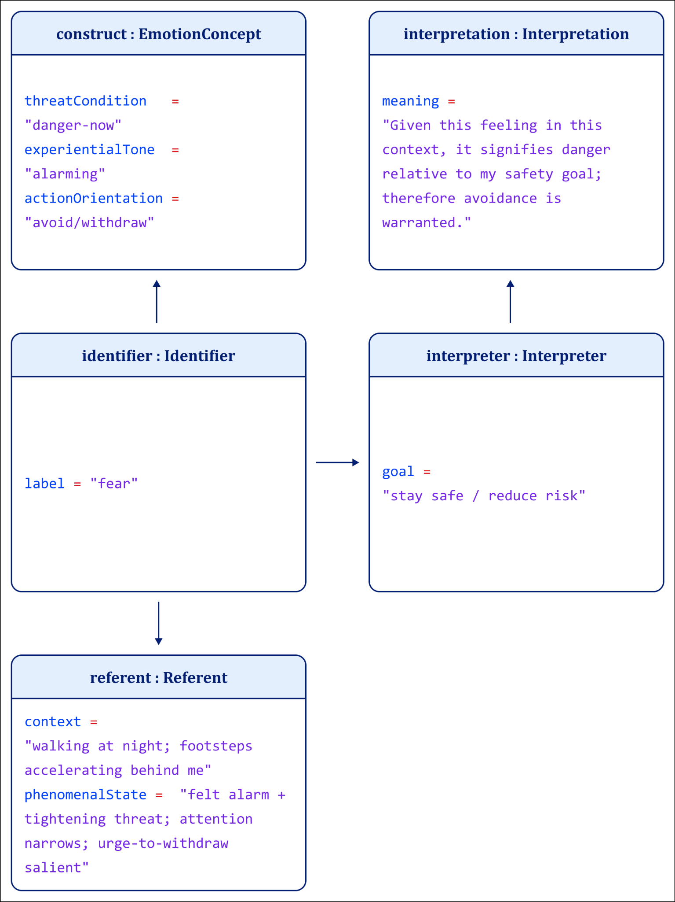  
—--------------------------------------------------------------------------------------------------------------------------------------------------------  
**Figure 9-2. Emotion Semiotic Sign UML Object Diagram**

Figure 9-1 presents the Constructivist Semiotic Model of Emotions (CSME) as a UML class diagram. It specifies the abstract architecture of an admissible emotional construct by defining its constituent relationships and governing constraints. The diagram does not depict a particular emotional episode. Instead, it specifies the identity conditions that every emotional construct must satisfy in order to qualify as an instance of the architecture. The illustrated properties represent exemplar normative dimensions rather than an exhaustive schema for every possible emotion.

Figure 9-2 presents a Constructivist Semiotic Sign (CSS) as a UML object diagram. Whereas the class diagram specifies the architecture abstractly, the object diagram instantiates that architecture within a particular emotional episode. The interpreter constructs emotional meaning by interpreting a referent consisting of physiological affect, feeling, and context under a governing goal. The identifier stabilizes the resulting construct for cognition and communication, while the concept supplies the identity conditions that distinguish the construct from every other emotion type.

Together, these diagrams distinguish the architecture from its instantiation. The UML class diagram specifies what every admissible emotional construct must contain. The UML object diagram demonstrates how an interpreter realizes that architecture within a particular emotional episode. This distinction preserves the central claim of the CSME: emotional meaning does not reside in physiology, feeling, or symbolic labels alone. An agent constructs emotional meaning by instantiating a Constructivist Semiotic Sign under explicit ontological, semiotic, and computational constraints.

The diagrams that follow no longer argue for the architecture. They demonstrate that the architecture survives formal specification and computational execution without collapsing the distinctions among affect, feeling, interpretation, commitment, and emotion.

I can clarify the model by applying it to a familiar case: love. In this simplified illustration, I treat Love as the governing concept and show Romance, Lust, and Attachment as different instantiated interpretations of that concept. The example does not replace the full Constructivist Semiotic Sign. Rather, it condenses the sign structure so the reader can see how different identifiers arise from different relations among felt state, context, biochemical profile, and the interpreting agent's goal.

The point is not that Romance, Lust, and Attachment name three unrelated emotions. The point is that the same general concept, Love, can generate different constructs when the agent interprets a felt state under different contextual and purposive constraints. A candlelight dinner, a sexually charged setting, and a caregiving scene do not merely decorate the emotion. They help specify what kind of love the agent constructs.

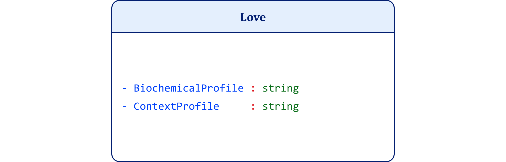  
—--------------------------------------------------------------------------------------------------------------------------------------------------------  
**Figure 9-3. Love Concept UML Class Diagram**

<table style="width:100%;">
<colgroup>
<col style="width: 17%" />
<col style="width: 27%" />
<col style="width: 27%" />
<col style="width: 28%" />
</colgroup>
<tbody>
<tr class="odd">
<td><strong>CSS Constituent</strong></td>
<td><strong>Romance</strong></td>
<td><strong>Lust</strong></td>
<td><strong>Attachment</strong></td>
</tr>
<tr class="even">
<td>Referent</td>
<td><strong> 
</strong>Romantic encounter</td>
<td> 
Sexually charged environment</td>
<td> 
Parents with child and dog</td>
</tr>
<tr class="odd">
<td>Identifier</td>
<td>Romance</td>
<td>Lust</td>
<td>Attachment</td>
</tr>
<tr class="even">
<td>Construct</td>
<td>1. BiochemicalProfile: dopamine, norepinephrine, serotonin. 
2. ContextProfile: courtship, attentiveness, exclusivity, affectionate exchange.</td>
<td>1. BiochemicalProfile: testosterone, estrogen. 
2. ContextProfile: sexual attraction, bodily display, erotic opportunity, physical proximity.</td>
<td>1. BiochemicalProfile: oxytocin, vasopressin. 
2. ContextProfile: care, familiarity, kinship, protection, durable trust.</td>
</tr>
<tr class="odd">
<td>Referent</td>
<td>Felt state of attraction, warmth, anticipation, and affiliative interest.</td>
<td>Felt state of sexual arousal, desire, bodily attraction, and approach readiness.</td>
<td>Felt state of safety, care, trust, belonging, and relational security.</td>
</tr>
<tr class="even">
<td>Interpreter</td>
<td>Interpreter seeking romantic bonding or exclusive affection.</td>
<td>Interpreter seeking sexual gratification or physical intimacy.</td>
<td>Interpreter seeking long-term security, emotional stability, or kinship continuity.</td>
</tr>
</tbody>
</table>

—--------------------------------------------------------------------------------------------------------------------------------------------------------  
**Table 9.7. Interpretive Variations of Love under the Constructivist Semiotic Model of Emotions**

Table 9.7 shows why CSME treats emotion as interpretive construction rather than simple biological activation. Biochemistry contributes real constraint, but it does not determine the emotion by itself. Context contributes real constraint, but it does not determine the emotion by itself. The agent constructs the emotion sign by binding felt state, context, concept, identifier, and goal into a coherent interpretation. In this sense, Romance, Lust, and Attachment function as distinct interpretations of Love rather than as isolated emotional substances.

Emotional meaning exists only when an agent interprets a sign relative to a goal and a context. I therefore require identifiable constituents, an act of interpretation, and constraints that allow success or failure. Without these, I can describe a biological event or a behavioral reflex, but I cannot claim emotional meaning.

This commitment grounds everything that follows. Without a semiotic architecture, emotion cannot be meaning at all. It becomes a pulse without a person. I restore the identity of emotion by restoring the authority of the agent who means it.

The corresponding C# executables for the projects below are available in the downloaded ZIP file under the matching project folder. Each folder includes a README with instructions for building, running, and reproducing the sample outputs.

Project 1 formalizes the claim that an emotion concept functions as a constraint structure. For demonstration, the program stipulates a simplified Fear concept with two admissibility conditions: the context must equal danger, and the arousal level must meet or exceed 6. The number does not claim to identify a psychological threshold for fear. It gives the executable a clear constraint so the program can test whether a runtime instance satisfies the concept.

The implementation defines an emotion concept with explicit constraint properties: required context and minimum arousal. Validation consists of testing whether the instance satisfies the concept’s constraints. The agent does not model validity as an object; the agent produces validity as a judgment.

Two parameters are accepted at runtime: context and arousal level.

Input

Output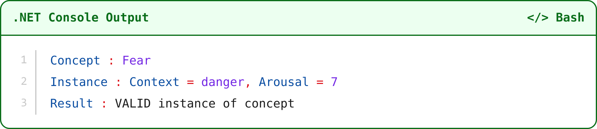

Input

Output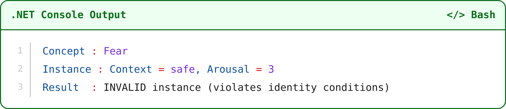

The run danger 7 passes because the instance satisfies both conditions: its context matches danger, and its arousal level exceeds the stipulated minimum of 6. The run safe 3 fails because the context does not match danger and the arousal level falls below 6. This demonstration does not claim that fear has a fixed psychological arousal threshold. It uses a stipulated threshold to show how a concept can govern admissible instances. Project 1 therefore demonstrates that identity depends on constraint satisfaction rather than resemblance or categorization. The structure accepts or rejects an instance according to whether the instance satisfies the concept’s admissibility conditions.

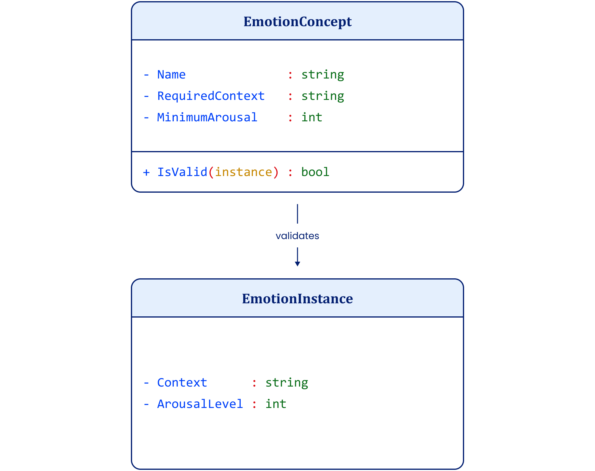  
—---------------------------------------------------------------------------------------------------------------------------------------------------------  
**Figure 9-4. Emotion Concept–Emotion Instance Validation UML Class Diagram**

Project 1 uses this validation structure to show how a concept governs an instance. The EmotionConcept supplies admissibility conditions, while IsValid(instance) tests whether a concrete EmotionInstance satisfies them. The example stipulates MinimumArousal = 6 only to make the validation executable; it does not claim that fear has a universal arousal threshold.

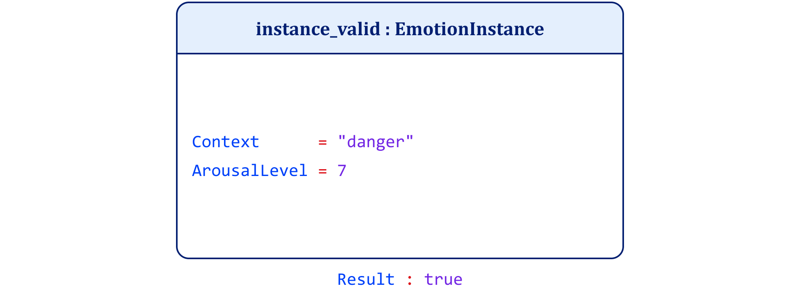  
—---------------------------------------------------------------------------------------------------------------------------------------------------------  
**Figure 9-5.** **Fear Instance (Valid) UML Object Diagram  
  
**

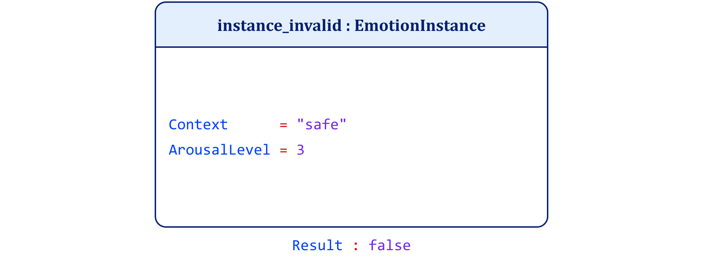  
—---------------------------------------------------------------------------------------------------------------------------------------------------------  
**Figure 9-6. Fear Instance (Invalid) UML Object Diagram**

Project 1 demonstrates that the Fear concept accepts an instance only when the instance satisfies its stipulated admissibility conditions. Figure 9-5 shows the valid case: danger 7 satisfies the required context and minimum arousal condition. Figure 9-6 shows the invalid case: safe 3 fails because it satisfies neither condition. Thus, identity depends on constraint satisfaction rather than resemblance or categorization.

Project 2 defends the bridge condition established in the chapter: a feeling may be real, identifiable, and context-bound without yet carrying emotional meaning. Figure 9-7 shows this bridge structure: a FeelingState may support EmotionalMeaning, but it does not automatically become emotional meaning. The project therefore separates eligibility for meaning from meaning itself. This distinction matters because a theory of emotion can collapse feeling into emotion if it treats every conscious occurrence as an interpretation.

The implementation defines a feeling state through context and arousal. As Figure 9-8 shows, these properties establish semiotic availability: the state exists, the program can track it, and an interpreter can take it up as material for meaning. Emotional meaning appears only when the program invokes interpretation. This preserves the distinction between sign material and significance. The same feeling can therefore appear in two conditions: first, as available but not yet meaningful; second, as interpreted and semantically achieved.

The program accepts three runtime inputs: context, arousal level, and mode. Figure 9-8 shows the contrast between the two conditions. The mode controls whether the program stops at semiotic availability or proceeds to semantic achievement. In this way, Project 2 shows that feelings do not become meaningful by default. Meaning appears only when a separate interpretive step occurs.

Input  

Output  
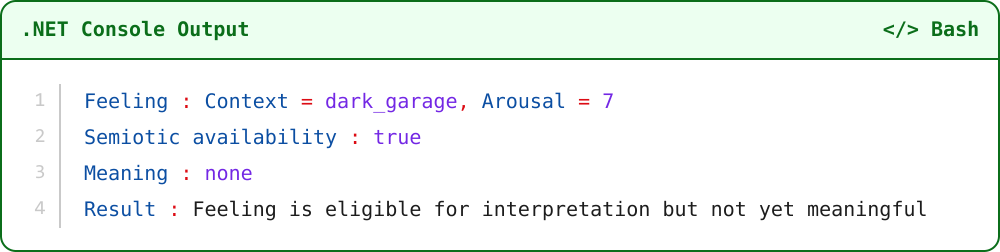

Input  

Output  
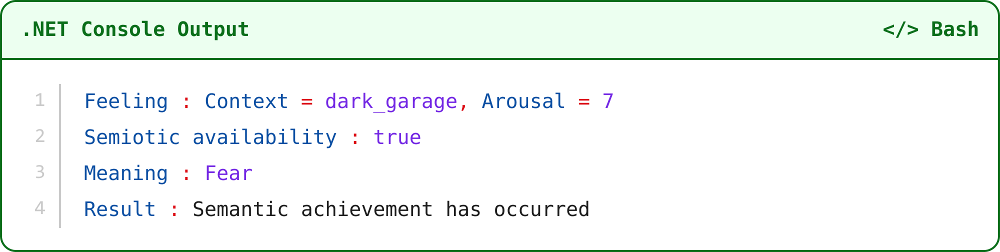

The contrast between these two outputs is the whole argument in executable form. Nothing in the underlying feeling changes. The contextualized arousal remains constant. The only change is whether interpretation has occurred. This demonstrates that feeling can function as sign-material without yet counting as an emotion.

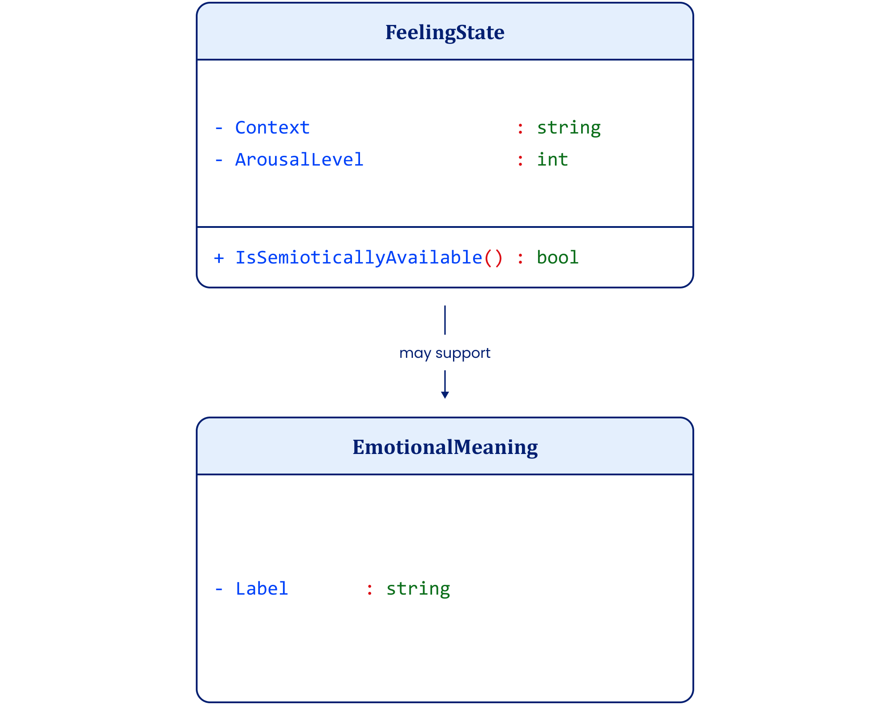  
-----------------------------------------------------------------------------------------------------------------------------------------------------------  
**Figure 9-7. Feeling State–Emotional Meaning Bridge UML Class Diagram**

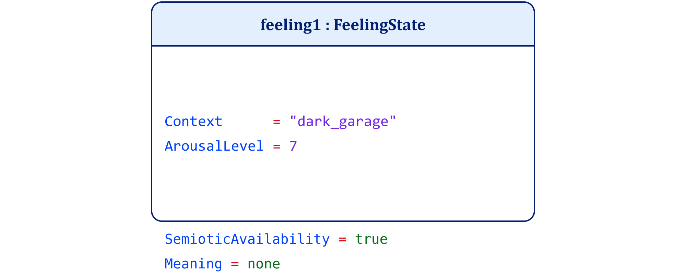  
---------------------------------------------------------------------------------------------------------------------------------------------------------  
**Figure 9-8. Feeling State (Before Interpretation) UML Object Diagram**

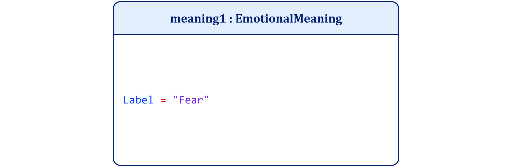  
------------------------------------------------------------------------------------------------------------------------------------------------------------  
**Figure 9-9. Emotional Meaning UML Object Diagram**

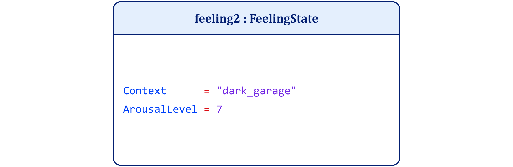  
--------------------------------------------------------------------------------------------------------------------------------------------------------  
**Figure 9-10. Feeling State (Before Interpretation) UML Object Diagram**

Project 3 defends one of the chapter’s strongest claims: the same feeling-in-context can yield different emotions under different goals. This directly supports my argument that emotional meaning does not equal bodily state. If bodily state alone determined emotion, then a constant feeling would also produce a constant emotion. Project 3 shows the opposite: the feeling remains constant while the emotion changes when the governing goal changes.

Figures 9-11 through 9-14 present the class structure for this demonstration. Figure 9-11 defines the FeelingState through context and arousal. Figure 9-12 defines the Goal as the governing constraint. Figure 9-13 defines EmotionInterpretation as the resulting emotional meaning. Figure 9-14 defines the Interpreter, which uses the feeling state and goal together to produce the interpretation.

Figures 9-15 through 9-18 show the concrete object executions. Figure 9-15 holds the feeling constant: the context remains backstage, and arousal remains 8. Figure 9-16 introduces the goal perform_well, which supports the interpretation shown in Figure 9-17: Excitement. Figure 9-18 then changes the goal to avoid_failure, and Figure 9-19 shows the resulting interpretation: Anxiety.

The program accepts three runtime inputs: context, arousal level, and goal. In both executions, the feeling remains unchanged. Only the goal changes. That change produces a different emotional meaning. Project 3 therefore demonstrates that the body does not carry emotional meaning within itself. Meaning arises when an interpreter takes up a felt state under a governing aim.

Input  

Output  
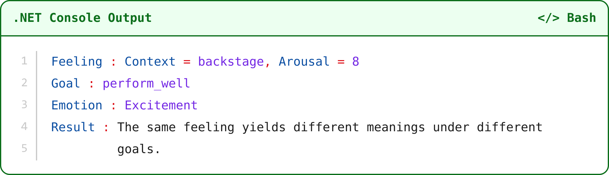

Input  

Output  
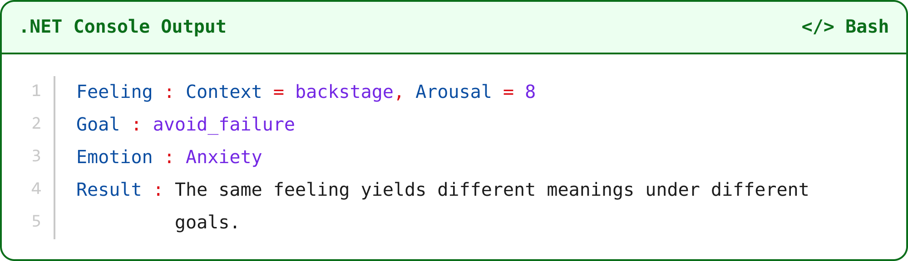

The contrast between these outputs demonstrates the core argument in executable form. Nothing in the feeling changes. The context remains backstage. The arousal remains high. Only the goal changes. Yet the meaning shifts from excitement to anxiety. This shows that emotional meaning is not found in the feeling alone but is constructed through goal-governed interpretation.

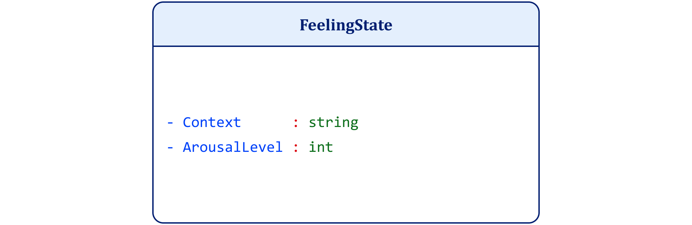  
—----------------------------------------------------------------------------------------------------------------------------------------------------  
**Figure 9-11. Feeling State UML Class Diagram  
**

  
—----------------------------------------------------------------------------------------------------------------------------------------------------  
**Figure 9-12. Goal UML Class Diagram**

  
—----------------------------------------------------------------------------------------------------------------------------------------------------  
**Figure 9-13. Emotional Interpretation UML Class Diagram**

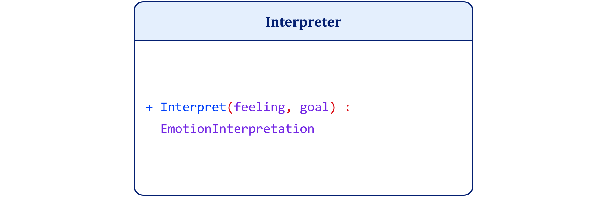  
—----------------------------------------------------------------------------------------------------------------------------------------------------  
**Figure 9-14. Interpreter UML Class Diagram**

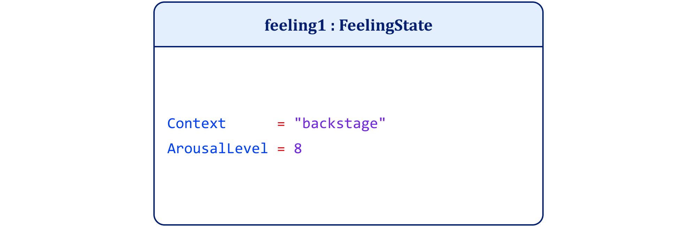  
—----------------------------------------------------------------------------------------------------------------------------------------------------  
**Figure 9-15. Feeling State UML Object Diagram**

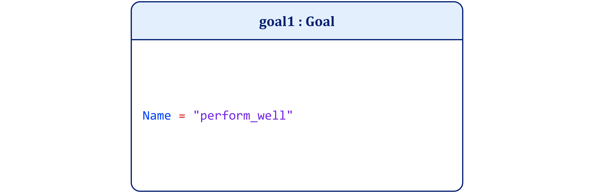  
—----------------------------------------------------------------------------------------------------------------------------------------------------  
**Figure 9-16. Performance Goal UML Object Diagram**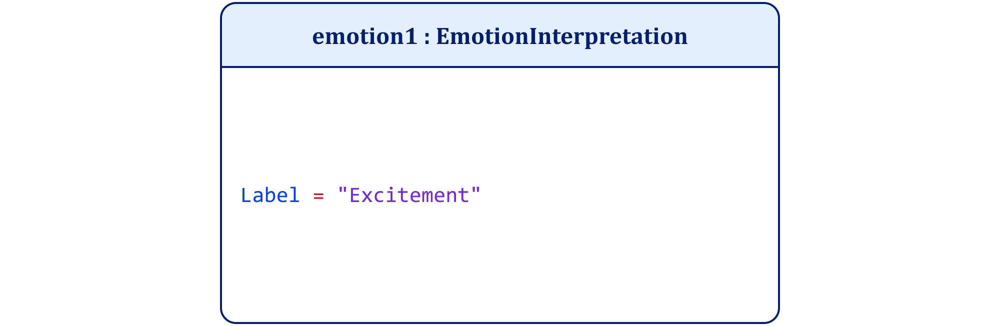  
—----------------------------------------------------------------------------------------------------------------------------------------------------  
**Figure 9-17. Excitement Interpretation UML Object Diagram**

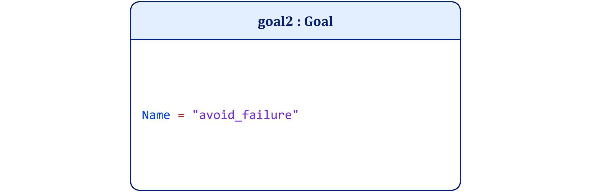  
—----------------------------------------------------------------------------------------------------------------------------------------------------  
**Figure 9-18. Avoidance Goal UML Object Diagram**

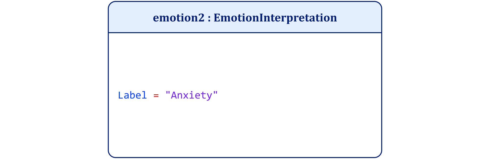  
—---------------------------------------------------------------------------------------------------------------------------------------------------------  
**Figure 9-19. Anxiety Interpretation UML Object Diagram**

Project 4 illustrates the chapter’s claim that emotional meaning arises through an ordered sequence rather than a single undifferentiated event. Figures 9-20 through 9-23 present the class structure for that sequence. Figure 9-20 defines the external situation. Figure 9-21 defines the feeling state that the situation can produce. Figure 9-22 defines the goal that governs interpretation. Figure 9-23 defines emotional meaning as the result of interpretation. Figure 9-24 shows the pipeline that first converts situation into feeling, then interprets that feeling under a goal.

Figures 9-25 through 9-28 show the corresponding object-level execution. Figure 9-25 presents the external situation, footsteps_behind. Figure 9-26 shows the resulting feeling state: context dark_street, arousal level 7. Figure 9-27 introduces the goal stay_safe, and Figure 9-28 shows the resulting meaning, Fear. Figure 9-29 then shows the alternative meaning, Relief, when the interpretive context changes.

Project 4 therefore demonstrates phase separation. The external situation does not contain emotional meaning by itself. The situation first gives rise to feeling. The agent then interprets that feeling under a goal. Emotion appears only after that interpretive act.

Input

Output  
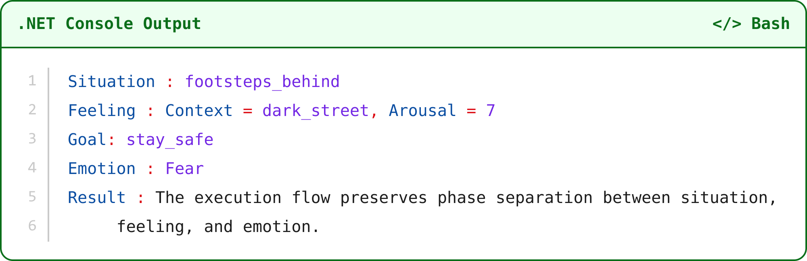

Input  

Output  
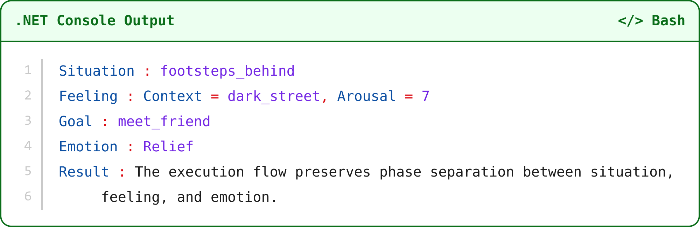

The contrast between these outputs demonstrates the architectural point. The external event does not contain emotional meaning within itself. It first produces a feeling state. That feeling then becomes emotionally meaningful only when interpreted under a governing goal. This preserves the chapter’s distinction between causal sequence and semantic achievement.

  
—----------------------------------------------------------------------------------------------------------------------------------------------------  
**Figure 9-20. External Situation UML Class Diagram**

  
—----------------------------------------------------------------------------------------------------------------------------------------------------  
**Figure 9-21. Feeling State UML Class Diagram**

  
—----------------------------------------------------------------------------------------------------------------------------------------------------  
**Figure 9-22. Goal UML Class Diagram**

  
—----------------------------------------------------------------------------------------------------------------------------------------------------  
**Figure 9-23. Emotional Meaning UML Class Diagram**

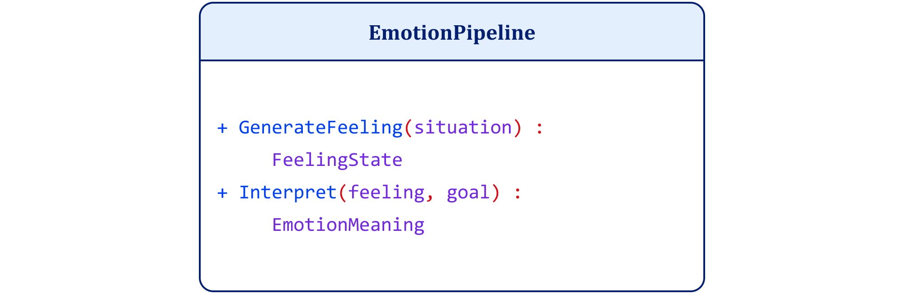  
—----------------------------------------------------------------------------------------------------------------------------------------------------  
**Figure 9-24. Emotion Pipeline UML Class Diagram**

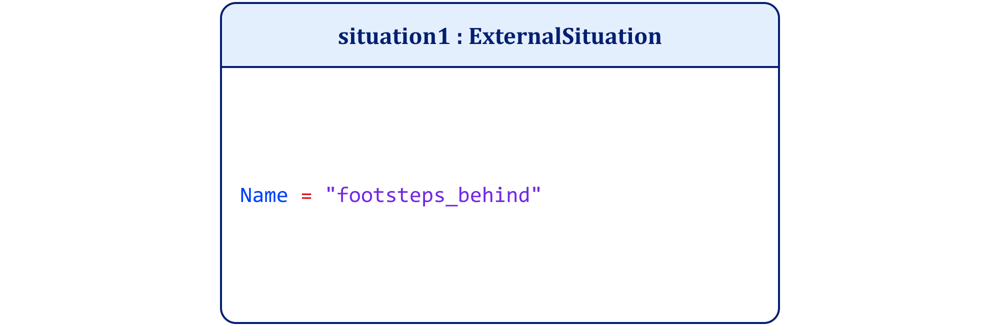  
—----------------------------------------------------------------------------------------------------------------------------------------------------  
**Figure 9-25. External Situation UML Object Diagram**

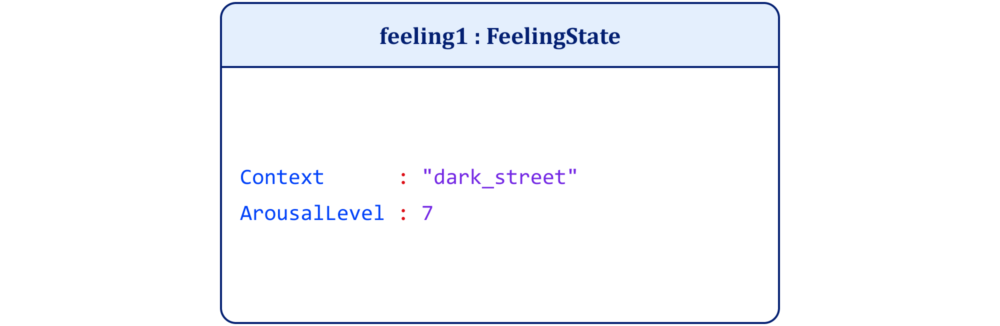  
—----------------------------------------------------------------------------------------------------------------------------------------------------  
**Figure 9-26. Feeling State UML Object Diagram**

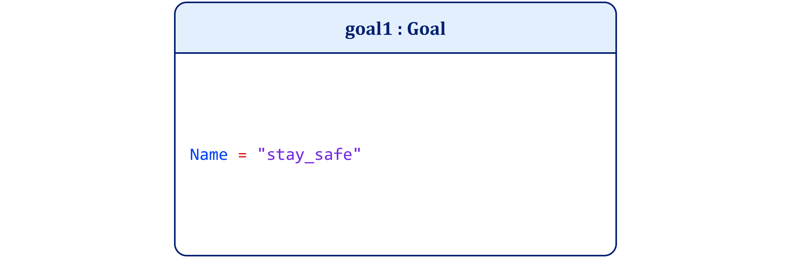  
—----------------------------------------------------------------------------------------------------------------------------------------------------  
**Figure 9-27. Safety Goal UML Object Diagram**

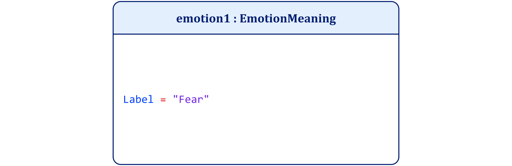  
—----------------------------------------------------------------------------------------------------------------------------------------------------  
**Figure 9-28. Fear Meaning UML Object Diagram**

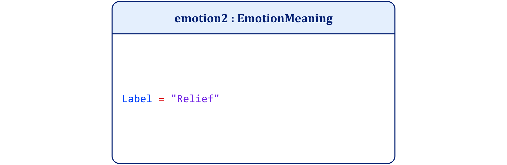  
—----------------------------------------------------------------------------------------------------------------------------------------------------  
**Figure 9-29. Relief Meaning UML Object Diagram**

Project 5 isolates the chapter’s final executable claim: an agent can revise emotional meaning without changing the underlying feeling. Figures 9-30 through 9-32 define the class structure for that revision. Figure 9-30 defines the feeling state through context and arousal. Figure 9-31 defines the goal that continues to govern interpretation. Figure 9-32 defines emotional meaning as the interpretive result. Figure 9-33 defines the Reinterpreter, which takes the same feeling and goal together with updated contextual knowledge.

Figures 9-34 through 9-36 show the object-level execution. Figure 9-34 holds the feeling constant: context dark_street, arousal level 7. Figure 9-35 holds the goal constant: stay_safe. Figure 9-36 shows the initial interpretation, Fear, when the agent treats the other person as unknown. Figure 9-37 shows the revised interpretation, Relief, when the agent recognizes the other person as a friend.

Project 5 therefore demonstrates revisability. The feeling does not change, and the governing goal does not change. Updated contextual knowledge changes the interpretation. Emotional meaning therefore does not reside inside the bodily state; an agent constructs it through interpretation and can revise it when context warrants correction.

Input  

Output  
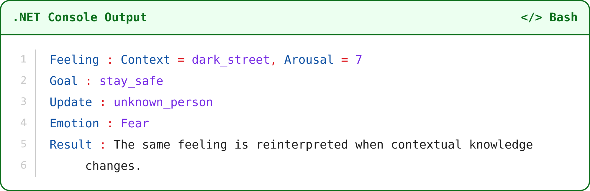

Input  

Output  
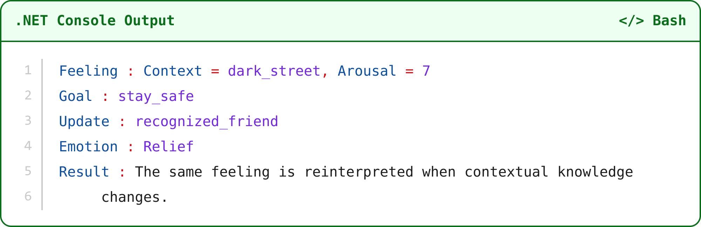

The contrast between these outputs demonstrates the argument in executable form. The feeling remains constant. The governing goal remains constant. Only contextual knowledge changes. Yet the meaning shifts from fear to relief. This shows that emotional meaning is not contained in the bodily state itself but arises through interpretation and can therefore be revised when interpretation is corrected.

  
—----------------------------------------------------------------------------------------------------------------------------------------------------  
**Figure 9-30. Feeling State UML Class Diagram**

  
—----------------------------------------------------------------------------------------------------------------------------------------------------  
**Figure 9-31. Goal UML Class Diagram**

  
—----------------------------------------------------------------------------------------------------------------------------------------------------  
**Figure 9-32. Emotional Meaning UML Class Diagram**

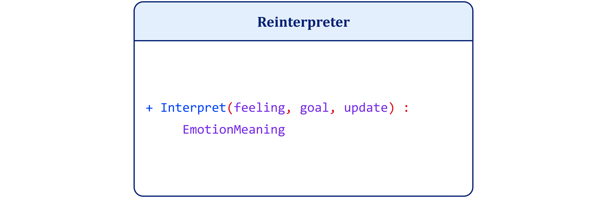  
—----------------------------------------------------------------------------------------------------------------------------------------------------  
**Figure 9-33. Reinterpreter UML Class Diagram**  
—----------------------------------------------------------------------------------------------------------------------------------------------------  
**Figure 9-34. Feeling State (Stable) UML Object Diagram**

  
—----------------------------------------------------------------------------------------------------------------------------------------------------  
**Figure 9-35. Safety Goal (Stable) UML Object Diagram**

  
—----------------------------------------------------------------------------------------------------------------------------------------------------  
**Figure 9-36. Emotion Meaning (Initial Fear) UML Object Diagram**

  
—----------------------------------------------------------------------------------------------------------------------------------------------------  
**Figure 9-37. Emotion Meaning (Revised Relief) UML Object Diagram**

The five projects have now performed a single task under different constraints. They have not introduced new claims. They have enforced the claims already made.

Each project isolates a failure point in contemporary emotion theory and replaces it with an executable constraint. The first project fixes identity conditions by demonstrating that a concept governs its instances through admissibility rather than emerging from classification. The second project secures the bridge condition by showing that a feeling may be available for interpretation without already possessing meaning. The third project restores interpretive governance by proving that the same feeling-in-context yields different emotions under different goals. The fourth project preserves phase separation by enforcing the ordered transition from situation to feeling to interpretation without collapse. The fifth project establishes revisability by showing that meaning can change while the underlying feeling remains constant.

Taken together, these projects do not merely illustrate the theory. They constrain it. Each executable forces a distinction that the architecture requires. If any distinction is removed, the code collapses into contradiction. Identity dissolves into grouping. Availability collapses into meaning. The body is mistaken for the interpreter. Sequence collapses into simultaneity. Revision becomes impossible. The projects therefore function as proof by failure. They show not only what the model asserts, but what breaks when its constraints are violated.

The result is a system in which emotional meaning survives computational pressure without sacrificing philosophical precision. The architecture holds. Affect remains causal. Feeling remains experiential. Emotion remains interpretive. The agent remains responsible.

What remains is to present the system as a unified execution. The projects demonstrated the parts. The next step shows the whole.

Figure 9-38 now integrates these constraints into a single, phase-ordered architecture.

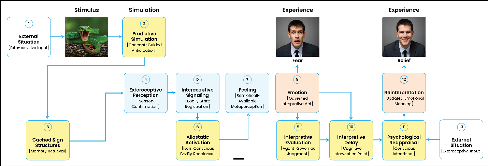  
—----------------------------------------------------------------------------------------------------------------------------------------------------  
**Figure 9-38. Metamorphosis of an Emotion**

Figure 9-38 illustrates the complete architecture through which emotional meaning is constructed within the Constructivist Semiotic Model of Emotions (CSME). The diagram separates simulation, bodily regulation, feeling, and interpretation into distinct stages so that the reader can see precisely where emotional meaning arises in the process. Each numbered step corresponds to a labeled component in the diagram and shows how environmental input, predictive cognition, physiological readiness, and conceptual interpretation interact without collapsing into one another. The sequence demonstrates that biological and predictive processes shape the field of possible interpretations but do not constitute emotional meaning themselves. Emotional meaning emerges only when the agent performs an interpretive act that stabilizes a semiotic sign binding affect, concept, and governing goal.<a href="../references/notes/chapter-09.md#note-217">217</a>

Throughout the diagram, bodily regulation, prediction, and perception are treated as operations of the cognitive system. Interpretation, however, belongs to the agent. The system prepares and constrains the field of possible meanings, but only the agent performs the interpretive act that constitutes emotional meaning.

**(1) External Situation (Exteroceptive Input).  
** The process begins with an external situation that impinges on the sensory systems. At this stage the stimulus is a physical configuration of the environment. It may trigger perceptual and physiological responses, but it possesses no intrinsic emotional meaning. The stimulus is therefore causally efficacious but semantically inert.<a href="../references/notes/chapter-09.md#note-218">218</a>

**(2) Predictive Simulation (Concept-Guided Anticipation).  
** The stimulus activates predictive simulation. The cognitive system anticipates possible outcomes by projecting concept-guided expectations about relevance, affordances, and potential consequences. This simulation narrows the range of plausible interpretations but remains pre-interpretive. It constrains the field within which an agent may later interpret the feeling, but it does not determine emotional meaning.<a href="../references/notes/chapter-09.md#note-219">219</a>

**(3) Cached Sign Structures (Memory Retrieval).  
** Predictive simulation draws upon cached sign structures stored in memory. Previously learned conceptual associations, cultural scripts, and past experiences supply the conceptual resources through which the situation may later be interpreted. These stored structures supply conceptual resources that the agent may draw upon during interpretation. They prepare the architecture of possible meanings but do not themselves produce emotional meaning.

**(4) Exteroceptive Perception (Sensory Confirmation).  
** Simultaneously, the organism organizes incoming sensory information through exteroceptive perception. Environmental features become structured into a coherent situational representation shaped by predictive expectations. Perception therefore delivers organized sensory input rather than evaluative meaning.<a href="../references/notes/chapter-09.md#note-220">220</a>

**(5) Interoceptive Signaling (Bodily State Registration).  
** At the same time the body generates interoceptive signals reflecting physiological changes within the organism. These signals communicate information about bodily condition such as heart rate, muscle tension, and metabolic readiness. Interoception supplies causal input to the system but does not yet constitute emotion.

**(6) Allostatic Activation (Non-Conscious Bodily Readiness).  
** The organism adjusts bodily resources through allostatic regulation in anticipation of potential demand. Energy allocation, arousal levels, and attentional readiness shift automatically as the system prepares for action. These changes influence the interpretive field by making certain responses more viable than others, yet they do not, in themselves, provide evaluative meaning.<a href="../references/notes/chapter-09.md#note-221">221</a>

**(7) Feeling (Metaperceived Awareness of Bodily State).  
** Interoceptive activity becomes consciously accessible through metaperception. Feeling arises as the conscious awareness of bodily condition within context, making the affective state available to the agent as potential sign-material for interpretation. Although this experience is real and experientially salient, no emotion yet exists at this stage. Feeling constitutes the experiential referent that later becomes available for interpretation.<a href="../references/notes/chapter-09.md#note-222">222</a>

At this point the diagram introduces two consecutive stages labeled Emotion (8) and Interpretive Evaluation (9) but stages 8 and 9 represent a single interpretive act analytically decomposed for conceptual clarity, not a temporal sequence. Stage 8 identifies the act as a whole; Stage 9 isolates its evaluative structure. The diagram's sequential notation is a representational convenience, not an ontological claim about temporal order. Stage 8 represents the unified interpretive act through which an agent constitutes emotional meaning by assigning significance to a felt state under goal-relative constraints. Stage 9 provides an internal analytical decomposition of that same act. It isolates the evaluative judgment that determines how the felt state should be understood relative to the agent’s goals and contextual conditions. The diagram therefore separates the act and its evaluative structure for purposes of conceptual clarity. In the actual operation of the architecture, these components occur as a single interpretive commitment rather than as sequential processes.

**(8) Emotion (Goal-Governed Interpretive Act).  
** Emotion arises when the agent performs a goal-governed interpretive act that assigns meaning to the felt state. At this point the agent binds the felt experience to an emotion concept under governing goals and contextual constraints. The cognitive system provides the enabling architecture that makes this act possible.

**(9) Interpretive Evaluation (Agent-Governed Judgment).  
** The interpretive act includes an evaluative judgment in which the agent determines how the felt state should be understood relative to contextual goals and conceptual constraints. Stage 9 isolates this evaluative dimension analytically, but it does not introduce a separate step in time. It specifies the internal structure of the interpretive act already represented in Stage 8. The cognitive system constrains the interpretive field, but the judgment itself belongs to the agent.<a href="../references/notes/chapter-09.md#note-223">223</a>

**(10) Interpretive Delay (Cognitive Intervention Point).  
** The architecture permits interpretive delay. The agent may pause before finalizing interpretation, allowing reflective consideration of alternative conceptual bindings. This stage explains how agents can intervene in emotional interpretation rather than remaining locked into automatic responses.<a href="../references/notes/chapter-09.md#note-224">224</a>

**(11) Psychological Reappraisal (Intentional Reinterpretation).  
** Through deliberate reflection the agent may reinterpret the situation by revising contextual assumptions, conceptual framing, or governing goals. Reappraisal does not eliminate the underlying feeling but alters the meaning assigned to it.

**(12) Reinterpretation (Updated Emotional Meaning).  
** When reinterpretation occurs, the same bodily state may stabilize under a different emotional concept. In the diagram the initial interpretation of fear may be reconstructed as relief once new contextual information becomes available. Emotional meaning therefore proves revisable rather than fixed.

**(13) Updated External Situation (Revised Exteroceptive Context).  
**Finally, step 13 returns the process to the external situation, completing the loop. Changes in the external environment do not retroactively alter earlier interpretations; rather, they update the predictive and allostatic parameters that shape future interpretive possibilities. This is the learning and refinement mechanism of the architecture. Over time this feedback contributes to learning and refinement of the interpretive system.<a href="../references/notes/chapter-09.md#note-225">225</a>

Taken together, the sequence demonstrates that emotions are neither reflexive bodily outputs nor automatic products of predictive categorization. Bodily signals and predictive simulations prepare the interpretive field, but emotional meaning arises only when the cognitive system stabilizes a semiotic sign that binds affect, concept, and goal. Emotion is therefore not detected but constructed through interpretive commitment within a goal-governed architecture of cognition.

I did not merely claim in this chapter that emotions are constructed. I demonstrated what an emotion must be to qualify as meaning. I enforced that requirement through a disciplined, inspectable architecture. The Constructivist Semiotic Model of Emotions (CSME) does not describe emotional life through metaphor. It specifies the conditions that make emotional meaning possible, executable, and accountable.<a href="../references/notes/chapter-09.md#note-226">226</a>

I resolved the three structural failures that undermine most emotion theories.

First, I eliminated ontological collapse. Affect, feeling, and emotion do not form stages of a single process. They serve as non-substitutable roles with distinct identity conditions. Physiological affect belongs to the body as a causal substrate. Feeling belongs to consciousness as metaperceived interoception. Emotion belongs to interpretation as meaning achieved under constraint. With these roles fixed, sensation cannot masquerade as meaning. Regulation cannot masquerade as judgment.<a href="../references/notes/chapter-09.md#note-227">227</a>

Second, I secured the bridge condition. Semiotic availability does not equal semantic achievement. A feeling becomes eligible for meaning without becoming meaningful by default. It functions as sign-material situated in context, but it does not yet signify. Emotional meaning emerges only when an agent interprets that feeling under goal-relative constraints. Without this distinction, theories either smuggle meaning into sensation or dissolve meaning into mechanism.<a href="../references/notes/chapter-09.md#note-228">228</a>

Third, I restored interpretive governance. Emotional meaning does not function as an automatic output of appraisal loops or predictive simulations. It constitutes an agent-owned act governed by correctness conditions. Because goals and context constrain interpretation, emotions can succeed or fail. They can be justified or mistaken. They can be revised over time. Without this governed act, no emotional meaning exists. One finds only physiological change and behavioral consequence.<a href="../references/notes/chapter-09.md#note-229">229</a>

I demonstrated that these distinctions survive formal pressure. The CSME applies a unified semiotic architecture across both feeling and emotion while it preserves phase separation. The UML class diagram fixes the identity conditions of emotion concepts. The object diagram shows how an agent instantiates emotional meaning in context. The metamorphosis flow illustrates how prediction, perception, allostasis, and metaperception prepare the field without themselves constituting significance. No level collapses into another. No role performs the work of its neighbor.<a href="../references/notes/chapter-09.md#note-230">230</a>

The division of labor remains precise. Computation constrains and prepares. Interpretation constitutes meaning. Prediction biases salience. Allostasis shapes readiness. Simulation retrieves prior structures. None of these operations decides what a feeling signifies. They constrain the interpretive field, but only the agent determines the emotional meaning of the feeling through an act of interpretation. Meaning enters the architecture only when an agent interprets a semiotically available feeling relative to a governing goal.<a href="../references/notes/chapter-09.md#note-231">231</a>

. This model respecifies the identity conditions, bridged experience and meaning, and located governance in the agent. This model secures emotional meaning as accountable rather than automatic.<a href="../references/notes/chapter-09.md#note-232">232</a>

The architecture now stands complete. An agent does not discover emotion. An agent constructs it under the law.<a href="../references/notes/chapter-09.md#note-233">233</a>

I have fixed emotional meaning as a constructed achievement rather than a discovered state. Now I face an unavoidable task. If emotions are signs, I must explain what makes signs possible in the first place. Emotional Constructivism rests on a macro-semiotic architecture, yet that architecture presupposes a deeper layer it has not yet justified. Interpretation requires symbolic material before it can produce meaning.<a href="../references/notes/chapter-09.md#note-234">234</a>

This chapter moves downward as well as forward. I shift from the macro-semiotic sign to its micro-semiotic constituents. I ask how symbols make concepts possible, how concepts become available for interpretation, and why meaning collapses whenever this symbolic substrate is absent. The focus is no longer emotion alone. I target the general machinery of understanding that emotions depend on.<a href="../references/notes/chapter-09.md#note-235">235</a>

What follows is a formal account of how symbols enable concepts, how concepts participate in signs, and how signs yield intensional meaning.<a href="../references/notes/chapter-09.md#note-236">236</a> I show why perception can occur without symbols, but understanding cannot.<a href="../references/notes/chapter-09.md#note-237">237</a> I show why signals can exist without meaning, but signs cannot. Emotional meaning is only one instance of a more general semiotic achievement.<a href="../references/notes/chapter-09.md#note-238">238</a>

Chapter 10: All I know is what I have symbols for.  
The Making of Meaning.

**Sources**
