[Contents](README.md) · [Notes](../references/notes/chapter-12.md) · [Bibliography](../references/bibliography/chapter-12.md)

# Chapter 12 — Our Feelings Are Real, But Are Our Emotions?

*How the Mind Misidentifies Sensation*

*Chapter 11 established the symbolic threshold: feeling becomes emotion only when an agent can organize it under a detachable identifier, apply identity conditions, and authorize the result as meaningful. Chapter 12 asks why we so often forget that threshold. I turn to the central error behind ordinary talk, psychology, social judgment, and artificial emotion detection: we collapse affect, feeling, expression, behavior, and emotion into one kind of reality, then treat the result as objective.*

*I distinguish the realities that emotional life contains. Physiological affect belongs to the body’s regulatory and predictive economy. Feeling arises when the organism becomes conscious of that bodily condition. Emotion begins only when an agent interprets feeling under symbolic, contextual, and goal-governed constraint. At the first-person level, emotion exists as an authorized prototype. At the social level, agents stabilize emotion as a non-pejorative stereotype through shared use, communication, and correction.*

*The chapter’s demonstrations test this ontology rather than merely state it. The semiotic tests show that identifiers do not determine meaning, that identity conditions can vary under the same label, and that no universal objective essence, identity, or significance governs every admissible case. The FamilyClanSign and job-interview examples make the point executable: the same symbol, state, or situation can support different meanings when agents alter the governing constraints.*

*The result matters beyond theory. A racing heart does not contain fear. A facial expression does not reveal anger. A machine that classifies a voice, posture, or neural pattern does not detect emotion itself. Observers infer; systems correlate; agents authorize. A signal can indicate change, but only a sign carries meaning. Emotion therefore cannot enter the world as a discovered object. It enters as an interpretation that an agent commits to under rules.*

*By the end of the chapter, I can say more precisely why our feelings are real while our emotions require construction. Emotion should not masquerade as objective moral truth. Its proper role is to interpret feeling so that it can influence moral action and reward the agent for acting well. This prepares Chapter 13, where I move from misattribution to grammar: affective mechanisms become like instruments, feeling acquires timbre, and emotions appear as genres of interpreted experience.*

Chapter 11 established a decisive threshold. Animals and infants, up to a certain stage of development, possess affect and feeling but are incapable of constructing emotional meaning. Emotional meaning arises only when a felt state is stabilized under symbolic constraint; at higher levels, it requires reflective endorsement and revision. Feeling therefore precedes emotion both developmentally and architecturally.<a href="../references/notes/chapter-12.md#note-1">1</a>

Throughout this chapter, 'physiology' refers to both bodily and neural processes that generate and regulate affective states. That definition forces a deeper question. If affect exists as a physiological and regulatory process, and feeling as its conscious metaperceptual awareness, then emotion cannot be identical with physiology or felt experience. Yet affect and feeling are undeniably real. Organisms undergo measurable shifts in arousal, tension, attraction, aversion, depletion, and activation. These states become available in experience as feeling. What these processes and experiences lack is not reality, but meaning.<a href="../references/notes/chapter-12.md#note-2">2</a>

This chapter takes up that distinction directly. I argue that our feelings are real in the phenomenological sense, while our emotions arise only when an agent interprets a felt state under symbolic and contextual constraints. The problem is not whether we feel. The problem is that we systematically mistake physiology, and feeling for emotion itself.<a href="../references/notes/chapter-12.md#note-3">3</a>

We experience emotions as if they are real features of the world, yet we lack a clear account of how they are real. This produces a set of persistent confusions. We assume that we can observe, detect, or measure emotions through scientific instruments or through physiological expressions, signals, and behaviors.<a href="../references/notes/chapter-12.md#note-4">4</a>

We systematically misattribute affect and feeling in our attempts to derive emotional meaning. We treat emotional categories as if they possess objective essence, identity, and intrinsic meaning, rather than recognizing that agents interpret and construct them. These errors propagate across domains. They lead to interpersonal misunderstanding, clinical misdiagnosis, and the false assumption that artificial systems can detect emotion. We produce a stable illusion: that we detect emotion rather than construct it.<a href="../references/notes/chapter-12.md#note-5">5</a>

In this chapter, I address a persistent confusion: agents often conflate different kinds of reality and collapse them into objectivity. Physiological affect is real as bodily process. Felt experience is real as conscious awareness. Emotion is real differently. At the first-person level, an agent produces emotion as a subjective prototype by organizing a felt state under a detachable symbolic identifier and authorizing that construct under symbolic and contextual constraints. At the social level, agents stabilize emotion as a non-pejorative stereotype through communication, correction, and consensus. Emotion therefore does not reside in the body, expression, or neural activity as an objective property waiting for detection. What appears as recognition is inference: agents do not find emotion as an object; they construct emotional meaning from real affective and experiential conditions.<a href="../references/notes/chapter-12.md#note-6">6</a>

I treat this not as a problem of definition, but as a problem of misattribution. We take what is real in experience, affect and feeling, and treat it as if it already carries emotional meaning. Existing accounts attempt to locate emotion in physiology, behavior, or subjective experience and then debate which layer defines it. They shift the locus, but they do not explain why this confusion arises or what it means for emotion to count as meaningful at all.<a href="../references/notes/chapter-12.md#note-7">7</a>

n this chapter, I distinguish four kinds of reality that agents often collapse into objectivity. First, physiological and predictive reality concerns bodily regulation, anticipation, and affective readiness. Second, phenomenological reality concerns what the agent consciously feels. Third, emotional reality concerns the first-person construct the agent authorizes by organizing feeling under a detachable symbolic identifier and identity conditions. Fourth, social reality concerns the shared stabilization of that construct through communication, correction, and consensus. The central error this chapter addresses is not that agents mistake unreality for reality, but that they treat every kind of reality as if it were objective in the same way.<a href="../references/notes/chapter-12.md#note-8">8</a>

Four Levels of Reality in Emotional Life

The issue is not where to locate emotion, but why agents misattribute it and what must occur for emotional meaning to exist at both the first-person and social levels. Resolving the confusion between affect, feeling, and emotion requires a distinction between what presents itself in experience and what an agent constructs from it. Agents often treat physiology, expression, and felt experience as if they already contain meaning. They do not. What, then, do we mean by “real”?<a href="../references/notes/chapter-12.md#note-9">9</a>

We believe what we feel.

Phenomenological reality refers to what the agent encounters directly in first-person experience. I do not infer, predict, or interpret this reality. I feel it. When an organism undergoes a shift in affective state, that shift becomes available in consciousness as feeling. This feeling presents itself immediately. It requires no justification, belief, or conceptual framing. It is not a conclusion I reach; it is a state I undergo.<a href="../references/notes/chapter-12.md#note-10">10</a>

In this sense, phenomenological reality is epistemically primary. It provides the first point of access to the internal conditions of the organism. Even when the agent misidentifies the underlying causes, the experience remains. I may mistake why I feel a certain way or what that feeling signifies, but I do not mistake the fact of the feeling itself.<a href="../references/notes/chapter-12.md#note-11">11</a>

Consider a sudden racing heartbeat and bodily tension before a meeting. I may interpret this feeling as anxiety about the meeting itself, when in fact caffeine, lack of sleep, or residual arousal from prior activity caused the state. The feeling is real. The feeling is present. The error lies in the source I assign to it and the significance I give it.<a href="../references/notes/chapter-12.md#note-12">12</a>

This distinction is critical. Feeling is not yet emotion. It is not yet meaning. Feeling presents the internal state of the organism before the agent takes anything to be the case. It does not represent a fact about the world, and it carries no objective psychological meaning on its own. When the agent later interprets that state, the agent may take it as fear, excitement, threat, or opportunity. Emotion therefore does not reveal the world. It reflects how an agent assigns meaning to an interoceptive condition. What appears in experience is not a fact about the external situation, but a candidate for interpretation that the agent may take up correctly or incorrectly.

We do not feel what we perceive. We feel what perception does to our bodies.<a href="../references/notes/chapter-12.md#note-13">13</a>

We believe what we predict.

Predictive reality refers to the processes that generate affect prior to conscious awareness. The organism does not passively receive the world and then react. It continuously simulates, anticipates, and prepares for what it expects to occur. These predictive processes shape physiological states in advance. They modulate arousal, valence, and readiness before the agent feels anything at all. In this sense, prediction is causally prior to experience, even though the agent cannot directly access it.<a href="../references/notes/chapter-12.md#note-14">14</a>

What the agent feels in experience is therefore not a direct readout of the external world, but the result of internally generated expectations interacting with incoming signals. The body prepares first. That preparation becomes available as feeling. An elevated heart rate, tension, or unease may arise not because of what is objectively present, but because of what the system has predicted.<a href="../references/notes/chapter-12.md#note-15">15</a>

Consider walking down a dark street after watching a suspenseful film. The agent predicts a threat. The body increases arousal and prepares for danger. A shadow moves, and the agent feels fear. A moment later, the agent recognizes a harmless passerby. The prediction fails. This mismatch generates a prediction error, and the system updates its model. The agent then reinterprets the same physiological state as relief or embarrassment.<a href="../references/notes/chapter-12.md#note-16">16</a>

Prediction drives the initial state. Prediction error drives its correction.

Between what generates a feeling and what the agent experiences, the agent must still determine what that feeling means.

We believe what we interpret.

Emotional reality arises when an agent interprets a felt state under the constraints of context and goal. The feeling itself does not tell me what produced it, what it concerns, or what it means. I assign that significance by applying a symbolic identifier and authorizing it under specific identity conditions. The same physiological and felt pattern therefore takes on different meanings depending on the situation and my purposes. A racing heart and heightened arousal may become fear in one context and excitement in another. The underlying affect remains constant; the meaning I assign to it changes.<a href="../references/notes/chapter-12.md#note-17">17</a>

Consider standing backstage before a performance. The body shows elevated heart rate, tension, and heightened alertness. One agent interprets this state as anxiety and concludes, “I am afraid of failing.” Another agent interprets the same state as excitement and concludes, “I am ready to perform.” The physiological and felt state remains largely the same. The emotion differs because the agent performs a different act of meaning.<a href="../references/notes/chapter-12.md#note-18">18</a>

Emotion does not reside in the body or emerge directly from experience. The agent constructs it by interpreting a felt state. Once they authorize the interpretation, it governs the system as an emotion and begins to guide attention, judgment, and action.<a href="../references/notes/chapter-12.md#note-19">19</a>

These interpretations extend beyond the individual and enter shared use.

We believe what we agree.

Social reality arises when agents coordinate the use and interpretation of symbolic constructs across contexts. Emotional meanings move beyond first-person authorization when agents communicate, contest, and stabilize them through shared use. They stabilize when multiple agents communicate, interpret, and apply the same identifiers under shared rules. Through repeated use, correction, and alignment, agents converge on what counts as anger, fear, embarrassment, or pride in given situations. This convergence does not reveal intrinsic meanings in the underlying affect; it establishes norms of admissibility and use.<a href="../references/notes/chapter-12.md#note-20">20</a>

These norms function through agreement rather than discovery. Agents learn when a label applies, when it misapplies, and how to revise it under social feedback. In this way, agents stabilize emotional categories through shared practice. Such categories persist because agents recognize and reinforce them in interaction; they do not exist independently of that coordination.<a href="../references/notes/chapter-12.md#note-21">21</a>

Consider a child learning to label a feeling as “anger.” Caregivers correct, reinforce, and model usage. Over time, the child aligns their interpretations with those of others. What begins as a first-person authorization becomes a shared convention.<a href="../references/notes/chapter-12.md#note-22">22</a>

Yet even within this shared system, observers do not access emotion directly.

We believe what we see.<a href="../references/notes/chapter-12.md#note-23">23</a>

Empirical reality refers to what observers can measure, record, and verify from a third-person perspective. In the domain of affect, this includes physiological processes such as heart rate, hormonal changes, and neural activation. It also includes observable behavior such as facial expression, posture, and vocal tone. These phenomena are real, empirical, and accessible to observation. They admit measurement, replication, and analysis. In this sense, physiology and behavior belong fully to empirical reality.<a href="../references/notes/chapter-12.md#note-24">24</a>

This point must remain clear. Organisms undergo measurable changes in arousal, activation, and regulation. Observers reliably detect and classify these changes. Scientific methods identify patterns, correlate them with stimuli, and model their dynamics. Nothing in this argument denies the reality of what the observer sees.<a href="../references/notes/chapter-12.md#note-25">25</a>

The error arises when observers move from observation to attribution. Consider a researcher who records a heart rate of 120 beats per minute, a rise in skin conductance, and stronger neural activation during a task. The data is empirically verifiable. But when the researcher concludes that the participant feels fear, the observer does not detect emotion. The observer infers it.<a href="../references/notes/chapter-12.md#note-26">26</a>

The misattribution begins when agents treat inference as detection. We collapse physiology, feeling, and interpretation into a single, undifferentiated layer. We mistake the signal for the meaning.<a href="../references/notes/chapter-12.md#note-27">27</a>

What feels most real in experience is feeling itself, but feeling does not begin the process. Prediction and physiological regulation prepare the state that later appears in awareness. At the same time, observers can most readily access behavior and physiology, but those signals do not contain the meaning the agent constructs. These layers operate together but they do not coincide. When I collapse them, I mistake cause for experience, experience for meaning, and observation for access.<a href="../references/notes/chapter-12.md#note-28">28</a>

This mismatch produces systematic misattribution. We treat feelings as if they report facts about the world. We treat bodily expressions as if they reveal emotion. We treat neuroanatomical and physiological signals as if they contain emotional meaning. In each case, the observer collapses one kind of reality into another.<a href="../references/notes/chapter-12.md#note-29">29</a>

Now that I have shown misattribution across levels of reality, I will formally test whether emotion can reside in any of these levels.

Before doing so, I can anchor the first-person reality of emotional life in feeling. The organism does not merely undergo changes in arousal, valence, and activation. It becomes aware of them. That awareness constitutes feeling.<a href="../references/notes/chapter-12.md#note-30">30</a>

Feeling also differs from emotion. Emotion requires interpretation. It involves taking a felt state as something under a symbolic identifier and authorizing that classification under context and goal. Feeling does not perform this work. It does not classify, evaluate, or assign meaning. It presents the internal condition of the organism without specifying what that condition signifies. In this sense, feeling is non-conceptual and pre-interpretive. It provides the material from which emotional meaning may later arise, but it does not contain that meaning itself.<a href="../references/notes/chapter-12.md#note-31">31</a>

Feeling holds epistemic priority without holding explanatory authority. It gives the agent immediate access to experience, but it does not determine what that experience means.<a href="../references/notes/chapter-12.md#note-32">32</a> The agent must still interpret the state under symbolic constraint, and that interpretation may succeed or fail.<a href="../references/notes/chapter-12.md#note-33">33</a> Once I secure feeling as a first-order reality, the error becomes visible.Once we secure feeling as a first-order reality, the error becomes visible.

The classical formulation of misattribution begins with arousal. Schachter and Singer proposed that physiological activation does not determine emotional meaning on its own. Instead, the agent interprets arousal using contextual cues, producing different emotions from similar bodily states. In their experiments, participants experienced elevated arousal and then labeled it differently depending on the situation, reporting euphoria in playful contexts and anger in irritating ones.<a href="../references/notes/chapter-12.md#note-34">34</a>

Subsequent research challenged the strength of this claim. Critics showed that emotional differentiation does not rely solely on undifferentiated arousal paired with cognition. Distinct physiological patterns, prior learning, and rapid appraisal processes contribute to how agents experience and report emotions. The original model overstates the role of conscious labeling and understates the structure already present in affective systems.<a href="../references/notes/chapter-12.md#note-35">35</a>

Yet the core insight remains. Physiological activation does not fix emotional meaning. Even when affective processes exhibit structure, they still underdetermine interpretation. The agent does not detect emotion in arousal. The agent assigns meaning to a bodily state under context.<a href="../references/notes/chapter-12.md#note-36">36</a>

The implication is critical, but it must be stated carefully. A more specific physiological signal may narrow the range of plausible interpretations, but specificity does not eliminate the need for interpretation. It can constrain the field; it cannot determine emotional meaning by itself. The underdetermination therefore does not disappear when the signal gains greater physiological specificity. It persists until an agent interprets the signal under context, goal, and symbolic constraint.<a href="../references/notes/chapter-12.md#note-37">37</a>

The problem extends beyond arousal, which represents only one dimension of affect. Affective states include valence, arousal, and motivational intensity. Each contributes to the readiness of the organism to act. These dimensions shape experience and behavior, but they do not determine emotional meaning.<a href="../references/notes/chapter-12.md#note-38">38</a>

Even when affect carries structure, it still underdetermines interpretation. A state of high arousal and positive valence can become excitement, anticipation, or pride. A state of low energy and negative valence can become sadness, fatigue, or disappointment. The same affective configuration supports multiple interpretations. No configuration uniquely specifies an emotion.<a href="../references/notes/chapter-12.md#note-39">39</a>

This point marks the limitation of the original misattribution of arousal framework. Consider a persistent sense of unease during a conversation. The agent may interpret that state as distrust toward another person. Later, the agent may recognize that fatigue, hunger, or prior expectation produced the same feeling. The affect remains constant. The interpretation changes.<a href="../references/notes/chapter-12.md#note-40">40</a>

Misattribution does not depend on flawed experiments or special conditions. It follows from the nature of affect itself. Affect guides interpretation, but it does not determine it. The consequences of this misattribution are not theoretical. They are pervasive.<a href="../references/notes/chapter-12.md#note-41">41</a>

When clinicians treat affect and feeling as if they directly reveal emotional meaning, they risk misdiagnosis. A patient who presents with heightened arousal, tension, and unease may receive a diagnosis of anxiety, even when the underlying state reflects metabolic imbalance, sleep deprivation, or stimulant use. Similarly, low energy and diminished affect may lead to a diagnosis of depression when the condition arises from fatigue, illness, or environmental factors. In each case, the clinician moves from observable or reported affect to an inferred emotional category without isolating the interpretive step. The result is not merely conceptual confusion but practical error. Treatment targets the meaning the agent gives the state rather than the underlying condition. Misattribution therefore distorts both diagnosis and intervention by treating interpretation as if it were detection.<a href="../references/notes/chapter-12.md#note-42">42</a>

In social interaction, agents routinely infer emotion from expression and behavior, treating these signals as if they revealed internal states directly. An agent may interpret a neutral expression as hostility, a delayed response as disinterest, or a raised voice as anger. These interpretations often reflect the observer’s expectations, prior experiences, and current affective state rather than the other person’s meaning. The observer projects interpretation onto expression and then treats that projection as fact. This reproduces the physiological misattribution pattern described above: expression provides signals, the observer assigns meaning, and the observer then treats that assignment as something the expression revealed. Misattribution therefore becomes a primary driver of interpersonal conflict.<a href="../references/notes/chapter-12.md#note-43">43</a>

Engineers build artificial systems to detect emotion, and those systems replicate this error at scale. They analyze facial expressions, vocal patterns, and physiological signals, then classify them into emotional categories. They treat observable features as if they contained emotional meaning. Yet the system operates only on correlates. It identifies patterns that researchers or users correlate with certain labels, but it does not access the interpretive act that constitutes emotion. A model may classify a facial expression as anger or a vocal tone as sadness, but it does not determine what the agent takes their feeling to mean. As a result, AI systems do not access emotion. They approximate human inferences based on observable patterns, inheriting the same limitations and errors.<a href="../references/notes/chapter-12.md#note-44">44</a>

These failures point to a deeper structural issue. Agents treat meaning as intrinsic to signals rather than as something they construct through interpretation. The problem therefore cannot remain only psychological. It becomes semiotic. I must ask not merely where emotion occurs, but how agents construct meaning at all. Emotion cannot become intelligible until meaning itself becomes intelligible. If emotion counts as meaning, then it must satisfy the conditions under which meaning exists.<a href="../references/notes/chapter-12.md#note-45">45</a>

Saussure identified a fundamental property of signs: arbitrariness. The relationship between a signifier and what it signifies does not arise from intrinsic resemblance or natural connection. The word "tree" does not resemble the concept it denotes. It contains no feature that fixes its meaning. Different languages assign different signifiers to the same concept. This shows that convention, not necessity, governs the relationship. Nothing in the symbol itself determines what it means. The system assigns that relation.<a href="../references/notes/chapter-12.md#note-46">46</a>

Arbitrariness alone does not explain how meaning varies across contexts. The same signifier can support multiple meanings depending on how an agent interprets it. The word "bank" can refer to a financial institution or the side of a river. Nothing in the word itself determines which meaning applies. The agent must rely on context, prior knowledge, and situational cues to assign the appropriate interpretation. Meaning therefore does not reside in the symbol. The agent constructs it under constraint.<a href="../references/notes/chapter-12.md#note-47">47</a>

This dependence on interpretation extends beyond language. Consider an alarm. The sound produces immediate arousal and captures attention, but it does not contain a fixed meaning. The same signal may indicate danger, a scheduled test, or a malfunction, depending on context. The signal reliably produces affect, but it does not determine what that affect signifies. The agent must interpret the signal and assign its meaning.<a href="../references/notes/chapter-12.md#note-48">48</a>

Arbitrariness therefore applies not only to words, but to all meaning-bearing constructs.<a href="../references/notes/chapter-12.md#note-49">49</a>

Under the Constructivist Semiotic Sign (CSS), which I developed in Chapter 7, arbitrariness extends beyond the relation between symbol and concept to the structure of meaning itself. Meaning does not arise from intrinsic essence, fixed identity, or inherent properties. It arises when an agent stabilizes a construct under a detachable symbolic identifier governed by identity conditions. I authorize that construct in first-person use and align it through consensus across agents. These constraints do not eliminate arbitrariness. They organize it. Arbitrariness therefore does not imply randomness. It implies that agents construct meaning under rules rather than discover it in intrinsic features of the signal, the symbol, or the underlying state.<a href="../references/notes/chapter-12.md#note-50">50</a> This allows me to examine emotional meaning as a sign the agent constructs.

If arbitrariness applies to signs in general, it applies with equal force to emotional meaning. Emotional categories do not arise from intrinsic properties in physiology, expression, or feeling. No physiological pattern, no felt state, and no observable signal uniquely determines an emotion. These elements provide conditions for interpretation, but they do not contain meaning. The agent assigns that meaning.<a href="../references/notes/chapter-12.md#note-51">51</a>

Once emotional meaning depends on interpretation rather than intrinsic structure, three consequences follow. Emotional categories lack objective essence, fixed identity, and inherent meaning. No necessary set of properties define fear across all contexts. No invariant boundary separates fear from excitement in every case. No attribute in the body or brain carries emotional meaning as such. What exists instead are patterns that support multiple possible interpretations.<a href="../references/notes/chapter-12.md#note-52">52</a>

Consider a state in which the agent experiences rising arousal and increasing tension. In one context, they may take this as fear in response to a threat they perceive. In another, the agent may take it as excitement before a performance. The physiological and affective conditions can remain the same while the emotion differs. The difference arises because the agent assigns meaning under different constraints. The state does not contain fear or excitement. The agent constructs them.<a href="../references/notes/chapter-12.md#note-53">53</a>

This construction does not occur randomly. It occurs under constraint. The agent draws on context, prior experience, goals, and available symbolic identifiers to determine what the state counts as. Social interaction stabilizes these assignments further through shared usage and correction. Over time, these patterns produce the appearance of stable emotional categories.<a href="../references/notes/chapter-12.md#note-54">54</a>

This appearance invites misattribution. Because agents converge on similar interpretations, emotional categories seem to possess intrinsic identity and meaning. Yet this stability reflects coordination, not discovery. It reflects rule-governed construction, not inherent structure.<a href="../references/notes/chapter-12.md#note-55">55</a>

Emotional meaning therefore takes the form of a sign the agent constructs. The agent stabilizes it under symbolic constraint, authorizes it in first-person use, and aligns it through social coordination. Nothing in the underlying affect, expression, or physiology fixes the meaning in advance.<a href="../references/notes/chapter-12.md#note-56">56</a>

These claims carry a stronger implication. If emotional categories lack intrinsic essence, identity, and meaning, then no appeal to observation, intuition, or empirical correlation can establish them. I therefore need a formal test of whether emotional meaning resides in the signal or in the interpretive act. The question is architectural: does emotional meaning belong to the signal, or does an agent construct it through interpretation? To answer that question, I must examine the conditions under which meaning can and cannot arise.<a href="../references/notes/chapter-12.md#note-57">57</a>

If signals do not contain emotion, then this requires more than philosophical assertion. It requires formal demonstration. By modeling signs as constraint structures and instances as admissible instantiations, I will now test whether essence, identity, meaning, and significance reside in the sign itself or depend on the system that interprets it.<a href="../references/notes/chapter-12.md#note-58">58</a>

Before proceeding, I clarify two terms used throughout the following tests.

By objective, I refer to properties that reside in the sign itself, independent of any agent’s interpretation.

By universal, I refer to properties that hold invariantly across all admissible instances of a sign.

A property qualifies as a universal objective feature only if it is both intrinsic to the sign and invariant across its instances.<a href="../references/notes/chapter-12.md#note-59">59</a>

The following tests do not assume the conclusion. They examine whether signs possess intrinsic structure, essence, identity, or meaning, or whether these depend on rule-governed construction.<a href="../references/notes/chapter-12.md#note-60">60</a>

For each demonstration, I begin with a sign-agnostic analysis under the Constructivist Semiotic Sign. I then apply the results to emotion.<a href="../references/notes/chapter-12.md#note-61">61</a>

Test 1. The Arbitrariness of the Constructivist Semiotic Sign: Does any intrinsic feature of the sign determine its identifier?.

This test examines whether anything intrinsic to a sign determines its identifier. If the relation is objective, then identical sign configurations must yield the same identifier.<a href="../references/notes/chapter-12.md#note-62">62</a>

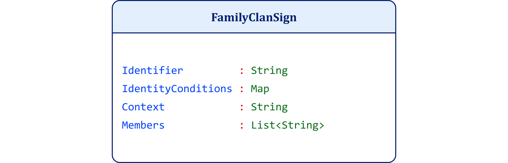

**Figure 12.1. FamilyClanSign UML Class Diagram**

**Figure 12.2. English Family Clan UML Object Diagram**

**Figure 12.3. Spanish Family Clan UML Object Diagram**

**Figure 12.4. Swahili Family Clan UML Object Diagram**

Each instance preserves the same admissible sign configuration relative to its context. The identity conditions remain constant. The members remain constant. The structural constraints remain constant. The context varies across linguistic systems, and the identifier varies accordingly.

Nothing in the structure determines which contextual system must apply. Nothing in the identity conditions determines it. Nothing in the members determines it. No intrinsic feature of the sign necessitates one identifier rather than another, nor the socio-cultural system in which that identifier operates.<a href="../references/notes/chapter-12.md#note-63">63</a>

This establishes the result. No intrinsic feature of the sign determines the identifier. Agents assign identifiers under constraint within a given socio-cultural context.<a href="../references/notes/chapter-12.md#note-64">64</a>

The relation between the identifier and what it denotes within the sign is arbitrary. This arbitrariness does not imply randomness. It reflects rule-governed assignment within a linguistic and cultural system.<a href="../references/notes/chapter-12.md#note-65">65</a>

If emotional signs possessed an intrinsically fixed relation between identifier and sign configuration, then identical affective-emotional configurations would require identical emotional labels across contexts. They do not. The same configuration admits different identifiers across linguistic and cultural systems.<a href="../references/notes/chapter-12.md#note-66">66</a>

The assignment of emotional identifiers therefore does not arise from the underlying configuration alone. Agents construct it under constraint within a socio-cultural framework.<a href="../references/notes/chapter-12.md#note-67">67</a>

Test 2. Underdetermination: Does one identifier uniquely fix one sign configuration?.

This test examines whether an identifier uniquely determines a sign. If the relation is objective, then a single identifier must fix a single set of identity conditions and corresponding instance.<a href="../references/notes/chapter-12.md#note-68">68</a>

**Figure 12.5. FamilyClanSign UML Class Diagram**

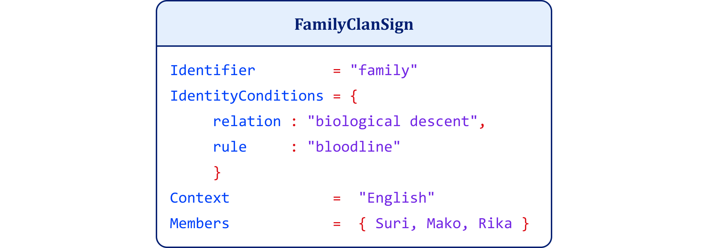

**Figure 12.6. English Family Clan UML Object Diagram (Biological)**

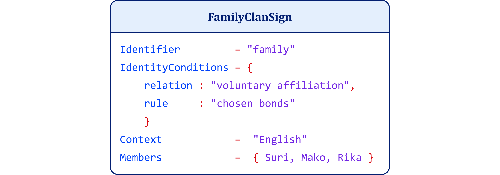

**Figure 12.7. English Family Clan UML Object Diagram (Chosen)**

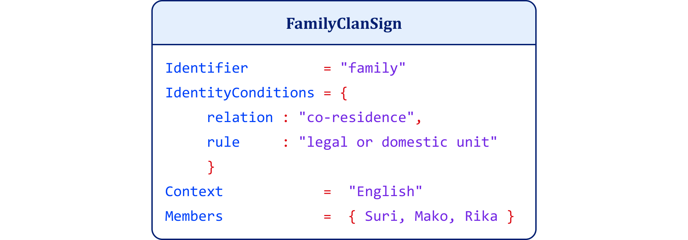

**Figure 12.8. English Family Clan UML Object Diagram (Legal Household)**

Each instance uses the same identifier. The context remains constant. The members remain constant. The structure remains constant. The identity conditions differ. In the UML diagrams, those admissibility conditions appear in the IdentityConditions property.

Nothing in the identifier determines which identity conditions must apply. The same identifier corresponds to multiple distinct configurations, each with different admissibility criteria.<a href="../references/notes/chapter-12.md#note-69">69</a>

This establishes the result. The identifier does not uniquely determine the sign configuration.<a href="../references/notes/chapter-12.md#note-70">70</a>

The identifier underdetermines the sign configuration. If emotional identifiers uniquely determined emotional states, then a label such as “fear” or “anger” would fix a single affective configuration, context, and interpretation. It does not. The same identifier applies across structurally distinct configurations, and each configuration uses different admissibility conditions.<a href="../references/notes/chapter-12.md#note-71">71</a> In the class diagram, IdentityConditions : Map defines the property type. In the object diagrams, IdentityConditions = { ... } supplies the concrete admissibility conditions for that instance.

Emotional identifiers therefore do not determine emotional meaning. They underdetermine it. Meaning arises from how the system configures affect, context, and interpretation under constraint.<a href="../references/notes/chapter-12.md#note-72">72</a>

Test 3. Universal Objective Essence: Does a single invariant set of identity conditions govern all admissible instances of the sign?

This test examines whether a sign possesses a universal and objective essence. If such an essence exists, then a single set of identity conditions must hold invariantly across all admissible instances of the sign.<a href="../references/notes/chapter-12.md#note-73">73</a>

**Figure 12.9. FamilyClanSign UML Class Diagram**

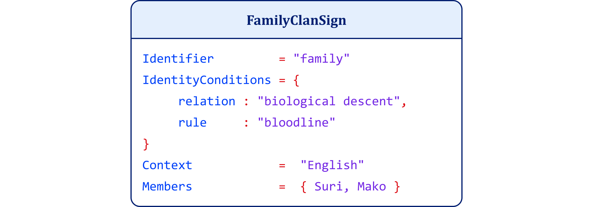

**Figure 12.10. English Family Clan UML Object Diagram (Biological Essence)**

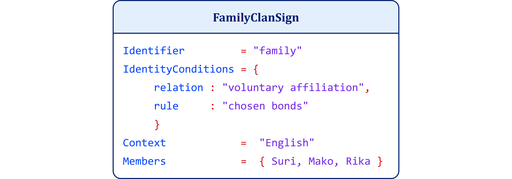

**Figure 12.11. English Family Clan UML Object Diagram (Chosen Essence)**

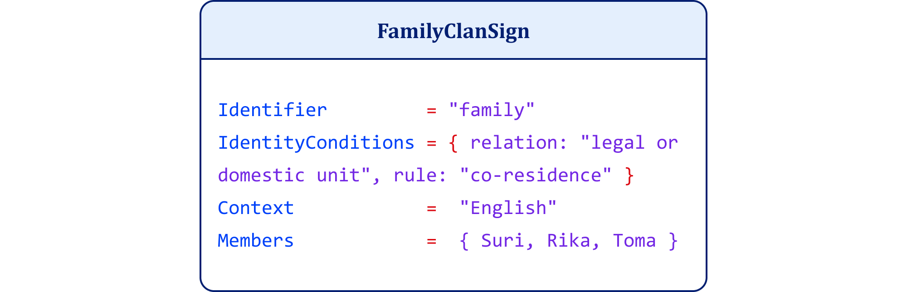

**Figure 12.12. English Family Clan UML Object Diagram (Institutional Essence)**

Each instance uses the same identifier. The context remains constant. The structure remains constant. The identity conditions differ, and the admissible membership changes with them.

No single set of identity conditions governs all admissible instances. Each configuration establishes a different criterion for what counts as a family, and each criterion yields a different corresponding instance. Nothing in the sign elevates one of these configurations to the status of a universal and objective essence.<a href="../references/notes/chapter-12.md#note-74">74</a>

This establishes the result. No universal and objective essence determines the sign.<a href="../references/notes/chapter-12.md#note-75">75</a>

There are no universal objective essences. If emotional categories possessed universal objective essences, then a single invariant set of identity conditions would define what counts as fear, anger, or joy across all admissible instances. It does not. Different configurations of affect, context, and interpretation satisfy the category under different constraints, and those different constraints yield different corresponding instances.<a href="../references/notes/chapter-12.md#note-76">76</a>

Emotional categories therefore do not possess universal objective essences. Agents construct them under variable identity conditions, not under a single invariant essence.<a href="../references/notes/chapter-12.md#note-77">77</a>

Test 4. Universal Objective Identity: Do identical identity conditions applied to the same referent yield a single invariant identity?

This test examines whether a sign possesses a universal and objective identity. If identity is intrinsic, then identical identity conditions applied to the same referent must yield a single, invariant identity.<a href="../references/notes/chapter-12.md#note-78">78</a>

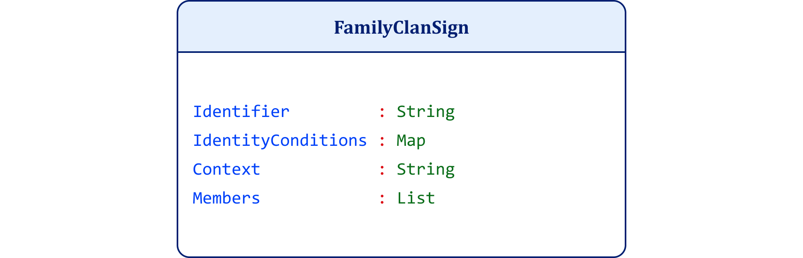

**Figure 12.13. FamilyClanSign UML Class Diagram**

**Figure 12.14. English Family Clan UML Object Diagram (Kinship Identity)**

**Figure 12.15. Spanish Family Clan UML Object Diagram (Lineage Identity)**

**Figure 12.16. Swahili Family Clan UML Object Diagram (Clan Identity)**

Each instance applies the same identity conditions. The members remain constant. The structure remains constant. The underlying group remains constant. Only the context changes, and the resulting identity changes with it. In this test, the changing identifier marks the context-specific symbolic label, while the changing identity names the role the same group occupies within that context.

Nothing in the identity conditions determines a single identity for the sign. The same conditions support multiple identities depending on how the system applies them within context.<a href="../references/notes/chapter-12.md#note-79">79</a>

This establishes the result. There is no universal and objective identity of the sign.<a href="../references/notes/chapter-12.md#note-80">80</a>

There are no universal objective identities. If emotional identities were intrinsic to affective configurations, then the same affective particulars would yield a single emotional identity whenever the underlying state remains the same. They do not. An agent can construct the same configuration as fear, excitement, anticipation, or stress depending on context and interpretation.<a href="../references/notes/chapter-12.md#note-81">81</a>

Emotional identity therefore does not reside in the underlying state. The agent assigns it under constraint.<a href="../references/notes/chapter-12.md#note-82">82</a>

Test 5. Universal Objective Significance: Does the same sign carry the same motivational force for every interpreter?

This test examines whether a sign possesses a universal and objective significance. If significance is intrinsic to the sign, then the same sign must carry the same motivational force for every interpreter. If significance varies while the sign remains constant, then significance does not reside in the sign itself.<a href="../references/notes/chapter-12.md#note-83">83</a>

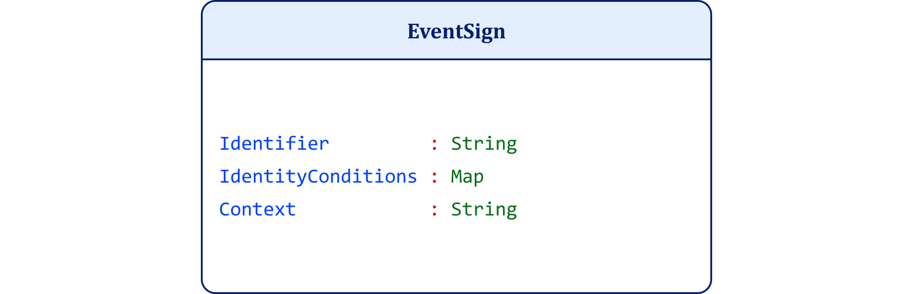

**Figure 12.17. EventSign UML Class Diagram**

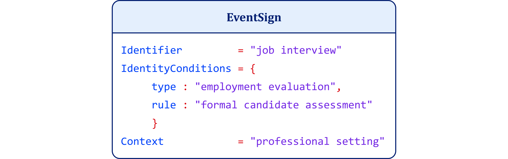

**Figure 12.18. Job Interview UML Object Diagram**

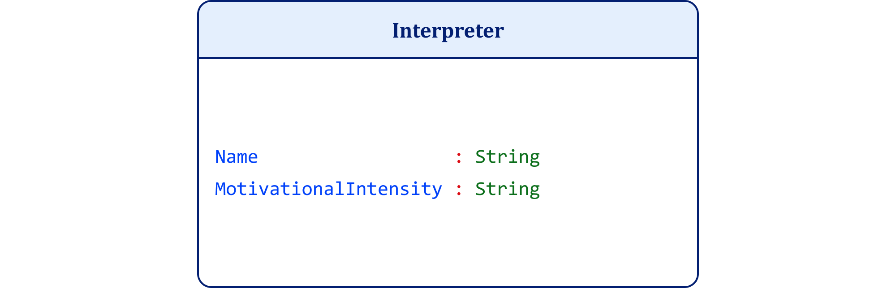

**Figure 12.19. Interpreter UML Class Diagram**

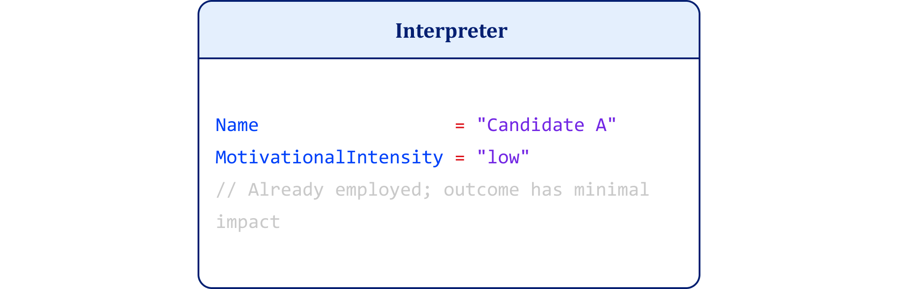

**Figure 12.20. Interpreter UML Object Diagram (Low Significance)**

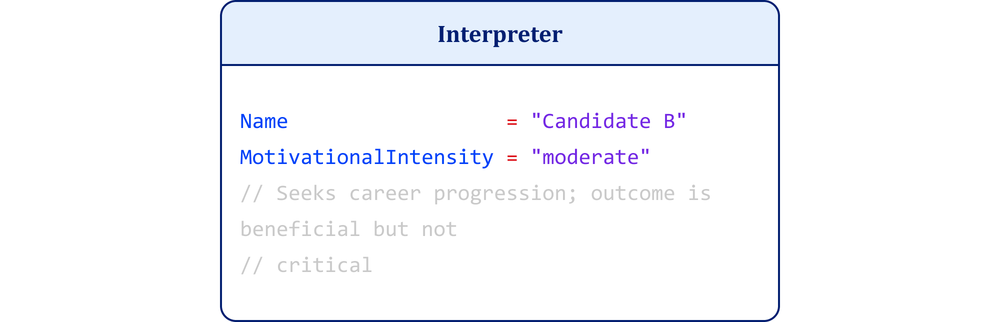

**Figure 12.21. Interpreter UML Object Diagram (Moderate Significance)**

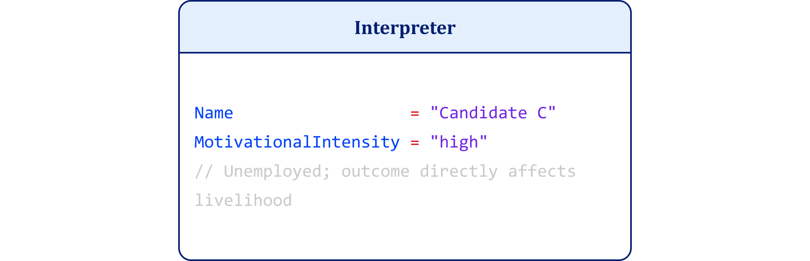

**Figure 12.22. Interpreter UML Object Diagram (High Significance)**

The sign remains constant. Its identifier remains constant. Its identity conditions remain constant. The event remains the same. Only the interpreters differ in their motivational intensity toward the same sign. The variation arises because each interpreter relates the same sign to different goals, stakes, and consequences.

Nothing in the sign determines whether it carries low, moderate, or high significance for an interpreter. Significance arises from the interpreter’s relation to the sign, not from an intrinsic feature of the sign itself.<a href="../references/notes/chapter-12.md#note-84">84</a>

This establishes the result. There is no universal objective significance of the sign.<a href="../references/notes/chapter-12.md#note-85">85</a>

There is no universal objective significance. If emotional significance were intrinsic to an emotional sign, then the same emotional construct would carry the same motivational force for every agent. It does not. The same emotional identity can matter little to one agent, moderately to another, and overwhelmingly to a third, depending on goals, values, and context.<a href="../references/notes/chapter-12.md#note-86">86</a>

Emotional significance therefore does not reside in the sign itself. It arises from the agent’s affective and motivational relation to the constructed meaning.<a href="../references/notes/chapter-12.md#note-87">87</a>

The corresponding C# executable for the tests below is available in the Chapter 12 project folder. The folder includes a README with instructions for building, running, and reproducing the sample outputs.

This C# project does not duplicate the UML diagrams. It operationalizes them. The diagrams show the static architecture of the Constructivist Semiotic Sign, but the executable project shows what that architecture permits and what it forbids. By running the demonstrations, the reader can see that no intrinsic feature of the sign determines the identifier, that a single identifier can underdetermine multiple sign configurations, that no invariant essence governs all admissible instances, that no universal objective identity follows necessarily from the same admissibility conditions, and that no universal objective significance resides in the sign itself. The project therefore functions as an executable supplement to the chapter’s formal argument. It does not prove the thesis by illustration alone. It tests the thesis by execution.<a href="../references/notes/chapter-12.md#note-88">88</a>

The project uses a shared JSON data layer and a single test engine. Each mode interrogates the same semiotic material differently. This matters because the argument of the chapter is not that signs are chaotic or random. The argument is that signs operate under constraint without intrinsic determination. The code makes that visible. It shows how the same structure can support variation without collapse, and how interpretation, rather than signal alone, completes meaning. In that respect, the program serves the same role for the chapter that a worked proof serves in mathematics. It allows the reader not only to inspect the architecture, but to watch it run.<a href="../references/notes/chapter-12.md#note-89">89</a>

For Test 1, the executable demonstration operationalizes arbitrariness by preserving the same admissible sign configuration while varying the identifier across socio-cultural contexts. The point is not that the system randomly changes labels, but that no intrinsic feature of the sign determines which identifier must apply. The identifiers are assigned under constraint within different linguistic systems.<a href="../references/notes/chapter-12.md#note-90">90</a>

The README documents the family-clan run as the canonical sample for Test 1.

For Test 2, the executable demonstration operationalizes underdetermination by holding the identifier constant while varying the admissible sign configuration. The reader supplies an identifier, and the program returns multiple valid configurations that the identifier can denote.<a href="../references/notes/chapter-12.md#note-91">91</a>

For Test 3, the executable demonstration operationalizes the absence of universal objective essence by checking whether one invariant set of identity conditions governs all admissible instances of the sign. Unlike Test 2, this test also shows that different identity conditions reshape the admissible instance itself.<a href="../references/notes/chapter-12.md#note-92">92</a>

For Test 4, the executable demonstration operationalizes the absence of universal objective identity by holding the admissibility conditions stable while showing that no single identity follows necessarily from them across contexts of interpretation. The reader supplies a concept, and the system reports multiple admissible identity assignments under the same underlying conditions.<a href="../references/notes/chapter-12.md#note-93">93</a>

For Test 5, the executable demonstration operationalizes the absence of universal objective significance by holding the sign constant while varying the interpreter. The sign remains the same, but the motivational intensity differs because each interpreter relates the same sign to different goals, stakes, and consequences.<a href="../references/notes/chapter-12.md#note-94">94</a>

Taken together, these runs show in executable form what the chapter establishes formally. No intrinsic feature of the sign determines its identifier. The identifier does not uniquely determine the sign configuration. No universal essence governs all admissible instances. No universal identity follows necessarily from the same admissibility conditions. No fixed significance resides in the sign apart from the interpreter. The code therefore augments the chapter by converting its conceptual demonstrations into operational tests.<a href="../references/notes/chapter-12.md#note-95">95</a>

These results converge on a single conclusion. Emotional categories do not possess intrinsic identifiers, essence, identity, or significance. No element of the sign determines its meaning in advance. Meaning arises only through construction under constraint, authorization by the agent, and coordination across agents.<a href="../references/notes/chapter-12.md#note-96">96</a>

If emotional meaning does not reside in signals, physiology, or behavior, then no system can access it directly. A person cannot directly access another agent’s emotion either. To claim otherwise is to mistake inference for mind reading. Detection presupposes that the property exists in the observable input. The demonstrations and their executable counterparts show that it does not. Signals provide correlates. Physiology provides conditions. Behavior provides expression. None of these determine the meaning of the emotion itself.<a href="../references/notes/chapter-12.md#note-97">97</a>

When an observer classifies a facial expression as anger or a vocal tone as sadness, the observer does not access emotion itself but assigns an interpretation based on patterns, context, prior knowledge, and socio-cultural convention. Artificial systems follow the same path. They operate on correlations between observable features and labeled categories. They reproduce inference, not interpretation.<a href="../references/notes/chapter-12.md#note-98">98</a>

Recognition therefore operates inferentially, not directly. It reconstructs meaning from signals without accessing the interpretive act that constitutes it.<a href="../references/notes/chapter-12.md#note-99">99</a>

Since I cannot detect emotion, I must determine where it exists and how an agent constructs it.

The preceding analysis establishes the structure of emotional meaning without locating it. If meaning arises through construction rather than residing in signals, I must identify where that construction occurs and how an agent gains access to it. The question shifts from what emotion is to where it exists. This shift directs attention to the locus of interpretation and the conditions under which an agent authorizes a construct as meaningful.<a href="../references/notes/chapter-12.md#note-100">100</a>

A change in heart rate, a tightening in the chest, or a shift in posture does not constitute fear, anger, or joy. These are conditions for interpretation, not instances of emotion. Emotion comes into existence when an agent organizes a felt state under a detachable symbolic identifier and authorizes it under identity conditions. Without that act, the state remains physiological or phenomenological. It does not become emotional.<a href="../references/notes/chapter-12.md#note-101">101</a>

Authorization plays a decisive role. An agent must endorse the construct as binding, not merely entertain it as a possibility. Without endorsement, the system produces representations or associations, but not emotional meaning. The agent commits to the classification and treats it as correct under the applicable constraints. This reflects a minimal form of rationality, intentionality, and commitment. This is what I mean when I say that emotions are both intentional and committal states: an emotion is about something as interpreted by the agent, and the agent authorizes that interpretation under identity conditions. The agent recognizes that the identifier governs admissibility and applies it accordingly.<a href="../references/notes/chapter-12.md#note-102">102</a>

Without this authorization, no emotion exists. The system may generate affect and structured representation, but it does not produce an emotion.<a href="../references/notes/chapter-12.md#note-103">103</a>

If emotion exists only through first-person authorization, others cannot access it directly.<a href="../references/notes/chapter-12.md#note-104">104</a>

Scientific observation cannot bypass the boundary between signal and meaning. When a researcher uses fMRI, EEG, or skin conductance, they record physiological correlates. They do not record emotion. The data shows activation in the amygdala or changes in cortisol levels, but these are facts of physiological reality, not the emotional reality of the agent. The scientist must still map those signals to a category such as fear or stress. That mapping is an act of inference, not discovery. It relies on the researcher’s own symbolic constraints.<a href="../references/notes/chapter-12.md#note-105">105</a>

This gap remains even when we use sophisticated machine learning. An algorithm identifies a pattern in a million data points and labels it "sadness" because a human trainer previously assigned that label to similar patterns. The system detects a correlation. It does not access the internal authorization that makes the state meaningful to the agent. No amount of data can transform an observation into an interpretation.<a href="../references/notes/chapter-12.md#note-106">106</a>

The limitation is not technological; it is ontological. Access to emotion requires participation in the act of authorization. Because that act belongs to the first-person agent, the observer remains outside it. Observers can measure correlates and infer meaning, but they do not participate in the authorizing act that constitutes the emotion. They encounter signals, not signs. A signal can indicate bodily or behavioral change. A sign requires an agent who authorizes what the signal means under a concept, context, and goal. The observer may infer the sign from the signal, but the observer does not possess the meaning the agent authorizes.<a href="../references/notes/chapter-12.md#note-107">107</a>

This structural separation defines the boundary of the known.

Scientific methods quantify physiological and neural processes that correlate with affect and feeling. Researchers measure heart rate, hormonal changes, neural activation patterns, and behavioral outputs. These measurements reveal how the organism regulates and expresses internal states. They do not reveal what those states mean.<a href="../references/notes/chapter-12.md#note-108">108</a>

A pattern of amygdala activation, increased arousal, or vocal intensity does not constitute fear, anger, or sadness. It marks a condition that an agent may interpret in multiple ways. The data identifies regularities and correlations across populations, but it does not capture the authorized interpretation that defines emotion in a particular case. The system records signals. It does not perform the interpretive act.<a href="../references/notes/chapter-12.md#note-109">109</a>

Third-person access therefore yields correlates without meaning. Science can map conditions under which emotions arise, but it cannot access the emotion itself.<a href="../references/notes/chapter-12.md#note-110">110</a>

These constraints lead to a general conclusion about access.

The gap between the observer and the agent is not a temporary hurdle for technology to clear. It is a structural feature of reality.<a href="../references/notes/chapter-12.md#note-111">111</a>

Because the observer only has direct access to the Objective level, any statement they make about the Emotional level is an inference. I can measure the heat of the engine, but I cannot see the driver’s authorization of the destination.

Emotion remains inaccessible from the outside perspective. It does not appear as an observable property in signals, physiology, or behavior, because meaning exists only where an agent authorizes a construct under symbolic constraint. Others interpret expression and infer emotional attribution. Science measures correlates and models regularities.

This does not render emotion unreal. It locates it precisely. Emotion exists where an agent constructs and endorses a felt state as something under identity conditions. Outside that act, observers encounter only signals, patterns, and data.

Emotion therefore admits no direct access from the outside. It exists only where the agent authorizes it.

If emotion exists only through authorized interpretation, I must now identify the minimum capacities required to construct and stabilize such meaning.

The barrier between the observer and the agent is not a technological hurdle. It is a structural feature of reality.

| Reality Level | Access Type | Primary Content |
| --- | --- | --- |
| Empirical | Third-Person (Direct) | Physiological signals, neural firing, behavior |
| Phenomenological | First-Person (Direct) | Raw feeling, interoception, affect |
| Emotional | First-Person (Authorized) | Constructed meaning, symbolic identifiers |
| Social | Second-Person (Inferred) | Shared labels, cultural norms, “Emotionese” |

**Table 12-1. Stratified Levels of Emotional Reality: Access and Primary Content**

Because the observer only has direct access to the Empirical level, any statement they make about the Emotional level is an inference. I can measure the heat of the engine, but I cannot see the driver’s authorization of the destination.<a href="../references/notes/chapter-12.md#note-112">112</a>

Emotion remains inaccessible from the outside perspective. It does not appear as an observable property in signals, physiology, or behavior, because meaning exists only where an agent authorizes a construct under symbolic constraint. Others interpret expression and infer emotional attribution. Science measures correlates and models regularities.<a href="../references/notes/chapter-12.md#note-113">113</a>

This does not render emotion unreal. It locates it precisely. Emotion exists where an agent constructs and endorses a felt state as something under identity conditions. Outside that act, observers encounter only signals, patterns, and data.<a href="../references/notes/chapter-12.md#note-114">114</a>

Emotion therefore admits no direct access from the outside. It exists only where the agent authorizes it.<a href="../references/notes/chapter-12.md#note-115">115</a>

If emotion exists only through authorized interpretation, I must now identify the minimum capacities required to construct and stabilize such meaning.

Meaning does not arise at a single level. <a href="../references/notes/chapter-12.md#note-116">116</a> It requires a two-level architecture that links individual construction to social stabilization.<a href="../references/notes/chapter-12.md#note-117">117</a>

At the first level, an agent constructs meaning by organizing a state under a detachable symbolic identifier governed by identity conditions and authorizing that construct as binding. This act establishes first-person meaning. It presupposes symbolic competence and a minimal rational capacity to apply identifiers across contexts, sustain consistency, and recognize admissibility. Without authorization, the system may generate affect and representation, but it does not produce meaning.<a href="../references/notes/chapter-12.md#note-118">118</a>

At the second level, meaning stabilizes through coordination across agents. Multiple agents communicate symbolic constructs, interpret them under shared rules, and apply them consistently across contexts. Through repeated alignment, they establish and maintain admissibility. Consensus does not uncover meaning in an underlying substrate. It stabilizes meaning through shared rules and agreement.<a href="../references/notes/chapter-12.md#note-119">119</a>

These levels form a sequential architecture. The individual agent first constructs the prototype by authorizing a felt state under identity conditions. The stereotype emerges at the level of agents through consensus and coordination. The first establishes meaning when the agent constructs it. The second stabilizes meaning when agents share, correct, and coordinate it.<a href="../references/notes/chapter-12.md#note-120">120</a>

I use the terms prototype and stereotype in a technical, non-pejorative sense. A prototype denotes the first-person construct an agent produces by organizing a state under a symbolic identifier and authorizing it under identity conditions. A stereotype denotes the socially stabilized form of that construct, maintained through communication, correction, and consensus across agents. The terms do not imply distortion or bias; they identify the two levels at which agents construct and stabilize meaning.<a href="../references/notes/chapter-12.md#note-121">121</a> This structure also appears outside of the domain of emotion.

I will now leverage a hypothetical cryptocurrency token to illustrate the two-level architecture of constructed meaning in an emotion-agnostic domain.

At the agent level, the construct becomes meaningful only when the agent can operate within a formal symbolic system. This includes the ability to use tools, programming languages, and protocol rules to construct a token, recognize a detachable identifier, and apply it correctly within those constraints. Without this capacity and its authorization in use, the construct does not function as meaningful for that agent.<a href="../references/notes/chapter-12.md#note-122">122</a>

At the social level, meaning depends on shared capabilities for communication and coordination across agents. The token must enter a shared system governed by rules of validation, transmission, and use. Multiple agents must possess the ability to interpret the construct under common constraints and to act on it in a coordinated way. Consensus stabilizes the construct across the network. Without these capacities, the construct remains private and does not achieve social reality.<a href="../references/notes/chapter-12.md#note-123">123</a>

A single individual cannot create a currency through belief alone. The construct becomes socially real only when agents with the required capabilities validate, accept, and use it under shared rules.<a href="../references/notes/chapter-12.md#note-124">124</a>

This example makes the two-level structure of constructed meaning explicit.<a href="../references/notes/chapter-12.md#note-125">125</a>

If a non-emotional construct requires this architecture, emotional meaning satisfies no weaker conditions. I now apply this architecture to emotion.<a href="../references/notes/chapter-12.md#note-126">126</a>

| Level | Process | Result |
| --- | --- | --- |
| Agent (Individual) | Authorization: Binding a symbolic identifier (e.g., “Grief”) to a felt state under specific identity conditions. | Prototype: A first-person authorized meaning that governs the agent’s internal state. |
| Agents (Social) | Consensus: Coordinating the use of “Grief” across multiple agents using shared rules and contextual cues. | Stereotype: A socially stabilized category that allows for coordination and “Emotionese.” |

**Table 12-2. Two-Level Architecture of Emotional Meaning: Process and Result**

This application reveals that emotion is not a biological "find" but a semiotic "achievement." To have an emotion, the agent must be a certain kind of system; one capable of both internal authorization and external alignment.<a href="../references/notes/chapter-12.md#note-127">127</a>

Emotion construction requires rule-governed application. The agent must apply the identifier across contexts, maintain admissibility under constraint, and sustain consistency over time. Without this capacity, the system produces affect and feeling but does not produce emotion.<a href="../references/notes/chapter-12.md#note-128">128</a>

Social interaction extends this process. Agents communicate emotional constructs, interpret them under shared rules, and coordinate their use across contexts. Through this alignment, emotional meaning stabilizes as a shared construct rather than a private attribution.<a href="../references/notes/chapter-12.md#note-129">129</a>

I can now proceed to further argue the distinction between entities that possess affective states and those that possess emotional meaning.

| Entity | Primary Process | Structural Capacity |
| --- | --- | --- |
| Infants / Animals | Reactivity & Association | Affective arousal + sensory integration |
| Interpretive Agents | Authorization & Consensus | Symbolic detachability + rule-governed identity |

**Table 12-3. Emotion Construction: Structural Capacities by Entity**

The two-level architecture clarifies why animals and infants differ in their capacity to construct emotional meaning. Animals exhibit affect, signaling, and coordinated behavior. They regulate states, respond to cues, and interact within social structures. These capacities, however, do not suffice for meaning. Animals do not demonstrate authorization. They do not stabilize the states they feel under detachable symbolic identifiers that identity conditions govern, nor do they endorse such constructs as binding. Their responses track stimuli and patterns, but they do not organize meaning under rules for construction.<a href="../references/notes/chapter-12.md#note-130">130</a>

Animals also do not demonstrate consensus in the relevant sense. They coordinate behavior, but they do not agree on rules that determine when symbolic constructs count as admissible. Animal coordination does not stabilize meaning across agents.<a href="../references/notes/chapter-12.md#note-131">131</a>

In this model, an infant may experience the high arousal and displeasure of "distress," but they do not yet have the symbolic hardware to authorize that state as "Grief" or "Anger." The transition to emotional agency is the transition into a semiotic system. Early development shows affect and feeling without authorization or consensus. Over time, infants acquire symbolic identifiers, apply them across contexts, and begin to authorize emotional constructs. Later, through social interaction, they align these constructs with shared rules and participate in consensus.<a href="../references/notes/chapter-12.md#note-132">132</a>

The distinction is architectural and developmental. Animals lack the architecture. Infants acquire it.<a href="../references/notes/chapter-12.md#note-133">133</a>

Even partial capacities do not suffice to construct emotional meaning.

Consider a system that possesses some, but not all, of the required capacities. A system may discriminate stimuli, categorize inputs, and coordinate behavior across contexts. It may even use symbols in limited ways or signal internal states to others. These capacities do not suffice for meaning.<a href="../references/notes/chapter-12.md#note-134">134</a>

Without authorization, the system does not treat a construct as binding under identity conditions. For example, an animal may respond to a threatening posture, but it does not authorize the construct fear as the correct classification of its own state. It may track cues and learn associations between signals, outcomes, and responses, but it does not commit to a classification as correct or incorrect. Without consensus, animals do not stabilize constructs across members of a group under shared rules. They may coordinate behavior, but they do not establish admissibility conditions that govern use.<a href="../references/notes/chapter-12.md#note-135">135</a>

Even if a system combines signaling, categorization, and limited symbolic use, the absence of either authorization or consensus prevents the emergence of meaning. Each capacity contributes, but no subset replaces the full architecture.<a href="../references/notes/chapter-12.md#note-136">136</a>

Emotional meaning therefore requires the complete system. Partial capacities cannot produce it.<a href="../references/notes/chapter-12.md#note-137">137</a>

Emotions are therefore real in a specific sense. At the agent level, the agent authorizes an interpretation as a prototype. At the group level, agents stabilize that interpretation as a non-pejorative stereotype through shared use. They do not exist as objective features in the signals from which observers attempt to read them.<a href="../references/notes/chapter-12.md#note-138">138</a>

No observer detects emotion. Each observer infers it. No system measures emotion. Each system correlates it.<a href="../references/notes/chapter-12.md#note-139">139</a>

Emotion belongs to construction, not detection.<a href="../references/notes/chapter-12.md#note-140">140</a>

The framework now applies across domains.

Once agents construct emotion as a system of meaning, its functional role changes. If emotions are constructions rather than sources of truth, what role should they play in guiding action? Having established what emotion is, I now turn to its normative role: how relevant are our emotions? The question matters because agents often treat emotion as if it delivered objective moral authority. Yet we often know what would serve us well and still fail to feel inclined toward it; we may also feel strongly toward what does not serve us well. The problem is not a lack of knowledge. It is a lack of alignment between evaluation and motivation. When agents treat emotional force as normative truth, they mistake an interpretive state for a moral judgment.<a href="../references/notes/chapter-12.md#note-141">141</a>

This tension reveals the next problem: what is the proper place of emotion in a life where knowledge and motivation often come apart?<a href="../references/notes/chapter-12.md#note-142">142</a>

Once agents construct emotion as a system of meaning, its functional role changes. If emotions are constructions rather than sources of truth, what role should they play in guiding action? Having established what emotion is, I now turn to its normative role: how relevant are our emotions? The question matters because agents often treat emotion as if it delivered objective moral authority. Yet we often know what would serve us well and still fail to feel inclined toward it; we may also feel strongly toward what does not serve us well. The problem is not a lack of knowledge. It is a lack of alignment between evaluation and motivation. When agents treat emotional force as normative truth, they mistake an interpretive state for a moral judgment.

The proper place of emotion is to interpret feeling so that it can influence moral action and reward the agent for acting well. Emotion should support moral judgment, not masquerade as moral truth.

In this chapter, I resolve a central confusion by distinguishing different kinds of reality rather than collapsing them into objectivity. Affect operates as a physiological and regulatory process. Feeling arises as conscious awareness of that process. Both are real in their own domains. Emotion is real differently: an agent produces emotion by organizing a felt state under a detachable symbolic identifier and authorizing it under shared symbolic and contextual constraints. Emotional meaning exists only through this interpretive act.<a href="../references/notes/chapter-12.md#note-143">143</a>

This analysis establishes four propositions. Emotional meaning does not reside in the signal. Emotional categories do not possess objective essence. Emotional identity does not reside in the referent. Emotional meaning does not reside in physiology, feeling, or behavior. In each case, meaning arises from structured interpretation under constraint.<a href="../references/notes/chapter-12.md#note-144">144</a>

These results converge on a unified account. Emotion functions as a two-level construct. At the first-person level, an agent authorizes a felt state under symbolic constraint, producing a prototype. At the social level, agents stabilize that construct through communication, interpretation, and consensus, producing a stereotype. Emotion is therefore both individually constructed and socially maintained.<a href="../references/notes/chapter-12.md#note-145">145</a>

This structure explains a systematic error. Agents encounter affect and feeling directly, yet treat them as if they already contain emotional meaning. Observers interpret expression and treat those interpretations as if they reveal internal states. Scientific systems measure physiological and behavioral patterns and treat those patterns as if they disclose emotion itself. In each case, the system mistakes the conditions of emotion for the emotion.<a href="../references/notes/chapter-12.md#note-146">146</a>

No system detects emotion. The agent constructs it. Others infer it. Science correlates it.<a href="../references/notes/chapter-12.md#note-147">147</a>

Emotion is therefore not a source of truth but a system of influence. Its proper role is subordinate. It should motivate action in accordance with what the agent has judged to be good, and it should reward successful alignment through felt experience. It does not define what is good. It supports or resists the agent's pursuit of it.<a href="../references/notes/chapter-12.md#note-148">148</a>

If emotional meaning arises through the organization of feeling, the remaining question is how structured meaning emerges from affective experience. The next chapter answers that question through the analogy of music. Instruments produce sound without determining musical meaning. Meaning emerges when an agent organizes sound into composition, and genres provide a higher level of organization by grouping diverse compositions under shared conventions without imposing a single defining essence. Jazz, classical, and blues encompass countless distinct works while remaining recognizable categories. Emotional categories function in the same way. Affective systems generate feeling without determining emotional significance. Agents organize feeling into emotional constructs, and shared emotional categories stabilize those constructions without requiring a universal objective essence.<a href="../references/notes/chapter-12.md#note-149">149</a>

To understand emotion, I must first understand the sound of feeling.<a href="../references/notes/chapter-12.md#note-150">150</a>
